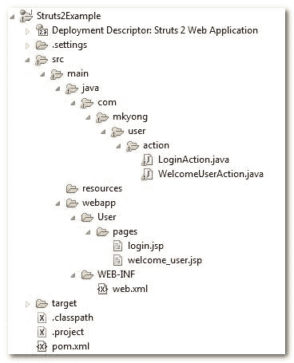

# Struts 2 Hello World 注释示例

> 原文：<http://web.archive.org/web/20230101150211/http://www.mkyong.com/struts2/struts-2-hello-world-annotation-example/>

在本教程中，它将重用之前的 [Strust 2 Hello World (XML 版本)](http://web.archive.org/web/20190302180720/http://www.mkyong.com/struts2/struts-2-hello-world-example/)示例，并将其转换为注释版本。

Download It – [Struts2-Hello-World-Annotation-Example.zip](http://web.archive.org/web/20190302180720/http://www.mkyong.com/wp-content/uploads/2010/06/Struts2-Hello-World-Annotation-Example.zip)

## Struts 2 注释概念

Struts 2 注释是由 Struts 2 约定插件支持的，因此，您必须理解其“**扫描方法学**”和“**命名转换器**”机制背后的魔力。

 ## 1.扫描方法

许多 Struts 2 的文章或书籍指出，您可以配置过滤器的" **init-param** 或"**Struts . conventi on . action . packages**"来告诉 Struts 2 在哪里扫描带注释的类。举个例子，

**web.xml**

```java
 <filter>
  <filter-name>struts2</filter-name>
  <filter-class>org.apache.struts2.dispatcher.FilterDispatcher</filter-class>
  <init-param>
	<param-name>actionPackages</param-name>
	<param-value>com.mkyong.common</param-value>
  </init-param>
</filter> 
```

从我的测试(Struts2 版本 2.1.6 和 2.1.8)来看，这是不正确的，无论你在" **param-value** 或"**Struts . conventi on . action . packages**中放什么，struts2 都会忽略它，只扫描指定的名为 **struts、Struts 2、action 或 actions** 的文件夹。

这是扫描的工作原理

1.  扫描位于名为“ **struts，struts2，action 或 actions** ”的包中的注释类。
2.  接下来，扫描符合以下任一标准的文件:
    *   实现了**com . open symphony . xwork 2 . action**接口。
    *   扩展**com . open symphony . xwork 2 . action support**类。
    *   文件名以动作结尾(如用户动作、登录动作)。

参见这个 [Struts 2 约定插件文档](http://web.archive.org/web/20190302180720/http://struts.apache.org/2.1.8/docs/convention-plugin.html#ConventionPlugin-Codebehindhelloworld)。

 ## 2.命名转换器

Struts 2 约定插件将把所有带注释的动作文件名转换成指定的格式。

比如:**LoginAction.java**

1.  首先，删除文件名末尾的“操作”一词(如果有)。
2.  其次，将文件名的第一个字母转换成小写。

因此，在删除结尾并转换第一个字母的大小写后， **LoginAction.action** 将变为 **login.action** 。

The Struts 2 convention plugin’s “scanning methodology” and “naming converter” features are really bring a lot of conveniences and benefits, only if your Struts 2 project is following the naming convention properly; otherwise it will be a total disaster.

## Struts 2 注释示例

是时候开始转换过程了。

## 最终项目结构



## 1.更新 pom.xml

要使用 Struts 2 注释特性，您需要下载**Struts 2-conventi on-plugin . jar**。
POM . XML

```java
 ...
    <dependency>
          <groupId>org.apache.struts</groupId>
	  <artifactId>struts2-core</artifactId>
	  <version>2.1.8</version>
    </dependency>

    <dependency>
          <groupId>org.apache.struts</groupId>
	  <artifactId>struts2-convention-plugin</artifactId>
	  <version>2.1.8</version>
    </dependency>
... 
```

## 2.登录操作

创建一个 **LoginAction** 扩展 **ActionSupport** 并且什么都不做， **ActionSupport** 默认返回一个“success”字符串，它将匹配@Result 并重定向到“ **pages/login.jsp** ”。

**注释版本**

```java
 package com.mkyong.user.action;

import org.apache.struts2.convention.annotation.Namespace;
import org.apache.struts2.convention.annotation.Result;
import org.apache.struts2.convention.annotation.ResultPath;

import com.opensymphony.xwork2.ActionSupport;

@Namespace("/User")
@ResultPath(value="/")
@Result(name="success",location="pages/login.jsp")
public class LoginAction extends ActionSupport{

} 
```

**XML 等效物**

```java
 <package name="user" namespace="/User" extends="struts-default">
	<action name="Login">
		<result>pages/login.jsp</result>
	</action>
</package> 
```

## 3.WelcomeUserAction

重写 execute()方法并指定@Action 和@Result 批注。

**注释版本**

```java
 package com.mkyong.user.action;

import org.apache.struts2.convention.annotation.Action;
import org.apache.struts2.convention.annotation.Namespace;
import org.apache.struts2.convention.annotation.Result;
import org.apache.struts2.convention.annotation.ResultPath;

import com.opensymphony.xwork2.ActionSupport;

@Namespace("/User")
@ResultPath(value="/")
public class WelcomeUserAction extends ActionSupport{

	private String username;

	public String getUsername() {
		return username;
	}

	public void setUsername(String username) {
		this.username = username;
	}

	@Action(value="Welcome", results={
		@Result(name="success",location="pages/welcome_user.jsp")
	})
	public String execute() {

		return SUCCESS;

	}
} 
```

**XML 等效物**

```java
 <package name="user" namespace="/User" extends="struts-default">
   <action name="Welcome" class="com.mkyong.user.action.WelcomeUserAction">
	<result name="SUCCESS">pages/welcome_user.jsp</result>
   </action>
</package> 
```

The Struts 2 annotations – **@Action**, **@Result** and **@Namespace** are self-explanatory, you can always compare it with the XML equivalent. The **@ResultPath** may need a bit explanation, see this [@ResultPath example](http://web.archive.org/web/20190302180720/http://www.mkyong.com/struts2/struts-2-resultpath-annotation-example/).

## 4.JSP 视图页面

普通 JSP 视图页面接受用户名和密码，并在单击提交按钮后重定向到欢迎页面。

**login.jsp**

```java
<%@ page contentType="text/html; charset=UTF-8" %>
<%@ taglib prefix="s" uri="/struts-tags" %>

Struts 2 Hello World 注释示例

```

<form action="Welcome"> <textfield name="username" label="Username"><password name="password" label="Password"><submit>**welcome_user.jsp**

```java
<%@ page contentType="text/html; charset=UTF-8" %>
<%@ taglib prefix="s" uri="/struts-tags" %>

Struts 2 Hello World 注释示例

你好

```

## 5.struts.xml

不需要创建 struts.xml 文件，所有类都有注释。

## 6.web.xml

只需创建一个经典的 web.xml 文件，并将 **FilterDispatcher** 过滤器声明为普通过滤器。

```java
 <!DOCTYPE web-app PUBLIC
 "-//Sun Microsystems, Inc.//DTD Web Application 2.3//EN"
 "http://java.sun.com/dtd/web-app_2_3.dtd" >

<web-app>
  <display-name>Struts 2 Web Application</display-name>

  <filter>
	<filter-name>struts2</filter-name>
	<filter-class>org.apache.struts2.dispatcher.FilterDispatcher</filter-class>
  </filter>

  <filter-mapping>
	<filter-name>struts2</filter-name>
	<url-pattern>/*</url-pattern>
  </filter-mapping>

</web-app> 
```

## 7.运行它

**登录动作**改为**登录动作**，参见上面的“命名转换器”。
http://localhost:8080/struts 2 example/User/log in . action


*http://localhost:8080/struts 2 example/User/welcome . action*


## 参考

1.  [Struts 2 约定插件文档](http://web.archive.org/web/20190302180720/http://struts.apache.org/2.1.8/docs/convention-plugin.html)
2.  [Strust 2 Hello World (XML 版)](http://web.archive.org/web/20190302180720/http://www.mkyong.com/struts2/struts-2-hello-world-example/)

[annotation](http://web.archive.org/web/20190302180720/http://www.mkyong.com/tag/annotation/) [hello world](http://web.archive.org/web/20190302180720/http://www.mkyong.com/tag/hello-world/) [struts2](http://web.archive.org/web/20190302180720/http://www.mkyong.com/tag/struts2/)</submit></password></textfield></form>


