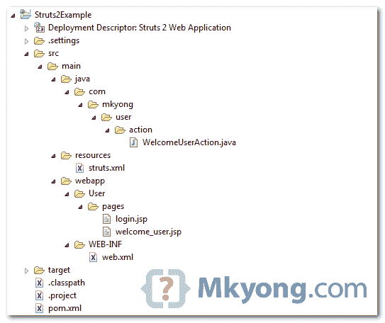
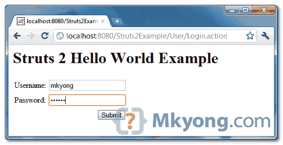
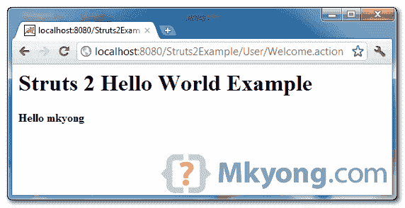

# Struts 2 Hello World 示例

> 原文：<http://web.archive.org/web/20230101150211/http://www.mkyong.com/struts2/struts-2-hello-world-example/>

在这个例子中，我们向您展示了如何在 Struts 2 中创建一个 hello world 示例。

使用了以下库或工具:

*   maven3
*   Eclipse 3.7
*   struts 2.3.1.2

## 1.最终项目结构

让我们回顾一下本教程的最终项目结构，以防您在后面的步骤中迷路。


freestar.config.enabled_slots.push({ placementName: "mkyong_incontent_1", slotId: "mkyong_incontent_1" });

## 2.Struts2 依赖关系

使用 Maven 下载整个 Struts2 依赖项。在`pom.xml`中增加`struts2-core`。

*文件:pom.xml*

```java
 <project  
        xmlns:xsi="http://www.w3.org/2001/XMLSchema-instance"
	xsi:schemaLocation="http://maven.apache.org/POM/4.0.0 
        http://maven.apache.org/maven-v4_0_0.xsd">
	<modelVersion>4.0.0</modelVersion>
	<groupId>com.mkyong.common</groupId>
	<artifactId>Struts2Example</artifactId>
	<packaging>war</packaging>
	<version>com.mkyong.common</version>
	<name>Struts2Example Maven Webapp</name>
	<url>http://maven.apache.org</url>
	<dependencies>
		<dependency>
			<groupId>junit</groupId>
			<artifactId>junit</artifactId>
			<version>3.8.1</version>
			<scope>test</scope>
		</dependency>
		<dependency>
			<groupId>org.apache.struts</groupId>
			<artifactId>struts2-core</artifactId>
			<version>2.3.1.2</version>
		</dependency>
	</dependencies>
	<build>
		<finalName>Struts2Example</finalName>
		<plugins>
			<plugin>
				<artifactId>maven-compiler-plugin</artifactId>
				<version>2.3.2</version>
				<configuration>
					<source>1.6</source>
					<target>1.6</target>
				</configuration>
			</plugin>
		</plugins>
	</build>
</project> 
```

## 3.转换为 Eclipse 项目

在命令提示符下编译并转换为 Eclipse web 项目:

```java
 mvn eclipse:eclipse -Dwtpversion=2.0 
```

回顾日食。类路径文件中，将下载以下 Struts2 依赖项:

*文件:。类路径*

```java
 <classpath>
  <classpathentry kind="src" path="src/main/java" including="**/*.java"/>
  <classpathentry kind="src" path="src/main/resources" excluding="**/*.java"/>
  <classpathentry kind="output" path="target/classes"/>
  <classpathentry kind="var" path="M2_REPO/asm/asm/3.3/asm-3.3.jar"/>
  <classpathentry kind="var" path="M2_REPO/asm/asm-commons/3.3/asm-commons-3.3.jar"/>
  <classpathentry kind="var" path="M2_REPO/asm/asm-tree/3.3/asm-tree-3.3.jar"/>
  <classpathentry kind="var" path="M2_REPO/commons-fileupload/commons-fileupload/1.2.2/commons-fileupload-1.2.2.jar" />
  <classpathentry kind="var" path="M2_REPO/commons-io/commons-io/2.0.1/commons-io-2.0.1.jar"/>
  <classpathentry kind="var" path="M2_REPO/commons-lang/commons-lang/2.5/commons-lang-2.5.jar"/>
  <classpathentry kind="var" path="M2_REPO/org/freemarker/freemarker/2.3.18/freemarker-2.3.18.jar"/>
  <classpathentry kind="var" path="M2_REPO/javassist/javassist/3.11.0.GA/javassist-3.11.0.GA.jar"/>
  <classpathentry kind="var" path="M2_REPO/junit/junit/3.8.1/junit-3.8.1.jar"/>
  <classpathentry kind="var" path="M2_REPO/ognl/ognl/3.0.4/ognl-3.0.4.jar"/>
  <classpathentry kind="var" path="M2_REPO/org/apache/struts/struts2-core/2.3.1.2/struts2-core-2.3.1.2.jar"/>
  <classpathentry kind="lib" path="C:/Program Files/Java/jdk1.6.0_13/lib/tools.jar"/>
  <classpathentry kind="var" path="M2_REPO/org/apache/struts/xwork/xwork-core/2.3.1.2/xwork-core-2.3.1.2.jar"/>
  <classpathentry kind="con" path="org.eclipse.jdt.launching.JRE_CONTAINER"/>
</classpath> 
```

## 4.JSP 视图页面

一个 JSP 登录页面，使用 Struts 2 标记来显示用户名和密码输入字段以及提交按钮。

login.jsp

```java
 <%@ page contentType="text/html; charset=UTF-8"%>
<%@ taglib prefix="s" uri="/struts-tags"%>
<html>
<head></head>
<body>
	<h1>Struts 2 Hello World Example</h1>

	<s:form action="Welcome">
		<s:textfield name="username" label="Username" />
		<s:password name="password" label="Password" />
		<s:submit />
	</s:form>

</body>
</html> 
```

*File:welcome _ user . jsp*–向用户显示欢迎消息的 JSP 视图页面。

```java
 <%@ page contentType="text/html; charset=UTF-8"%>
<%@ taglib prefix="s" uri="/struts-tags"%>
<html>
<head></head>
<body>
	<h1>Struts 2 Hello World Example</h1>

	<h2>
		Hello
		<s:property value="username" />
	</h2>

</body>
</html> 
```

Struts 1 和 Struts 2 具有非常相似的 UI 标记语法，只是在命名 HTML 元素方面有一点不同，例如:

**支柱 1**

```java
 <%@taglib uri="http://struts.apache.org/tags-html" prefix="html"%>
<html:form action="Welcome">
   <html:text property="username"/>
</html:form> 
```

**支柱 2**

```java
 <%@ taglib prefix="s" uri="/struts-tags" %>
<s:form action="Welcome">
	<s:textfield name="username" label="Username"/>
</s:form> 
```

## 5.动作，把所有的业务逻辑放在这里

一个简单的 Struts2 Action 类，它用来声明里面所有的业务逻辑。

*文件:WelcomeUserAction.java*

```java
 package com.mkyong.user.action;

public class WelcomeUserAction{

	private String username;

	public String getUsername() {
		return username;
	}

	public void setUsername(String username) {
		this.username = username;
	}

	// all struts logic here
	public String execute() {

		return "SUCCESS";

	}
} 
```

在 Struts2 中，Action 类不需要实现任何接口或扩展任何类，但需要创建一个`execute()`方法来将所有业务逻辑放入其中，并返回一个字符串值来告诉用户重定向到哪里。

**Note**
You may see some users implement `the com.opensymphony.xwork2.Action` class, but it’s totally optional, because the `com.opensymphony.xwork2.Action` is just provide some handy constant values only.**Note**
Struts1’s Action class is required to extends the `org.apache.struts.action.Action`. But Struts 2 Action class is optional, but you are still allow to implement the `com.opensymphony.xwork2.Action` for some handy constant values or extends the `com.opensymphony.xwork2.ActionSupport` for some common default Action implementation functions.

## 5.Struts 配置文件

一个 Strut 配置文件将所有的东西链接在一起。**XML 文件名必须是“struts . XML”**。

*文件:struts.xml*

```java
 <?xml version="1.0" encoding="UTF-8" ?>
<!DOCTYPE struts PUBLIC
"-//Apache Software Foundation//DTD Struts Configuration 2.0//EN"
"http://struts.apache.org/dtds/struts-2.0.dtd">

<struts>

	<package name="user" namespace="/User" extends="struts-default">
		<action name="Login">
			<result>pages/login.jsp</result>
		</action>
		<action name="Welcome" class="com.mkyong.user.action.WelcomeUserAction">
			<result name="SUCCESS">pages/welcome_user.jsp</result>
		</action>
	</package>

</struts> 
```

声明一个包，并将动作类放入其中，动作类是自解释的，但是您可能会对下面的新标签感兴趣:

**1。**package name = " user "
只是一个包名，不用太在意。

**2。namespace="/User"**
用于匹配"/User" URL 模式。参见本文—[Struts 2 名称空间示例和解释](http://web.archive.org/web/20210208000110/http://www.mkyong.com/struts2/struts-2-namespace-configuration-example-and-explanation/)。

**Note**
Actually, the Struts2 Namespaces is equivalent to [Struts 1 multiple modules](http://web.archive.org/web/20210208000110/http://www.mkyong.com/struts/struts-multiple-configuration-files-example/)

**3。extends = " struts-default "**
这意味着该包扩展了 struts-default 包的组件和拦截器，这在位于 **struts2-core.jar** 文件根目录下的 **struts-default.xml** 文件中声明。

## 6.web.xml

配置 web 应用程序部署描述符(web.xml)文件，将 Struts2 集成到您的 Web 项目中。

*文件 web.xml*

```java
 <!DOCTYPE web-app PUBLIC
 "-//Sun Microsystems, Inc.//DTD Web Application 2.3//EN"
 "http://java.sun.com/dtd/web-app_2_3.dtd" >

<web-app>
	<display-name>Struts 2 Web Application</display-name>

	<filter>
		<filter-name>struts2</filter-name>
		<filter-class>
                org.apache.struts2.dispatcher.ng.filter.StrutsPrepareAndExecuteFilter
                </filter-class>
	</filter>

	<filter-mapping>
		<filter-name>struts2</filter-name>
		<url-pattern>/*</url-pattern>
	</filter-mapping>

</web-app> 
```

## 7.运行它

在 Struts2 中，可以用后缀直接访问 **action 类。动作**。

*http://localhost:8080/struts 2 example/User/log in . action*




*http://localhost:8080/struts 2 example/User/welcome . action*




## 下载它

Download it – [Struts2-Hello-World-Example.zip](http://web.archive.org/web/20210208000110/http://www.mkyong.com/wp-content/uploads/2010/06/Struts2-Hello-World-Example.zip) (7 KB)Tags : [hello world](http://web.archive.org/web/20210208000110/https://mkyong.com/tag/hello-world/) [struts2](http://web.archive.org/web/20210208000110/https://mkyong.com/tag/struts2/)freestar.config.enabled_slots.push({ placementName: "mkyong_leaderboard_btf", slotId: "mkyong_leaderboard_btf" });<input type="hidden" id="mkyong-current-postId" value="5635">