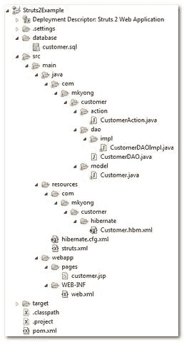
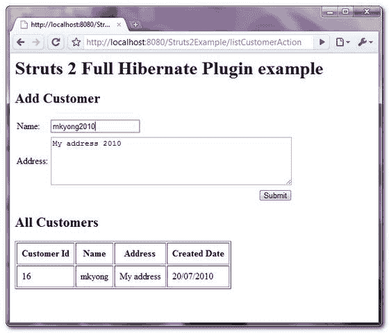
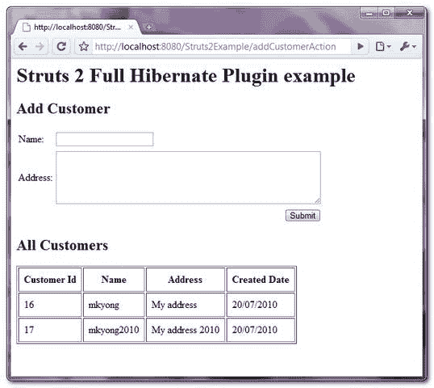

# Struts 2 + Hibernate 与“完全 Hibernate 插件”的集成

> 原文：<http://web.archive.org/web/20230101150211/http://www.mkyong.com/struts2/struts-2-hibernate-integration-with-full-hibernate-plugin/>

在最后一个 [Struts 2 + Hibernate 集成](http://web.archive.org/web/20190220143412/http://www.mkyong.com/struts2/struts-2-hibernate-integration-example/)的例子中，它使用 servlet 上下文监听器来处理 Hibernate 会话，并且很好地将 Struts 2 与 Hibernate 框架集成在一起。

但是，总有需要改进的地方:)在本教程中，我们将向您展示如何通过使用由 [jyoshiriro](http://web.archive.org/web/20190220143412/http://code.google.com/u/jyoshiriro/) 创建的名为“ [Full Hibernate Plugin](http://web.archive.org/web/20190220143412/http://code.google.com/p/full-hibernate-plugin-for-struts2/) ”的 2.2GA 版本的 Struts2 插件来集成 Struts2 和 Hibernate。

查看集成步骤摘要:

1.  将“ **Full Hibernate 插件**jar”放在项目类路径中。
2.  使用批注" **@SessionTarget** "注入 Hibernate 会话；而“ **@TransactionTarget** ”则注入 Hibernate 事务。
3.  在 **struts.xml** 中，使包扩展“ **hibernate-default** ”，而不是默认栈。

查看关系:

```java
 Struts 2 <-- (Full Hibernate Plugin) ---> Hibernate <-----> Database 
```

**Note**
This tutorial is an update version from the previous [Struts 2 + Hibernate integration](http://web.archive.org/web/20190220143412/http://www.mkyong.com/struts2/struts-2-hibernate-integration-example/) example (servlet context listener), So the JSP and Hibernate configuration are almost same, just the integration part is a bit different, try to compare both to spot the different.

## 1.项目结构

查看完整的项目文件夹结构。

 <ins class="adsbygoogle" style="display:block; text-align:center;" data-ad-format="fluid" data-ad-layout="in-article" data-ad-client="ca-pub-2836379775501347" data-ad-slot="6894224149">## 2.MySQL 表脚本

客户的表脚本。

```java
 DROP TABLE IF EXISTS `mkyong`.`customer`;
CREATE TABLE  `mkyong`.`customer` (
  `CUSTOMER_ID` bigint(20) unsigned NOT NULL AUTO_INCREMENT,
  `NAME` varchar(45) NOT NULL,
  `ADDRESS` varchar(255) NOT NULL,
  `CREATED_DATE` datetime NOT NULL,
  PRIMARY KEY (`CUSTOMER_ID`)
) ENGINE=InnoDB AUTO_INCREMENT=17 DEFAULT CHARSET=utf8; 
```

 <ins class="adsbygoogle" style="display:block" data-ad-client="ca-pub-2836379775501347" data-ad-slot="8821506761" data-ad-format="auto" data-ad-region="mkyongregion">## 3.获取“完整的 Hibernate 插件”和依赖项

获取所有 Struts2、Hibernate、 **Full Hibernate 插件**和 MySQL 依赖库。由于“**全 Hibernate 插件**”不支持 Maven，您需要从官网下载并手动包含到您的 Maven 本地库。

1.  下载“[全休眠插件](http://web.archive.org/web/20190220143412/http://code.google.com/p/full-hibernate-plugin-for-struts2/)”。
2.  将下载的 jar 放到 c: drive 中，并使用 Maven 的命令将其包含到 Maven 本地存储库中。

    ```java
     mvn install:install-file -Dfile=c:\struts2-fullhibernatecore-plugin-2.2-GA.jar 
    -DgroupId=com.google.code -DartifactId=struts2-fullhibernatecore-plugin 
    -Dversion=2.2 -Dpackaging=jar 
    ```

3.  用跟随 Maven 坐标链接它。

    ```java
     <dependency>
    		<groupId>com.google.code</groupId>
    		<artifactId>struts2-fullhibernatecore-plugin</artifactId>
    		<version>2.2</version>
    	</dependency> 
    ```

以下是本教程中的所有依赖库:

文件:pom.xml

```java
 //...
	<!-- Struts 2 -->
	<dependency>
	        <groupId>org.apache.struts</groupId>
		<artifactId>struts2-core</artifactId>
		<version>2.1.8</version>
        </dependency>

	<!-- MySQL database driver -->
	<dependency>
		<groupId>mysql</groupId>
		<artifactId>mysql-connector-java</artifactId>
		<version>5.1.9</version>
	</dependency>

	<!-- Struts 2 Hibernate Plugins -->
	<dependency>
		<groupId>com.google.code</groupId>
		<artifactId>struts2-fullhibernatecore-plugin</artifactId>
		<version>2.2</version>
	</dependency>

	<!-- Log4j logging (Struts 2 Hibernate Plugins dependency) -->
	<dependency>
                <groupId>log4j</groupId>
	        <artifactId>log4j</artifactId>
	        <version>1.2.9</version>
        </dependency>

	<!-- Hibernate validator (Struts 2 Hibernate Plugins dependency) -->
	<dependency>
               <groupId>org.hibernate</groupId>
	       <artifactId>hibernate-validator</artifactId>
	       <version>3.1.0.GA</version>
        </dependency>

	<!-- slf4j logging (Struts 2 Hibernate Plugins dependency) -->
	<dependency>
               <groupId>org.slf4j</groupId>
	       <artifactId>slf4j-api</artifactId>
	       <version>1.6.1</version>
        </dependency>

	<!-- Hibernate core -->
	<dependency>
		<groupId>org.hibernate</groupId>
		<artifactId>hibernate</artifactId>
		<version>3.2.7.ga</version>
	</dependency>

	<!-- Hibernate core library dependency start -->
	<dependency>
		<groupId>dom4j</groupId>
		<artifactId>dom4j</artifactId>
		<version>1.6.1</version>
	</dependency>

	<dependency>
		<groupId>commons-logging</groupId>
		<artifactId>commons-logging</artifactId>
		<version>1.1.1</version>
	</dependency>

	<dependency>
		<groupId>commons-collections</groupId>
		<artifactId>commons-collections</artifactId>
		<version>3.2.1</version>
	</dependency>

	<dependency>
		<groupId>cglib</groupId>
		<artifactId>cglib</artifactId>
		<version>2.2</version>
	</dependency>
	<!-- Hibernate core library dependency end -->

	<!-- Hibernate query library dependency start -->
	<dependency>
		<groupId>antlr</groupId>
		<artifactId>antlr</artifactId>
		<version>2.7.7</version>
	</dependency>
	<!-- Hibernate query library dependency end -->
//... 
```

The “**Full Hibernate Plugin**” is required the **Hibernate validator** and **SLF4j** dependency, which is not really make sense, as most of the Java developers still do not use it.

## 4.冬眠的东西

所有的 Hibernate 模型和配置。

**Customer.java**–为客户表创建一个类。

```java
 package com.mkyong.customer.model;

import java.util.Date;

public class Customer implements java.io.Serializable {

	private Long customerId;
	private String name;
	private String address;
	private Date createdDate;

	//getter and setter methods
} 
```

**customer . hbm . XML**–客户的 Hibernate 映射文件。

```java
 <?xml version="1.0"?>
<!DOCTYPE hibernate-mapping PUBLIC "-//Hibernate/Hibernate Mapping DTD 3.0//EN"
"http://hibernate.sourceforge.net/hibernate-mapping-3.0.dtd">
<!-- Generated 20 Julai 2010 11:40:18 AM by Hibernate Tools 3.2.5.Beta -->
<hibernate-mapping>
    <class name="com.mkyong.customer.model.Customer" 
		table="customer" catalog="mkyong">
        <id name="customerId" type="java.lang.Long">
            <column name="CUSTOMER_ID" />
            <generator class="identity" />
        </id>
        <property name="name" type="string">
            <column name="NAME" length="45" not-null="true" />
        </property>
        <property name="address" type="string">
            <column name="ADDRESS" not-null="true" />
        </property>
        <property name="createdDate" type="timestamp">
            <column name="CREATED_DATE" length="19" not-null="true" />
        </property>
    </class>
</hibernate-mapping> 
```

文件:hibernate.cfg.xml，hibernate 数据库配置文件。

```java
 <?xml version="1.0" encoding="utf-8"?>
<!DOCTYPE hibernate-configuration PUBLIC
"-//Hibernate/Hibernate Configuration DTD 3.0//EN"
"http://hibernate.sourceforge.net/hibernate-configuration-3.0.dtd">
<hibernate-configuration>
  <session-factory>
    <property name="hibernate.bytecode.use_reflection_optimizer">false</property>
    <property name="hibernate.connection.password">password</property>
    <property name="hibernate.connection.url">jdbc:mysql://localhost:3306/mkyong</property>
    <property name="hibernate.connection.username">root</property>
    <property name="hibernate.dialect">org.hibernate.dialect.MySQLDialect</property>
    <property name="show_sql">true</property>
    <property name="format_sql">true</property>
    <property name="use_sql_comments">false</property>
    <mapping resource="com/mkyong/customer/hibernate/Customer.hbm.xml" />
  </session-factory>
</hibernate-configuration> 
```

## 5.数据访问对象(Data Access Object)

实现 DAO 设计模式来执行数据库操作。在 **CustomerDAOImpl** 类中，将 Hibernate 会话和事务都声明为类成员。在 Struts 2 项目初始化过程中，**全 Hibernate 插件**会分别使用 **@SessionTarget** 和 **@TransactionTarget** 注释将相应的 Hibernate 会话和事务注入到类成员中。

**CustomerDAO.java**

```java
 package com.mkyong.customer.dao;

import java.util.List;

import com.mkyong.customer.model.Customer;

public interface CustomerDAO{

	void addCustomer(Customer customer);

	List<Customer> listCustomer();

} 
```

**CustomerDAOImpl.java**

```java
 package com.mkyong.customer.dao.impl;

import java.util.List;

import org.hibernate.Session;
import org.hibernate.Transaction;

import com.googlecode.s2hibernate.struts2.plugin.annotations.SessionTarget;
import com.googlecode.s2hibernate.struts2.plugin.annotations.TransactionTarget;
import com.mkyong.customer.dao.CustomerDAO;
import com.mkyong.customer.model.Customer;

public class CustomerDAOImpl implements CustomerDAO{

	@SessionTarget
	Session session;

	@TransactionTarget
	Transaction transaction;

	//add the customer
	public void addCustomer(Customer customer){

		session.save(customer);

	}

	//return all the customers in list
	public List<Customer> listCustomer(){

		return session.createQuery("from Customer").list();

	}

} 
```

## 6.行动

在 Action 类中，调用 DAO 类来执行数据库操作。

**CustomerAction.java**

```java
 package com.mkyong.customer.action;

import java.util.ArrayList;
import java.util.Date;
import java.util.List;

import com.mkyong.customer.dao.CustomerDAO;
import com.mkyong.customer.dao.impl.CustomerDAOImpl;
import com.mkyong.customer.model.Customer;
import com.opensymphony.xwork2.ActionSupport;
import com.opensymphony.xwork2.ModelDriven;

public class CustomerAction extends ActionSupport 
	implements ModelDriven{

	Customer customer = new Customer();
	List<Customer> customerList = new ArrayList<Customer>();
	CustomerDAO customerDAO = new CustomerDAOImpl();

	public String execute() throws Exception {
		return SUCCESS;
	}

	public Object getModel() {
		return customer;
	}

	public List<Customer> getCustomerList() {
		return customerList;
	}

	public void setCustomerList(List<Customer> customerList) {
		this.customerList = customerList;
	}

	//save customer
	public String addCustomer() throws Exception{

		//save it
		customer.setCreatedDate(new Date());
		customerDAO.addCustomer(customer);

		//reload the customer list
		customerList = null;
		customerList = customerDAO.listCustomer();

		return SUCCESS;

	}

	//list all customers
	public String listCustomer() throws Exception{

		customerList = customerDAO.listCustomer();

		return SUCCESS;

	}

} 
```

## 7.JSP 页面

添加和列出客户的 JSP 页面。

**customer.jsp**

```java
 <%@ taglib prefix="s" uri="/struts-tags" %>
<%@ taglib prefix="s" uri="/struts-tags" %>
<html>
<head>
</head>

<body>
<h1>Struts 2 Full Hibernate Plugin example</h1>

<h2>Add Customer</h2>
<s:form action="addCustomerAction" >
  <s:textfield name="name" label="Name" value="" />
  <s:textarea name="address" label="Address" value="" cols="50" rows="5" />
  <s:submit />
</s:form>

<h2>All Customers</h2>

<s:if test="customerList.size() > 0">
<table border="1px" cellpadding="8px">
	<tr>
		<th>Customer Id</th>
		<th>Name</th>
		<th>Address</th>
		<th>Created Date</th>
	</tr>
	<s:iterator value="customerList" status="userStatus">
		<tr>
			<td><s:property value="customerId" /></td>
			<td><s:property value="name" /></td>
			<td><s:property value="address" /></td>
			<td><s:date name="createdDate" format="dd/MM/yyyy" /></td>
		</tr>
	</s:iterator>
</table>
</s:if>
<br/>
<br/>

</body>
</html> 
```

## 8.struts.xml

Link it all ~ make 包扩展了“ **hibernate-default** ”而不是“ **struts-default** ”。

```java
 <?xml version="1.0" encoding="UTF-8" ?>
<!DOCTYPE struts PUBLIC
"-//Apache Software Foundation//DTD Struts Configuration 2.0//EN"
"http://struts.apache.org/dtds/struts-2.0.dtd">

<struts>
  <constant name="struts.devMode" value="true" />

  <package name="default" namespace="/" extends="hibernate-default">

    <action name="addCustomerAction" 
	class="com.mkyong.customer.action.CustomerAction" method="addCustomer" >
       <result name="success">pages/customer.jsp</result>
    </action>

    <action name="listCustomerAction" 
	class="com.mkyong.customer.action.CustomerAction" method="listCustomer" >
        <result name="success">pages/customer.jsp</result>
    </action>

</package>	
</struts> 
```

## 9.演示

访问它:http://localhost:8080/struts 2 example/listcustomeraction . action



## 下载源代码

Download it – [Struts2-Hibernate-FullHibernatePluginExample.zip](http://web.archive.org/web/20190220143412/http://www.mkyong.com/wp-content/uploads/2010/07/Struts2-Hibernate-FullHibernatePluginExample.zip) (12 KB)

## 参考

1.  [Struts 2 全休眠插件文档](http://web.archive.org/web/20190220143412/http://code.google.com/p/full-hibernate-plugin-for-struts2/)
2.  [Struts 2 + Hibernate 集成示例(servlet 上下文监听器)](http://web.archive.org/web/20190220143412/http://www.mkyong.com/struts2/struts-2-hibernate-integration-example/)
3.  [将库安装到 Maven 本地存储库中](http://web.archive.org/web/20190220143412/http://www.mkyong.com/maven/how-to-include-library-manully-into-maven-local-repository/)

[hibernate](http://web.archive.org/web/20190220143412/http://www.mkyong.com/tag/hibernate/) [integration](http://web.archive.org/web/20190220143412/http://www.mkyong.com/tag/integration/) [struts2](http://web.archive.org/web/20190220143412/http://www.mkyong.com/tag/struts2/)


