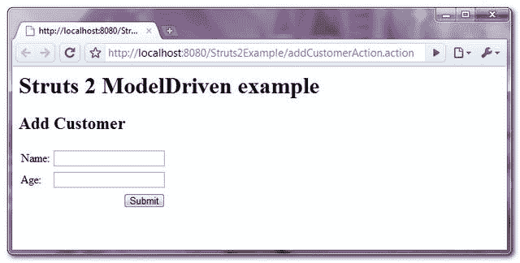
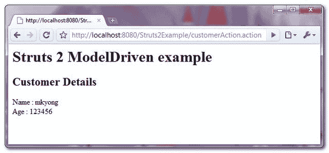

# Struts 2 模型驱动示例

> 原文：<http://web.archive.org/web/20230101150211/http://www.mkyong.com/struts2/struts-2-modeldriven-example/>

Download it – [Struts2-ModelDriven-Example.zip](http://web.archive.org/web/20210506213157/http://www.mkyong.com/wp-content/uploads/2010/07/Struts2-ModelDriven-Example.zip)

如果一个动作实现了" **ModelDriven** "接口，它将获得额外的能力**将表单数据自动转移到对象中**。请参见下面的完整示例:

## 1.域对象

一个客户对象，带有 setter 和 getter 方法。

**Customer.java**

```java
 package com.mkyong.common;

public class Customer{

	String name;
	int age;

	public String getName() {
		return name;
	}
	public void setName(String name) {
		this.name = name;
	}
	public int getAge() {
		return age;
	}
	public void setAge(int age) {
		this.age = age;
	}

} 
```

## 2.行动

Action 类，实现了 **ModelDriven** 接口，声明了 **getModel()** 方法返回客户的对象。当表单数据提交给此操作时，它会自动将表单数据传输到客户属性中。

The customer object have to be initialize manually.

**CustomerAction.java**

```java
 package com.mkyong.common.action;

import com.mkyong.common.Customer;
import com.opensymphony.xwork2.ActionSupport;
import com.opensymphony.xwork2.ModelDriven;

public class CustomerAction extends ActionSupport 
	implements ModelDriven{

	//have to initialize it
	Customer customer = new Customer();

	public String execute() throws Exception {

		return SUCCESS;

	}

	public Object getModel() {

		return customer;

	}
} 
```

## 3.JSP 页面

模型驱动的演示的 JSP 页面。

**addCustomer.jsp**

```java
 <%@ taglib prefix="s" uri="/struts-tags" %>
<html>
<head>
</head>

<body>
<h1>Struts 2 ModelDriven example</h1>

<h2>Add Customer</h2>
<s:form  action="customerAction" >
  <s:textfield name="name" label="Name" />
  <s:textfield name="age" label="Age" value=""/>
  <s:submit />
</s:form>

</body>
</html> 
```

**success.jsp**

```java
 <%@ taglib prefix="s" uri="/struts-tags" %>
<html>
<head>
</head>

<body>
<h1>Struts 2 ModelDriven example</h1>

<h2>Customer Details</h2>
Name : <s:property value="name" /><br>
Age : <s:property value="age" /><br>

</body>
</html> 
```

## 4.struts.xml

全部链接起来~

```java
 <?xml version="1.0" encoding="UTF-8" ?>
<!DOCTYPE struts PUBLIC
"-//Apache Software Foundation//DTD Struts Configuration 2.0//EN"
"http://struts.apache.org/dtds/struts-2.0.dtd">

<struts>
 	<constant name="struts.devMode" value="true" />

	<package name="default" namespace="/" extends="struts-default">

		<action name="addCustomerAction" 
			class="com.mkyong.common.action.CustomerAction" >
		    <result name="success">pages/addCustomer.jsp</result>
		</action>

		<action name="customerAction" 
			class="com.mkyong.common.action.CustomerAction" >
		    <result name="success">pages/success.jsp</result>
		</action>

	</package>

</struts> 
```

## 5.演示

进入客户表格，**填写表格(姓名:【mkyong】，年龄:【123456】)**点击提交按钮，**表格数据(姓名:&年龄)将自动转入客户房产(姓名:&年龄)**(按房产名称匹配)。

*http://localhost:8080/struts 2 example/addcustomeraction . action*



*http://localhost:8080/struts 2 example/customer action . action*



## 参考

1.  [模型驱动文档](http://web.archive.org/web/20210506213157/https://struts.apache.org/2.1.6/struts2-core/apidocs/com/opensymphony/xwork2/ModelDriven.html)

Tags : [struts2](http://web.archive.org/web/20210506213157/https://mkyong.com/tag/struts2/)<input type="hidden" id="mkyong-current-postId" value="6327">