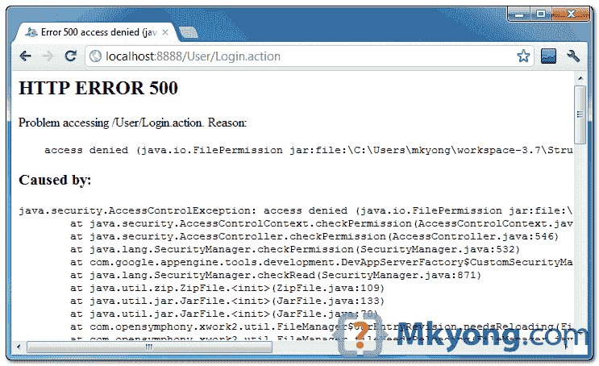

# GAE 上的 struts 2–Java . security . accesscontrolexception:拒绝访问

> 原文：<http://web.archive.org/web/20230101150211/http://www.mkyong.com/google-app-engine/struts-2-on-gae-java-security-accesscontrolexception-access-denied/>

## 问题

在 Google App Engine (SDK v1.6.3.1)上开发 struts 2(v 2.3.1.2)，本地开发，打“`java.security.AccessControlException: access denied`”错误？



## 解决办法

通常，这是因为你在`struts.xml`文件中打开了上的 **devMode。**

*文件:struts.xml*

```java
 <?xml version="1.0" encoding="UTF-8" ?>
<!DOCTYPE struts PUBLIC
"-//Apache Software Foundation//DTD Struts Configuration 2.0//EN"
"http://struts.apache.org/dtds/struts-2.0.dtd">

<struts>
	<constant name="struts.devMode" value="true" /> 
	//...
</struts> 
```

当你打开`devMode`时，Struts2 将试图写入磁盘进行日志记录，这被 GAE 否认，它只能写入谷歌数据存储。

要解决这个问题，您必须删除您的`struts.xml`文件中的`devMode`语句。

**Note**
In short, Struts 2 `devMode` is not support in GAE environment.

## 参考

1.  [struts 2.1.8 在 app engine 的本地服务器上遇到了 AccessControlException】](http://web.archive.org/web/20220607032907/https://groups.google.com/group/google-appengine-java/browse_thread/thread/b78fea68441eaf4e/4eec677cef795e03)

<input type="hidden" id="mkyong-current-postId" value="10856">