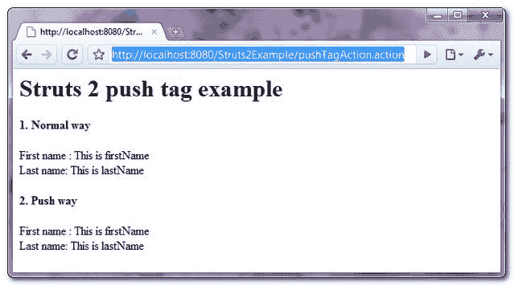

> 原文：<http://web.archive.org/web/20230101150211/http://www.mkyong.com/struts2/struts-2-push-tag-example/>

# Struts 2 推送标签示例

Download It – [Struts2-Push-Tag-Example.zip](http://web.archive.org/web/20190304032830/http://www.mkyong.com/wp-content/uploads/2010/07/Struts2-Push-Tag-Example.zip)

Struts 2 " **push** "标签用于将值推到栈顶，以便于访问或引用。参见一个完整的“**推**标签示例:

## 1.行动

操作类仅转发请求。

**PushTagAction.java**

```java
 package com.mkyong.common.action;

import com.opensymphony.xwork2.ActionSupport;

public class PushTagAction extends ActionSupport{

	public String execute() throws Exception {

		return SUCCESS;
	}
} 
```

 <ins class="adsbygoogle" style="display:block; text-align:center;" data-ad-format="fluid" data-ad-layout="in-article" data-ad-client="ca-pub-2836379775501347" data-ad-slot="6894224149">## 2.豆

一个简单的 Person 类，稍后会将它放入堆栈以便于访问。

**Person.java**

```java
 package com.mkyong.common;

public class Person{

	private String firstName = "This is firstName";
	private String lastName = "This is lastName";

	public String getFirstName() {
		return firstName;
	}
	public String getLastName() {
		return lastName;
	}
} 
```

 <ins class="adsbygoogle" style="display:block" data-ad-client="ca-pub-2836379775501347" data-ad-slot="8821506761" data-ad-format="auto" data-ad-region="mkyongregion">## 3.推送标签示例

它显示了" **push** 标签的使用。

**push.jsp**

```java
 <%@ taglib prefix="s" uri="/struts-tags" %>
<html>
<head>
</head>

<body>
<h1>Struts 2 push tag example</h1>

<h2>1\. Normal way</h2>
<s:bean name="com.mkyong.common.Person" var="personBean" />
First name : <s:property value="#personBean.firstName" /><br/>
Last name: <s:property value="#personBean.lastName" /><br/>

<h2>2\. Push way</h2>
<s:push value="#personBean" >
First name : <s:property value="firstName" /><br/>
Last name: <s:property value="lastName" /><br/>
</s:push>

</body>
</html> 
```

它是如何工作的？
正常情况下，如果你想得到豆子的属性，可以像**<s:property value = " # person bean . first name "/>**一样引用。使用“ **push** 标签，可以将“ **#personBean** ”推到栈顶，直接访问属性**<s:property value = " first name "/>**。两者返回相同的结果，只是访问机制不同。

The “push” tag is saving you to type few characters, don’t see any real value behind.

## 4.struts.xml

链接一下~

```java
 <?xml version="1.0" encoding="UTF-8" ?>
<!DOCTYPE struts PUBLIC
"-//Apache Software Foundation//DTD Struts Configuration 2.0//EN"
"http://struts.apache.org/dtds/struts-2.0.dtd">

<struts>
 	<constant name="struts.devMode" value="true" />
	<package name="default" namespace="/" extends="struts-default">

		<action name="pushTagAction" 
			class="com.mkyong.common.action.PushTagAction" >
			<result name="success">pages/push.jsp</result>
		</action>

	</package>
</struts> 
```

## 5.演示

*http://localhost:8080/struts 2 example/pushtagaction . action*

**输出**



## 参考

1.  [Struts 2 推送标签文档](http://web.archive.org/web/20190304032830/http://struts.apache.org/2.1.8/docs/push.html)

[struts2](http://web.archive.org/web/20190304032830/http://www.mkyong.com/tag/struts2/)


