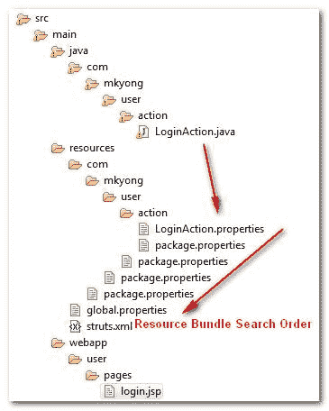

# struts 2–资源包示例

> 原文：<http://web.archive.org/web/20230101150211/http://www.mkyong.com/struts2/struts-2-resource-bundle-example/>

要使用资源包从属性文件中检索消息，您必须理解 Struts 2 资源包的搜索顺序:

## 资源包搜索顺序

资源包按以下顺序搜索:

1.  ActionClass.properties
2.  接口.属性
3.  BaseClass.properties
4.  模型驱动的模型
5.  包.属性
6.  向上搜索 i18n 消息键层次结构本身
7.  全局资源属性

Refer to Struts 2 [Resource Bundle documentation](http://web.archive.org/web/20190302163540/http://struts.apache.org/2.1.8/docs/localization.html) for detail explanation.Hi Struts 2, you search too much, there are too many search orders involved and cost performance if the properties file is not found.

实际上，按照上面的顺序组织属性文件是不可能的。所以，只要了解几个常用的搜索顺序应该就够了: **ActionClass.properties** 、 **package.properties** 和**全局资源属性**。见下图:



如果一个**com . mkyong . user . action . loginaction**想要通过资源包获得一条消息，它会搜索

1.  com . mkyong . user . action . loginaction . properties(找到，退出，否则下一个)
2.  com . mkyong . user . action . package . properties(找到，退出，否则下一个)
3.  com . mkyong . user . package . properties(find exit，else next)
    …将 find package.properties 保存在每个父目录中，一直到根目录
4.  找到[全局资源属性](http://web.archive.org/web/20190302163540/http://www.mkyong.com/struts2/how-to-configure-global-resource-bundle-in-struts-2/)，如果您在应用程序中配置了它

Understand this search order can give you more confident to decide the correct folder for properties file. ## 获取资源包

访问资源包的几个示例:

*P . S’**username . required**和’**username**是属性文件中的关键字。*

 ## 1.动作类

在 Action 类中，您可以扩展 ActionSupport 并通过 getText('key ')函数获得资源包。

```java
 ...
public class LoginAction extends ActionSupport{
	...
	public void validate(){
		if("".equals(getUsername())){
			addFieldError("username", getText("username.required"));
		}
	}
} 
```

## 2.属性标签

在属性标记中，使用 getText('key ')。

```java
 <s:property value="getText('username')" /> 
```

## 3.文本标签

在文本标签中，设置“名称”属性中的键。

```java
 <s:text name="username" /> 
```

## 4.信息标号属性

UI 组件的 Key 属性有特殊的功能，详见本 [key 属性示例](http://web.archive.org/web/20190302163540/http://www.mkyong.com/struts2/struts-2-key-attribute-example/)。

```java
 <s:textfield key="username" /> 
```

## 5.I18n 标签

这个 i18n 标记可以从在“name”属性中声明的指定资源包中获取消息。在本例中，它要求从**com/mkyong/user/package . properties**文件中获取“用户名”消息。

```java
 <s:i18n name="com.mkyong.user.package" >
     <s:text name="username" />
</s:i18n> 
```

Download full project for practice – [Struts2-Resource-Bundle-Example.zip](http://web.archive.org/web/20190302163540/http://www.mkyong.com/wp-content/uploads/2010/06/Struts2-Resource-Bundle-Example.zip)

## 参考

1.  [struts 2 中的全局资源包](http://web.archive.org/web/20190302163540/http://www.mkyong.com/struts2/how-to-configure-global-resource-bundle-in-struts-2/)
2.  [Struts 2 关键属性示例](http://web.archive.org/web/20190302163540/http://www.mkyong.com/struts2/struts-2-key-attribute-example/)
3.  [Struts 2 资源包搜索订单文档](http://web.archive.org/web/20190302163540/http://struts.apache.org/2.1.8/docs/localization.html)

[resource bundle](http://web.archive.org/web/20190302163540/http://www.mkyong.com/tag/resource-bundle/) [struts2](http://web.archive.org/web/20190302163540/http://www.mkyong.com/tag/struts2/)


