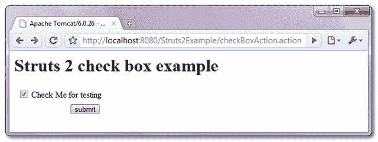
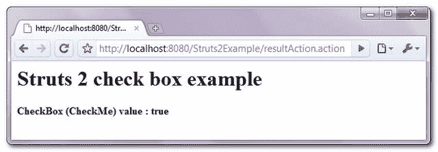

# Struts 2 <checkbox>复选框示例</checkbox>

> 原文：<http://web.archive.org/web/20230101150211/http://www.mkyong.com/struts2/struts-2-scheckbox-checkbox-example/>

Download It – [Struts2-CheckBox-Example.zip](http://web.archive.org/web/20190309091406/http://www.mkyong.com/wp-content/uploads/2010/06/Struts2-CheckBox-Example.zip)

在 Struts 2 中，可以使用 **< s:checkbox >** 标签创建一个 HTML 复选框。 **fieldValue="true"** 是复选框将提交的实际值。

```java
 <s:checkbox name="checkMe" fieldValue="true" label="Check Me for testing"/> 
```

In common, you do not need to declared the **fieldValue=”true”**, because true is the default value.

它将生成下面的 HTML。

```java
 <input type="checkbox" name="checkMe" value="true" id="xx_checkMe"/>
<input type="hidden" id="__checkbox_xx_checkMe" name="__checkbox_checkMe" value="true"/>
<label for="resultAction_checkMe" class="checkboxLabel">Check Me for testing</label> 
```

## 预先选择复选框

如果您想要预先选择一个复选框，只需添加一个 value 属性并将其设置为 true。

```java
 <s:checkbox name="checkMe" fieldValue="true" value="true" label="Check Me for testing"/> 
```

它将生成下面的 HTML。

```java
 <input type="checkbox" name="checkMe" value="true" checked="checked" id="xx_checkMe"/>
<input type="hidden" id="__checkbox_xx_checkMe" name="__checkbox_checkMe" value="true" />
<label for="resultAction_checkMe" class="checkboxLabel">Check Me for testing</label> 
```

 <ins class="adsbygoogle" style="display:block; text-align:center;" data-ad-format="fluid" data-ad-layout="in-article" data-ad-client="ca-pub-2836379775501347" data-ad-slot="6894224149">## Struts 2 **< s:复选框>** 示例

一个完整的例子，通过 Struts 2**<s:checkbox>**创建复选框，并将提交的复选框值赋给 Action 类并显示。

 <ins class="adsbygoogle" style="display:block" data-ad-client="ca-pub-2836379775501347" data-ad-slot="8821506761" data-ad-format="auto" data-ad-region="mkyongregion">## 1.行动

带有用于保存复选框值的 **checkMe** 布尔属性的操作类。CheckBoxAction.java
T3

```java
 package com.mkyong.common.action;

import com.opensymphony.xwork2.ActionSupport;

public class CheckBoxAction extends ActionSupport{

	private boolean checkMe;

	public boolean isCheckMe() {
		return checkMe;
	}

	public void setCheckMe(boolean checkMe) {
		this.checkMe = checkMe;
	}

	public String execute() {

		return SUCCESS;

	}

	public String display() {

		return NONE;

	}

} 
```

## 2.结果页面

使用 Struts 2 " **s:checkbox** "标记创建复选框的结果页。

**checkBox.jsp**

```java
 <%@ taglib prefix="s" uri="/struts-tags" %>
<html>
<head>
</head>

<body>
<h1>Struts 2 check box example</h1>

<s:form action="resultAction" namespace="/">

<h2>
	<s:checkbox name="checkMe" fieldValue="true" label="Check Me for testing"/>
</h2> 

<s:submit value="submit" name="submit" />

</s:form>

</body>
</html> 
```

**result.jsp**

```java
 <%@ taglib prefix="s" uri="/struts-tags" %>
<html>

<body>
<h1>Struts 2 check box example</h1>

<h2>
  CheckBox (CheckMe) value : <s:property value="checkMe"/>
</h2> 

</body>
</html> 
```

## 3.struts.xml

链接在一起~

```java
 <?xml version="1.0" encoding="UTF-8" ?>
<!DOCTYPE struts PUBLIC
"-//Apache Software Foundation//DTD Struts Configuration 2.0//EN"
"http://struts.apache.org/dtds/struts-2.0.dtd">

<struts>

 <constant name="struts.devMode" value="true" />

<package name="default" namespace="/" extends="struts-default">

   <action name="checkBoxAction" 
         class="com.mkyong.common.action.CheckBoxAction" method="display">
	<result name="none">pages/checkBox.jsp</result>
   </action>

   <action name="resultAction" class="com.mkyong.common.action.CheckBoxAction">
	<result name="success">pages/result.jsp</result>
   </action>
  </package>

</struts> 
```

## 5.演示

*http://localhost:8080/struts 2 example/checkbox action . action*



*http://localhost:8080/struts 2 example/result action . action*



## 参考

1.  [Struts 2 复选框文档](http://web.archive.org/web/20190309091406/http://struts.apache.org/2.0.14/docs/checkbox.html)

[checkbox](http://web.archive.org/web/20190309091406/http://www.mkyong.com/tag/checkbox/) [struts2](http://web.archive.org/web/20190309091406/http://www.mkyong.com/tag/struts2/)


