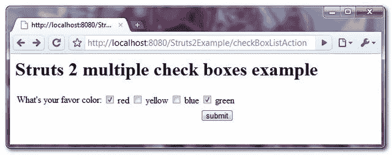
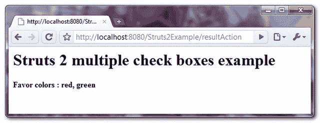

# Struts 2 <checkboxlist>多个复选框示例</checkboxlist>

> 原文：<http://web.archive.org/web/20230101150211/http://www.mkyong.com/struts2/struts-2-scheckboxlist-multiple-check-boxes-example/>

Download It – [Struts2-multiple-checkboxes-example.zip](http://web.archive.org/web/20190309091555/http://www.mkyong.com/wp-content/uploads/2010/06/Struts2-default-value-multiple-checkboxes-example.zip)

在 Struts 2 中，可以使用 **< s:checkboxlist >** 标签来创建多个同名的复选框。唯一关心的是如何在一个变量中保存多个检查值？举个例子，

```java
 public List<String> getColors() {
	colors = new ArrayList<String>();
	colors.add("red");
	colors.add("yellow");
	colors.add("blue");
	colors.add("green");
	return colors;
} 
```

```java
 <s:checkboxlist label="What's your favor color" list="colors" 
name="yourColor" value="defaultColor" /> 
```

带有“红色”、“黄色”、“蓝色”和“绿色”选项的多个复选框。如果选中了多个选项，您可以通过一个**字符串**对象来存储它。

例如，如果选中了“红色”和“黄色”选项，则选中的值将与逗号 **yourColor = "red，yellow"** 组合。

```java
 private String yourColor;

public void setYourColor(String yourColor) {
	this.yourColor = yourColor;
} 
```

Read this article about how to set the [default value for multiple check boxes](http://web.archive.org/web/20190309091555/http://www.mkyong.com/struts2/how-to-set-default-value-for-multiple-checkboxes-in-struts-2/).

## struts 2**<s:checkbox list>**示例

一个完整的 Struts 2 示例，通过 **< s:checkboxlist >** 创建多个同名的复选框，存储选中的值并显示在另一个页面中。

 ## 1.行动

操作类来生成和保存多个复选框值。
**CheckBoxListAction.java**

```java
 package com.mkyong.common.action;

import java.util.ArrayList;
import java.util.List;

import com.opensymphony.xwork2.ActionSupport;

public class CheckBoxListAction extends ActionSupport{

	private List<String> colors;

	private String yourColor;

	public String getYourColor() {
		return yourColor;
	}

	public void setYourColor(String yourColor) {
		this.yourColor = yourColor;
	}

	public CheckBoxListAction(){
		colors = new ArrayList<String>();
		colors.add("red");
		colors.add("yellow");
		colors.add("blue");
		colors.add("green");
	}

	public String[] getDefaultColor(){
		return new String [] {"red", "green"};
	}

	public List<String> getColors() {
		return colors;
	}

	public void setColors(List<String> colors) {
		this.colors = colors;
	}

	public String execute() {
		return SUCCESS;
	}

	public String display() {
		return NONE;
	}
} 
```

 ## 2.结果页面

通过“ **s:checkboxlist** ”标签呈现多个复选框。checkBoxlist.jsp
T3

```java
 <%@ taglib prefix="s" uri="/struts-tags" %>
<html>
<head>
</head>

<body>
<h1>Struts 2 multiple check boxes example</h1>

<s:form action="resultAction" namespace="/">

<h2>
	<s:checkboxlist label="What's your favor color" list="colors" 
	   name="yourColor" value="defaultColor" />
</h2> 

<s:submit value="submit" name="submit" />

</s:form>

</body>
</html> 
```

**result.jsp**

```java
 <%@ taglib prefix="s" uri="/struts-tags" %>
<html>

<body>
<h1>Struts 2 multiple check boxes example</h1>

<h2>
  Favor colors : <s:property value="yourColor"/>
</h2> 

</body>
</html> 
```

## 3.struts.xml

链接在一起~

```java
 <?xml version="1.0" encoding="UTF-8" ?>
<!DOCTYPE struts PUBLIC
"-//Apache Software Foundation//DTD Struts Configuration 2.0//EN"
"http://struts.apache.org/dtds/struts-2.0.dtd">

<struts>

 <constant name="struts.devMode" value="true" />

<package name="default" namespace="/" extends="struts-default">

   <action name="checkBoxListAction" 
         class="com.mkyong.common.action.CheckBoxListAction" method="display">
	<result name="none">pages/checkBoxlist.jsp</result>
   </action>

   <action name="resultAction" class="com.mkyong.common.action.CheckBoxListAction">
	<result name="success">pages/result.jsp</result>
   </action>
  </package>

</struts> 
```

## 5.演示

*http://localhost:8080/struts 2 example/checkboxlistaction . action*



*http://localhost:8080/struts 2 example/result action . action*



## 参考

1.  [Struts 2 检查列表文档](http://web.archive.org/web/20190309091555/http://struts.apache.org/2.0.14/docs/checkboxlist.html)

[checkbox](http://web.archive.org/web/20190309091555/http://www.mkyong.com/tag/checkbox/) [struts2](http://web.archive.org/web/20190309091555/http://www.mkyong.com/tag/struts2/)


