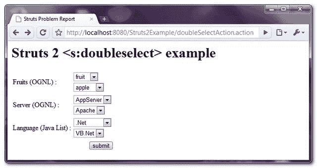
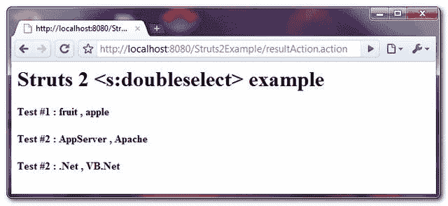

> 原文：<http://web.archive.org/web/20230101150211/http://www.mkyong.com/struts2/struts-2-sdoubleselect-example/>

# Struts 2 <doubleselect>示例</doubleselect>

Download It – [Struts2-Double-Select-Example.zip](http://web.archive.org/web/20190304032357/http://www.mkyong.com/wp-content/uploads/2010/06/Struts2-Double-Select-Example.zip)

在 Struts 2 中， **< s:doubleselect >** 标签用于创建两个 HTML 下拉框，一旦第一个下拉列表被选中，第二个下拉列表就会相应地改变。一个非常经典的例子是“**国家**”和“**州**”下拉选择，其中不同的“**州**”列表都取决于所选的“**国家**”。

**A < s:doubleselect >标签**

```java
 <s:doubleselect label="Fruits (OGNL) " 
name="fruit1" list="{'fruit','meat'}" 
doubleName="fruit2" 
doubleList="top == 'fruit' ? {'apple', 'orange','banana'} : {'chicken', 'pig'}" /> 
```

产生以下 HTML 代码…

```java
 <tr> 
<td class="tdLabel">
  <label for="resultAction_fruit1" class="label">
     Fruits (OGNL) :
  </label>
</td> 
<td> 
<select name="fruit1" id="resultAction_fruit1" 
    onchange="resultAction_fruit1Redirect(this.options.selectedIndex)"> 
    <option value="fruit">fruit</option> 
    <option value="meat">meat</option> 
</select> 
<br /> 
<select name="fruit2" id="resultAction_fruit2"> 
</select> 
<script type="text/javascript"> 
    var resultAction_fruit1Group = new Array(2 + 0);
    for (i = 0; i < (2 + 0); i++)
    resultAction_fruit1Group[i] = new Array();

    resultAction_fruit1Group[0][0] = new Option("apple", "apple");

    resultAction_fruit1Group[0][1] = new Option("orange", "orange");

    resultAction_fruit1Group[0][2] = new Option("banana", "banana");

    resultAction_fruit1Group[1][0] = new Option("chicken", "chicken");

    resultAction_fruit1Group[1][1] = new Option("pig", "pig");

    var resultAction_fruit1Temp = document.resultAction.resultAction_fruit2;
    resultAction_fruit1Redirect(0);
    function resultAction_fruit1Redirect(x) {
    	var selected = false;
        for (m = resultAction_fruit1Temp.options.length - 1; m >= 0; m--) {
            resultAction_fruit1Temp.options[m] = null;
        }

        for (i = 0; i < resultAction_fruit1Group[x].length; i++) {
            resultAction_fruit1Temp.options[i] = 
	     new Option(
              resultAction_fruit1Group[x][i].text, resultAction_fruit1Group[x][i].value
             );
         }

        if ((resultAction_fruit1Temp.options.length > 0) && (! selected)) {
           	resultAction_fruit1Temp.options[0].selected = true;
        }
    }
</script>   
</td> 
</tr> 
```

嗯， **< s:doubleselect >** 标签确实是生成了很多代码。它将创建两个下拉列表，许多 JavaScript 的代码来完成后面的魔术(第一次选择，第二次更改)，并且还为第一个下拉框附加了一个“ **onchange()** ”行为。

**Look complicated, but simple!**
It’s just two **<s:select>** tags combine in a single tag, see clearly again.

```java
 <s:doubleselect
name="" list="" 
doubleName="" doubleList="" /> 
```

“**名称**”和“**列表**是指第一个下拉列表；“**双重名称**”和“**双重列表**是指第二个下拉列表。数据填充同“ **[< s:选择>](http://web.archive.org/web/20190304032357/http://www.mkyong.com/struts2/struts-2-sselect-drop-down-box-example/)** ”标签。

## struts 2**<s:double select>**示例

一个完整的 **< s:doubleselect >** 标签的例子，展示了使用 OGNL 或 Java 列表来填充下拉列表中的数据。

 <ins class="adsbygoogle" style="display:block; text-align:center;" data-ad-format="fluid" data-ad-layout="in-article" data-ad-client="ca-pub-2836379775501347" data-ad-slot="6894224149">## 1.行动

操作类来生成和保存两个下拉列表。
**DoubleSelectAction.java**

```java
 package com.mkyong.common.action;

import java.util.ArrayList;
import java.util.Arrays;
import java.util.HashMap;
import java.util.Map;
import java.util.Set;

import com.opensymphony.xwork2.ActionSupport;

public class DoubleSelectAction extends ActionSupport{

	private String fruit1;
	private String fruit2;

	private String server1;
	private String server2;

	private String language1;
	private String language2;

	Map languageMap;

	public String getFruit1() {
		return fruit1;
	}

	public void setFruit1(String fruit1) {
		this.fruit1 = fruit1;
	}

	public String getFruit2() {
		return fruit2;
	}

	public void setFruit2(String fruit2) {
		this.fruit2 = fruit2;
	}

	public String getServer1() {
		return server1;
	}

	public void setServer1(String server1) {
		this.server1 = server1;
	}

	public String getServer2() {
		return server2;
	}

	public void setServer2(String server2) {
		this.server2 = server2;
	}

	public String getLanguage1() {
		return language1;
	}

	public void setLanguage1(String language1) {
		this.language1 = language1;
	}

	public String getLanguage2() {
		return language2;
	}

	public void setLanguage2(String language2) {
		this.language2 = language2;
	}

	public Map getLanguageMap() {
		return languageMap;
	}

	public void setLanguageMap(Map languageMap) {
		this.languageMap = languageMap;
	}

	public DoubleSelectAction(){
	  languageMap =new HashMap();		

          languageMap.put("Java", 
            new ArrayList<String>(Arrays.asList("Spring", "Hibernate", "Struts 2")));
          languageMap.put(".Net", new ArrayList<String>(Arrays.asList("VB.Net", "C#")));
          languageMap.put("JavaScript", new ArrayList<String>(Arrays.asList("jQuery")));
	}

	public String execute() {
		return SUCCESS;
	}

	public String display() {
		return NONE;
	}

} 
```

 <ins class="adsbygoogle" style="display:block" data-ad-client="ca-pub-2836379775501347" data-ad-slot="8821506761" data-ad-format="auto" data-ad-region="mkyongregion">## 2.结果页面

通过“ **< s:doubleselect >** ”标签呈现两个下拉框，通过 Java list 和 OGNL list 填充列表

**doubleselect.jsp**

```java
 <%@ taglib prefix="s" uri="/struts-tags" %>
<html>
<head>
</head>

<body>
<h1>Struts 2 <s:doubleselect> example</h1>

<s:form action="resultAction" namespace="/">

<s:doubleselect label="Fruits (OGNL) " 
name="fruit1" list="{'fruit','meat'}" 
doubleName="fruit2" 
doubleList="top == 'fruit' ? {'apple', 'orange','banana'} : {'chicken', 'pig'}" />

<s:set name="serverList" 
     value="#{
         'AppServer': {'Apache', 'Tomcat', 'JBoss'},
         'Database': {'Oracle', 'MySQL'}
         }" />
<s:doubleselect label="Server (OGNL) " 
name="server1" list="#serverList.keySet()" 
doubleName="server2" doubleList="#serverList[top]" />

<s:doubleselect label="Language (Java List) " 
name="language1" list="languageMap.keySet()" 
doubleName="language2" doubleList="languageMap.get(top)" />

<s:submit value="submit" name="submit" />

</s:form>

</body>
</html> 
```

**result.jsp**

```java
 <%@ taglib prefix="s" uri="/struts-tags" %>
<html>

<body>
<h1>Struts 2 <s:doubleselect> example</h1>

<h2>
  Test #1 : <s:property value="fruit1"/> , <s:property value="fruit2"/>
</h2> 

<h2>
  Test #2 : <s:property value="server1"/> , <s:property value="server2"/>
</h2> 

<h2>
  Test #2 : <s:property value="language1"/> , <s:property value="language2"/>
</h2> 

</body>
</html> 
```

## 3.struts.xml

链接在一起~

```java
 <?xml version="1.0" encoding="UTF-8" ?>
<!DOCTYPE struts PUBLIC
"-//Apache Software Foundation//DTD Struts Configuration 2.0//EN"
"http://struts.apache.org/dtds/struts-2.0.dtd">

<struts>

 <constant name="struts.devMode" value="true" />

<package name="default" namespace="/" extends="struts-default">

   <action name="doubleSelectAction" 
         class="com.mkyong.common.action.DoubleSelectAction" method="display">
	<result name="none">pages/doubleselect.jsp</result>
   </action>

   <action name="resultAction" class="com.mkyong.common.action.DoubleSelectAction">
	<result name="success">pages/result.jsp</result>
   </action>
  </package>

</struts> 
```

## 5.演示

*http://localhost:8080/struts 2 example/doubleselectaction . action*



*http://localhost:8080/struts 2 example/result action . action*



## 参考

1.  [Struts 2 双击文档](http://web.archive.org/web/20190304032357/http://struts.apache.org/2.1.8/docs/doubleselect.html)
2.  [支柱 2 < s:选择>示例](http://web.archive.org/web/20190304032357/http://www.mkyong.com/struts2/struts-2-sselect-drop-down-box-example/)
3.  [http://chuanliang2007.spaces.live.com/blog/cns!E5B7AB2851A4C9D2！393 .条目](http://web.archive.org/web/20190304032357/http://chuanliang2007.spaces.live.com/blog/cns!E5B7AB2851A4C9D2!393.entry)

[dropdown](http://web.archive.org/web/20190304032357/http://www.mkyong.com/tag/dropdown/) [struts2](http://web.archive.org/web/20190304032357/http://www.mkyong.com/tag/struts2/)


