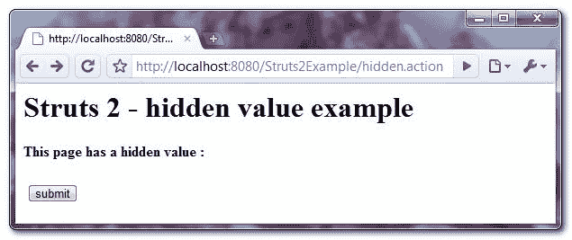
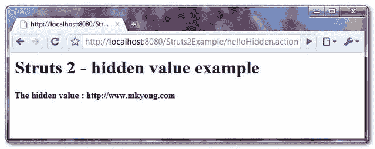

# Struts 2 <hidden>隐藏值示例</hidden>

> 原文：<http://web.archive.org/web/20230101150211/http://www.mkyong.com/struts2/struts-2-shidden-hidden-value-example/>

Download It – [Struts2-Hidden-Example.zip](http://web.archive.org/web/20190304030906/http://www.mkyong.com/wp-content/uploads/2010/06/Struts2-Hidden-Example.zip)

在 Struts 2 中，你可以使用 **< s:hidden >** 标签来创建一个 HTML 隐藏字段。

```java
 <s:hidden name="url" value="http://www.mkyong.com" /> 
```

它将呈现为以下 HTML 代码。

```java
 <input type="hidden" name="url" value="http://www.mkyong.com" /> 
```

## Struts 2 <hidden>示例</hidden>

带有 url 隐藏值的页面，并在表单提交后显示隐藏值。

 <ins class="adsbygoogle" style="display:block; text-align:center;" data-ad-format="fluid" data-ad-layout="in-article" data-ad-client="ca-pub-2836379775501347" data-ad-slot="6894224149">## 1.行动

**HiddenAction.java**

```java
 package com.mkyong.common.action;

import com.opensymphony.xwork2.ActionSupport;

public class HiddenAction extends ActionSupport{

	private String url;

	public String getUrl() {
		return url;
	}

	public void setUrl(String url) {
		this.url = url;
	}

	public String execute() {
		return SUCCESS;
	}

} 
```

 <ins class="adsbygoogle" style="display:block" data-ad-client="ca-pub-2836379775501347" data-ad-slot="8821506761" data-ad-format="auto" data-ad-region="mkyongregion">## 2.查看页面

Struts 2 " **s:hidden** "标记创建一个隐藏的值字段。

**hidden.jsp**

```java
 <%@ taglib prefix="s" uri="/struts-tags" %>
<html>
<head>
</head>

<body>
<h1>Struts 2 - hidden value example</h1>

<s:form action="helloHidden" namespace="/">

	<h2>This page has a hidden value (view source): 
	<s:hidden name="url" value="http://www.mkyong.com" /></h2> 

	<s:submit value="submit" name="submit" />

</s:form>

</body>
</html> 
```

**welcome.jsp**

```java
 <%@ page contentType="text/html;charset=UTF-8" %>
<%@ taglib prefix="s" uri="/struts-tags" %>
<html>

<body>
<h1>Struts 2 - hidden value example</h1>

<h2>
  The hidden value :
  <s:property value="url"/>
</h2> 

</body>
</html> 
```

## 3.struts.xml

链接在一起~

```java
 <?xml version="1.0" encoding="UTF-8" ?>
<!DOCTYPE struts PUBLIC
"-//Apache Software Foundation//DTD Struts Configuration 2.0//EN"
"http://struts.apache.org/dtds/struts-2.0.dtd">

<struts>

   <constant name="struts.devMode" value="true" />

   <package name="" namespace="/" extends="struts-default">
	<action name="hidden">
		<result>pages/hidden.jsp</result>
	</action>
	<action name="helloHidden" class="com.mkyong.common.action.HiddenAction">
		<result name="success">pages/welcome.jsp</result>
	</action>
   </package>

</struts> 
```

## 4.演示

*http://localhost:8080/struts 2 example/hidden . action*



## 参考

1.  [Struts 2 隐藏字段文档](http://web.archive.org/web/20190304030906/http://struts.apache.org/2.x/docs/hidden.html)

[hidden value](http://web.archive.org/web/20190304030906/http://www.mkyong.com/tag/hidden-value/) [struts2](http://web.archive.org/web/20190304030906/http://www.mkyong.com/tag/struts2/)


