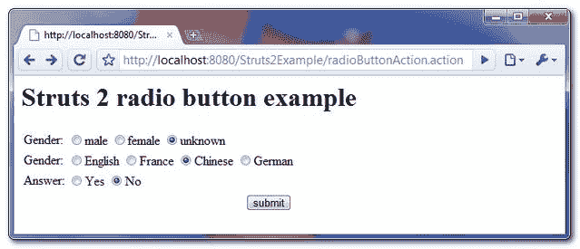
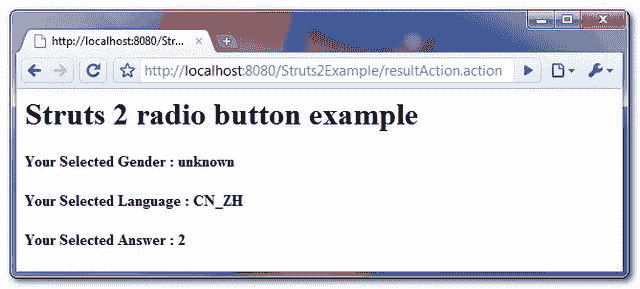

> 原文：<http://web.archive.org/web/20230101150211/http://www.mkyong.com/struts2/struts-2-sradio-radio-button-example/>

# Struts 2 <radio>单选按钮示例</radio>

Download It – [Struts2-Radio-Button-Example.zip](http://web.archive.org/web/20190305234436/http://www.mkyong.com/wp-content/uploads/2010/06/Struts2-Radio-Button-Example.zip)

在 Struts 2 中，可以使用 **< s:radio >** 标签创建一个 HTML 单选按钮。有趣的是，有很多方法可以将数据填充到单选按钮中，通过**列表、OGNL 或对象**。看看下面的例子就知道怎么做了。

## Struts 2 <radio>示例</radio>

这个例子展示了如何使用列表、OGNL 和对象向通过 Struts 2 <radio>标签创建的单选按钮填充数据。</radio>

 <ins class="adsbygoogle" style="display:block; text-align:center;" data-ad-format="fluid" data-ad-layout="in-article" data-ad-client="ca-pub-2836379775501347" data-ad-slot="6894224149">## 1.行动

为单选按钮创建性别和语言值列表的操作类。

**RadioButtonAction.java**

```java
 package com.mkyong.common.action;

import java.util.ArrayList;
import java.util.List;

import com.mkyong.common.model.Language;
import com.opensymphony.xwork2.ActionSupport;

public class RadioButtonAction extends ActionSupport{

	private List<String> genders;
	private List<Language> languages ;

	private String yourGender;
	private String yourAnswer;
	private String yourLanguage;

	private static final String MALE = "male";
	private static final String FEMALE = "female";
	private static final String UNKNOWN = "unknown";

	public RadioButtonAction(){

		genders = new ArrayList<String>();
		genders.add(MALE);
		genders.add(FEMALE);
		genders.add(UNKNOWN);

		languages = new ArrayList<Language>();
		languages.add( new Language("EN", "English") );
		languages.add( new Language("FR", "France") );
		languages.add( new Language("CN_ZH", "Chinese") );
		languages.add( new Language("DE", "German") );

	}

	//return default gender value
	public String getDefaultGenderValue(){
		return UNKNOWN;
	}

	//return default language value
	public String getDefaultLanguageValue(){
		return "CN_ZH";
	}

	public String execute() {
		return SUCCESS;
	}
	public String display() {
		return NONE;
	}

	//getter ad setter methods
} 
```

**Language.java**

```java
 package com.mkyong.common.model;

public class Language{

	private String languageCode;
	private String languageDisplay;

	//getter and setter methods

	public Language(String languageCode, String languageDisplay) {
		this.languageCode = languageCode;
		this.languageDisplay = languageDisplay;
	}
} 
```

 <ins class="adsbygoogle" style="display:block" data-ad-client="ca-pub-2836379775501347" data-ad-slot="8821506761" data-ad-format="auto" data-ad-region="mkyongregion">## 2.结果页面

使用 Struts 2 " **s:radio** "通过列表、OGNL 和对象创建三个单选按钮的结果页。

**radiobutton.jsp**

```java
 <%@ taglib prefix="s" uri="/struts-tags" %>
<html>
<head>
</head>

<body>
<h1>Struts 2 radio button example</h1>

<s:form action="resultAction" namespace="/">

<h2>
  <s:radio label="Gender" name="yourGender" list="genders" value="defaultGenderValue" />
  <s:radio label="Gender" name="yourLanguage" list="languages" 
      listKey="languageCode" listValue="languageDisplay" value="defaultLanguageValue" />
  <s:radio label="Answer" name="yourAnswer" list="#{'1':'Yes','2':'No'}" value="2" />
</h2> 

<s:submit value="submit" name="submit" />

</s:form>

</body>
</html>a 
```

**result.jsp**

```java
 <%@ taglib prefix="s" uri="/struts-tags" %>
<html>

<body>
<h1>Struts 2 radio button example</h1>

<h2>
  Your Selected Gender : <s:property value="yourGender"/>
</h2> 
<h2>
  Your Selected Language : <s:property value="yourLanguage"/>
</h2> 
<h2>
  Your Selected Answer : <s:property value="yourAnswer"/>
</h2> 

</body>
</html> 
```

## 3.struts.xml

链接在一起~

```java
 <?xml version="1.0" encoding="UTF-8" ?>
<!DOCTYPE struts PUBLIC
"-//Apache Software Foundation//DTD Struts Configuration 2.0//EN"
"http://struts.apache.org/dtds/struts-2.0.dtd">

<struts>

<constant name="struts.devMode" value="true" />

  <package name="" namespace="/" extends="struts-default">

    <action name="radioButtonAction" 
         class="com.mkyong.common.action.RadioButtonAction" method="display">
		<result name="none">pages/radiobutton.jsp</result>
    </action>

    <action name="resultAction" class="com.mkyong.common.action.RadioButtonAction">
		<result name="success">pages/result.jsp</result>
    </action>
  </package>

</struts> 
```

## 5.演示

*http://localhost:8080/struts 2 example/radio button action . action*



*http://localhost:8080/struts 2 example/result action . action*

To understand how to preselect a value, read this article – [preselect a radio button value in Struts 2](http://web.archive.org/web/20190305234436/http://www.mkyong.com/struts2/how-to-preselect-a-radio-button-value-in-struts-2/)

## 参考

1.  [http://struts.apache.org/2.0.11.2/docs/radio.html](http://web.archive.org/web/20190305234436/http://struts.apache.org/2.0.11.2/docs/radio.html)
2.  [http://struts . Apache . org/2 . 1 . 8 . 1/docs/struts-2-form-tags . html](http://web.archive.org/web/20190305234436/http://struts.apache.org/2.1.8.1/docs/struts-2-form-tags.html)
3.  [如何在 Struts 2 中预选单选按钮值](http://web.archive.org/web/20190305234436/http://www.mkyong.com/struts2/how-to-preselect-a-radio-button-value-in-struts-2/)

[radio button](http://web.archive.org/web/20190305234436/http://www.mkyong.com/tag/radio-button/) [struts2](http://web.archive.org/web/20190305234436/http://www.mkyong.com/tag/struts2/)


