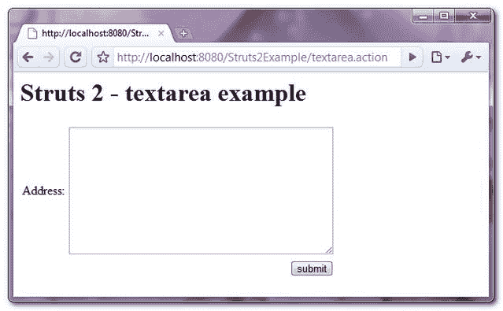

# Struts 2 <textarea>textarea 示例</textarea>

> 原文：<http://web.archive.org/web/20230101150211/http://www.mkyong.com/struts2/struts-2-stextarea-textarea-example/>

Download It – [Struts2-TextArea–Example.zip](http://web.archive.org/web/20190222143654/http://www.mkyong.com/wp-content/uploads/2010/06/Struts2-TextArea-Example.zip)

在 Struts 2 中，你可以使用 **< s:textarea >** 来创建一个 HTML textarea 字段。

```java
 <s:textarea label="Address" name="address" cols="40" rows="10"/> 
```

它将呈现为以下 HTML 代码。

```java
 <textarea name="address" cols="40" rows="10" id="formaction_address"></textarea> 
```

## Struts 2 <textarea>示例</textarea>

一个页面包含一个地址文本区字段，并在表单提交后显示文本区值。

 <ins class="adsbygoogle" style="display:block; text-align:center;" data-ad-format="fluid" data-ad-layout="in-article" data-ad-client="ca-pub-2836379775501347" data-ad-slot="6894224149">## 1.行动

**TextAreaAction.java**

```java
 package com.mkyong.common.action;

import com.opensymphony.xwork2.ActionSupport;

public class TextAreaAction extends ActionSupport{

	private String address;

	public String getAddress() {
		return address;
	}

	public void setAddress(String address) {
		this.address = address;
	}

	public String execute() {
		return SUCCESS;
	}

} 
```

 <ins class="adsbygoogle" style="display:block" data-ad-client="ca-pub-2836379775501347" data-ad-slot="8821506761" data-ad-format="auto" data-ad-region="mkyongregion">## 2.查看页面

Struts 2 " **s:textarea** "标记来创建一个 textarea 字段。

**textarea.jsp**

```java
 <%@ taglib prefix="s" uri="/struts-tags" %>
<html>
<head>
</head>

<body>
<h1>Struts 2 - textarea example</h1>

<s:form action="helloTextarea" namespace="/">

<h2>
  <s:textarea label="Address" name="address" cols="40" rows="10"/>
</h2> 

<s:submit value="submit" name="submit" />

</s:form>

</body>
</html> 
```

**welcome.jsp**

```java
 <%@ taglib prefix="s" uri="/struts-tags" %>
<html>

<body>
<h1>Struts 2 - textarea example</h1>

<h2>
  <s:property value="address"/>
</h2> 

</body>
</html> 
```

## 3.struts.xml

链接在一起~

```java
 <?xml version="1.0" encoding="UTF-8" ?>
<!DOCTYPE struts PUBLIC
"-//Apache Software Foundation//DTD Struts Configuration 2.0//EN"
"http://struts.apache.org/dtds/struts-2.0.dtd">

<struts>

 <constant name="struts.devMode" value="true" />

 <package name="" namespace="/" extends="struts-default">
	<action name="textarea">
	      <result>pages/textarea.jsp</result>
	</action>
	<action name="helloTextarea" 
              class="com.mkyong.common.action.TextAreaAction">
	      <result name="success">pages/welcome.jsp</result>
	</action>
  </package>

</struts> 
```

## 4.演示

*http://localhost:8080/struts 2 example/textarea . action*



## 参考

1.  [Struts 2 文本区文档](http://web.archive.org/web/20190222143654/http://struts.apache.org/2.x/docs/textarea.html)

[struts2](http://web.archive.org/web/20190222143654/http://www.mkyong.com/tag/struts2/) [textarea](http://web.archive.org/web/20190222143654/http://www.mkyong.com/tag/textarea/)


