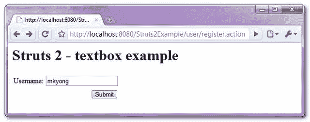
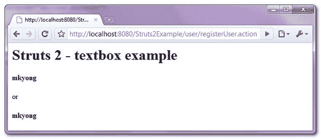

# Struts 2 <textfield>文本框示例</textfield>

> 原文：<http://web.archive.org/web/20230101150211/http://www.mkyong.com/struts2/struts-2-stextfield-textbox-example/>

Download It – [Struts2-textbox-Example.zip](http://web.archive.org/web/20190304031753/http://www.mkyong.com/wp-content/uploads/2010/06/Struts2-textbox-Example.zip)

在 Struts 2 中，你可以使用 **< s:textfield >** 来创建一个 HTML 输入框。例如，您可以用一个键属性或标签和名称属性来声明“ **s:textfield** ”。

```java
 <s:textfield key="username" />
//or
<s:textfield label="Username" name="username" /> 
```

两者都生成相同的 HTML 输出(默认的 xhtml 主题)。

```java
 <td class="tdLabel">
  <label for="registerUser_username" class="label">Username:</label>
</td>
<td>
  <input type="text" name="username" value="" id="registerUser_username"/>
</td> 
```

In Struts 2, the “name” will maps to the JavaBean property automatically. In this case, on form submit, the textbox value with “name=’username'” will call the corresponds Action’s setUsername(String xx) to set the value.

## Struts 2 <textfield>示例</textfield>

在 Struts 2 中创建文本框输入字段的快速指南。

 <ins class="adsbygoogle" style="display:block; text-align:center;" data-ad-format="fluid" data-ad-layout="in-article" data-ad-client="ca-pub-2836379775501347" data-ad-slot="6894224149">## 1.属性文件

存储消息的两个属性文件。

**global.properties**

```java
 #Global messages
username = Username
submit = Submit 
```

**register action . properties**

```java
 #error message
username.required = Username is required 
```

 <ins class="adsbygoogle" style="display:block" data-ad-client="ca-pub-2836379775501347" data-ad-slot="8821506761" data-ad-format="auto" data-ad-region="mkyongregion">## 2.行动

一个简单的 Action 类，通过验证来确保用户名不为空，否则返回一个错误消息。

**RegisterAction.java**

```java
 package com.mkyong.user.action;

import com.opensymphony.xwork2.ActionSupport;

public class RegisterAction extends ActionSupport{

	private String username;

	public String getUsername() {
		return username;
	}

	public void setUsername(String username) {
		this.username = username;
	}

	//business logic
	public String execute() {

		return "SUCCESS";

	}

	//simple validation
	public void validate(){
		if("".equals(getUsername())){
			addFieldError("username", getText("username.required"));
		}
	}
} 
```

## 3.查看页面

使用 Struts 2 " **s:textfield** "创建 HTML 文本框输入字段的结果页面。

**register.jsp**

```java
 <%@ taglib prefix="s" uri="/struts-tags" %>
<html>
<head>
</head>

<body>
<h1>Struts 2 - textbox example</h1>

<s:form action="registerUser" namespace="/user">

	<s:textfield key="username" />
	<s:submit key="submit" name="submit" />

</s:form>

</body>
</html> 
```

**welcome.jsp**

```java
 <%@ page contentType="text/html;charset=UTF-8" %>
<%@ taglib prefix="s" uri="/struts-tags" %>
<html>

<body>
<h1>Struts 2 - textbox example</h1>

<h2><s:property value="username"/></h2>
or
<h2><s:property value="%{username}"/></h2> 

</body>
</html> 
```

## 4.struts.xml

链接在一起~

```java
 <?xml version="1.0" encoding="UTF-8" ?>
<!DOCTYPE struts PUBLIC
"-//Apache Software Foundation//DTD Struts Configuration 2.0//EN"
"http://struts.apache.org/dtds/struts-2.0.dtd">

<struts>

   <constant name="struts.custom.i18n.resources" value="global" />
   <constant name="struts.devMode" value="true" />

   <package name="user" namespace="/user" extends="struts-default">
	<action name="register">
		<result>pages/register.jsp</result>
	</action>
	<action name="registerUser" 
                class="com.mkyong.user.action.RegisterAction">
		<result name="SUCCESS">pages/welcome.jsp</result>
		<result name="input">pages/register.jsp</result>
	</action>
   </package>

</struts> 
```

## 5.演示

*http://localhost:8080/struts 2 example/user/register . action*



## 参考

1.  [Struts 2 文本字段文档](http://web.archive.org/web/20190304031753/http://struts.apache.org/2.x/docs/textfield.html)

[struts2](http://web.archive.org/web/20190304031753/http://www.mkyong.com/tag/struts2/) [textbox](http://web.archive.org/web/20190304031753/http://www.mkyong.com/tag/textbox/)


