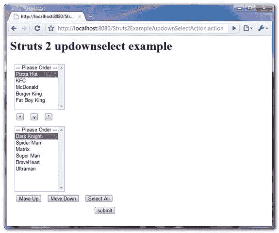
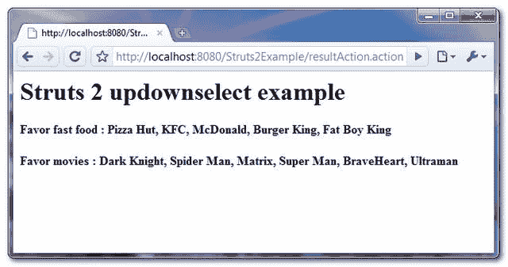

# struts 2 up down 选择示例

> 原文：<http://web.archive.org/web/20230101150211/http://www.mkyong.com/struts2/struts-2-updownselect-example/>

Download It – [Struts2-UpDownSelect-Example.zip](http://web.archive.org/web/20190304032252/http://www.mkyong.com/wp-content/uploads/2010/06/Struts2-UpDownSelect-Example.zip)

在 Struts 2 中， **< s:updownselect >** 标签用于创建一个 HTML 选择组件，并带有按钮来上下移动选择组件中的选项。提交表单时，所有选择选项将按排列顺序提交。

**< s:updownselect >示例**

```java
 <s:updownselect
list="#{'KFC':'KFC', 'McDonald':'McDonald', 'Burger King':'Burger King',
'Pizza Hut':'Pizza Hut', 'Fat Boy King':'Fat Boy King'}"
name="favFastFood"
headerKey="-1"
headerValue="--- Please Order ---" 
size="7"
/> 
```

产生下面的 HTML 代码，选择组件，按钮和 JavaScript 来上下移动选择组件中的选项。(默认 xhtml 主题)

```java
 <tr> 
<td class="tdLabel"></td> 
<td><script type="text/javascript" src="/Struts2Example/struts/optiontransferselect.js">
</script> 
<table> 
<tr><td> 
<select name="favFastFood" size="7" 
id="resultAction_favFastFood" multiple="multiple"> 
    <option value="-1">--- Please Order ---</option> 
    <option value="KFC">KFC</option> 
    <option value="McDonald">McDonald</option> 
    <option value="Burger King">Burger King</option> 
    <option value="Pizza Hut">Pizza Hut</option> 
    <option value="Fat Boy King">Fat Boy King</option> 
</select> 
<input type="hidden" id="__multiselect_resultAction_favFastFood" 
name="__multiselect_favFastFood" value="" /> 
</td></tr> 
<tr><td> 
 <input type="button" value="^" onclick="
moveOptionUp(document.getElementById('resultAction_favFastFood'), 'key', '-1');" />

 <input type="button" value="v" onclick="
moveOptionDown(document.getElementById('resultAction_favFastFood'), 'key', '-1');" />

 <input type="button" value="*" onclick="selectAllOptionsExceptSome(
document.getElementById('resultAction_favFastFood'), 'key', '-1');" />
</td></tr> 
</table></td> 
</tr> 
<script type="text/javascript"> 

var containingForm = document.getElementById("resultAction");
StrutsUtils.addEventListener(containingForm, "submit", 
   function(evt) {
     var updownselectObj = document.getElementById("resultAction_favFastFood");
     selectAllOptionsExceptSome(updownselectObj, "key", "-1");
   }, true);
</script> 
```

## Struts 2 <updownselect>示例</updownselect>

**< s:updownselect >** 标签的完整示例，展示了如何使用 OGNL 和 Java 列表将数据填充到 updown 选择列表中。

 ## 1.动作类

操作类来生成和存储选择选项。

**UpDownSelectAction.java**

```java
 package com.mkyong.common.action;

import java.util.ArrayList;
import java.util.List;

import com.opensymphony.xwork2.ActionSupport;

public class UpDownSelectAction extends ActionSupport{

	private List<String> moviesList = new ArrayList<String>();

	private String favMovie;
	private String favFastFood;

	public UpDownSelectAction(){

		moviesList.add("Spider Man");
		moviesList.add("Matrix");
		moviesList.add("Super Man");
		moviesList.add("Dark Knight");
		moviesList.add("BraveHeart");
		moviesList.add("Ultraman");

	}

	public String getFavFastFood() {
		return favFastFood;
	}

	public void setFavFastFood(String favFastFood) {
		this.favFastFood = favFastFood;
	}

	public List<String> getMoviesList() {
		return moviesList;
	}

	public void setMoviesList(List<String> moviesList) {
		this.moviesList = moviesList;
	}

	public String getFavMovie() {
		return favMovie;
	}

	public void setFavMovie(String favMovie) {
		this.favMovie = favMovie;
	}

	public String execute() throws Exception{

		return SUCCESS;
	}

	public String display() {
		return NONE;
	}

} 
```

 ## 2.结果页面

通过“ **< s:updownselect >** ”标签渲染 updown select 组件。

**updownselect.jsp**

```java
 <%@ taglib prefix="s" uri="/struts-tags" %>
<html>
<head>
<s:head />
</head>

<body>
<h1>Struts 2 updownselect example</h1>

<s:form action="resultAction" namespace="/" method="POST" >

<s:updownselect
list="#{'KFC':'KFC', 'McDonald':'McDonald', 'Burger King':'Burger King',
'Pizza Hut':'Pizza Hut', 'Fat Boy King':'Fat Boy King'}"
name="favFastFood"
headerKey="-1"
headerValue="--- Please Order ---" 
size="7"
/>

<s:updownselect
list="moviesList"
name="favMovie"
headerKey="-1"
headerValue="--- Please Order ---"
size="10"
moveUpLabel="Move Up"
moveDownLabel="Move Down"
selectAllLabel="Select All" />

<s:submit value="submit" name="submit" />

</s:form>

</body>
</html> 
```

**result.jsp**

```java
 <%@ taglib prefix="s" uri="/struts-tags" %>
<html>

<body>
<h1>Struts 2 updownselect example</h1>

<h2>
   Favor fast food : <s:property value="favFastFood"/> 
</h2> 

<h2>
   Favor movies : <s:property value="favMovie"/> 
</h2> 

</body>
</html> 
```

## 3.struts.xml

全部链接起来~

```java
 <?xml version="1.0" encoding="UTF-8" ?>
<!DOCTYPE struts PUBLIC
"-//Apache Software Foundation//DTD Struts Configuration 2.0//EN"
"http://struts.apache.org/dtds/struts-2.0.dtd">

<struts>

    <constant name="struts.devMode" value="true" />

   <package name="default" namespace="/" extends="struts-default">

   <action name="updownSelectAction" 
       class="com.mkyong.common.action.UpDownSelectAction" method="display">
       <result name="none">pages/updownselect.jsp</result>
   </action>

   <action name="resultAction" class="com.mkyong.common.action.UpDownSelectAction" >
       <result name="success">pages/result.jsp</result>
   </action>
  </package>

</struts> 
```

## 4.演示

*http://localhost:8080/struts 2 example/updownselectaction . action*
选择选项并上下移动。



提交时，所有选项将按排列顺序提交。



## 参考

1.  [Struts 2 updownselect 示例](http://web.archive.org/web/20190304032252/http://struts.apache.org/2.0.14/docs/updownselect.html)
2.  [http://www . mkyong . com/struts 2/struts-2-sdoubleselect-example/](http://web.archive.org/web/20190304032252/http://www.mkyong.com/struts2/struts-2-sdoubleselect-example/)

[struts2](http://web.archive.org/web/20190304032252/http://www.mkyong.com/tag/struts2/)


