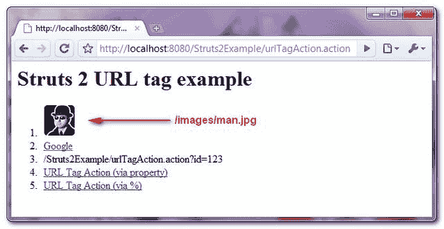

> 原文：<http://web.archive.org/web/20230101150211/http://www.mkyong.com/struts2/struts-2-url-tag-example/>

# Struts 2 URL 标记示例

Download It – [Struts2-URL-Tag-Example.zip](http://web.archive.org/web/20190307231639/http://www.mkyong.com/wp-content/uploads/2010/07/Struts2-URL-Tag-Example.zip)

Struts 2 " **url** "标签用于创建一个 url 并以文本格式输出。它本身从不工作，但它可以提供其他标签的 URL，如 **< s:a >** 创建超链接或 **< img >** 呈现图像。在本教程中，它展示了 Struts 2 " **url** 标签的 5 个常见用例。

## 1.行动

转发请求的操作类。

尖叫。java

```java
 package com.mkyong.common.action;

import com.opensymphony.xwork2.ActionSupport;

public class URLTagAction extends ActionSupport{

	public String execute() {
		return SUCCESS;
	}

} 
```

 <ins class="adsbygoogle" style="display:block; text-align:center;" data-ad-format="fluid" data-ad-layout="in-article" data-ad-client="ca-pub-2836379775501347" data-ad-slot="6894224149">## 2.Url 标记示例

下面的 5 个例子展示了 Struts 2 " **url** 标签的使用。

1.  Create an image url.

    ```java
     " /> 
    ```

    输出(假设根上下文名是“Struts2Example”)

    ```java
      
    ```

2.  Create a “Google” text and link it to http://www.google.com.

    ```java
     <a href="<s:url value="http://www.google.com"  />" target="_blank">Google</a> 
    ```

    输出

    ```java
     <a href="http://www.google.com" target="_blank">Google</a> 
    ```

    When you define the URL value with starting of “**http**” or “**www**” words, Struts 2 will render it as it is, without add the extra root context name as example 1.
3.  Create an Action URL with a “id” parameter, and output it as a text format.

    ```java
     <s:url action="urlTagAction.action" >
        <s:param name="id">123</s:param>
    </s:url> 
    ```

    输出

    ```java
     /Struts2Example/urlTagAction.action?id=123 
    ```

4.  Create an Action URL with a “name” parameter, and combine with **<s:a>** tag via **<s:property>**.

    ```java
     <s:url action="urlTagAction.action" var="urlTag" >
        <s:param name="name">mkyong</s:param>
    </s:url>
    <a href="<s:property value="#urlTag" />" >URL Tag Action (via property)</a> 
    ```

    输出

    ```java
     <a href="/Struts2Example/urlTagAction.action?name=mkyong" >URL Tag Action (via property)</a> 
    ```

5.  Create an Action URL with a “age” parameter, and combine with **<s:a>** tag via “**%{urlTag}**“.

    ```java
     <s:url action="urlTagAction.action" var="urlTag" >
        <s:param name="age">99</s:param>
    </s:url>
    <s:a href="%{urlTag}">URL Tag Action (via %)</s:a> 
    ```

    输出

    ```java
     <a href="/Struts2Example/urlTagAction.action?age=99">URL Tag Action (via %)</a> 
    ```

完整的 JSP 页面代码…

URL . JSP

```java
 <%@ taglib prefix="s" uri="/struts-tags" %>
 <html>
<head>
</head>

<body>
<h1>Struts 2 URL tag example</h1>

<ol>
<li>
" />
</li>

<li>
<a href="<s:url value="http://www.google.com"  />" target="_blank">Google</a>
</li>

<li>
<s:url action="urlTagAction.action" >
    <s:param name="id">123</s:param>
</s:url>
</li>

<li>
<s:url action="urlTagAction.action" var="urlTag" >
    <s:param name="name">mkyong</s:param>
</s:url>
<a href="<s:property value="#urlTag" />" >URL Tag Action (via property)</a>
</li>

<li>
<s:url action="urlTagAction.action" var="urlTag" >
    <s:param name="age">99</s:param>
</s:url>
<s:a href="%{urlTag}">URL Tag Action (via %)</s:a>
</li>

</ol>

</body>
</html> 
```

 <ins class="adsbygoogle" style="display:block" data-ad-client="ca-pub-2836379775501347" data-ad-slot="8821506761" data-ad-format="auto" data-ad-region="mkyongregion">## 3.struts.xml

链接一下~

```java
 <?xml version="1.0" encoding="UTF-8" ?>
<!DOCTYPE struts PUBLIC
"-//Apache Software Foundation//DTD Struts Configuration 2.0//EN"
"http://struts.apache.org/dtds/struts-2.0.dtd">

<struts>
    <constant name="struts.devMode" value="true" />
    <package name="default" namespace="/" extends="struts-default">

	<action name="urlTagAction" 
		class="com.mkyong.common.action.URLTagAction" >
		<result name="success">pages/url.jsp</result>
	</action>

    </package>		
</struts> 
```

## 4.演示

*http://localhost:8080/struts 2 example/urltagaction . action*

**输出**



## 参考

1.  [Struts 2 Url 标记文档](http://web.archive.org/web/20190307231639/http://struts.apache.org/2.0.14/docs/url.html)

[struts2](http://web.archive.org/web/20190307231639/http://www.mkyong.com/tag/struts2/) [url](http://web.archive.org/web/20190307231639/http://www.mkyong.com/tag/url/)


