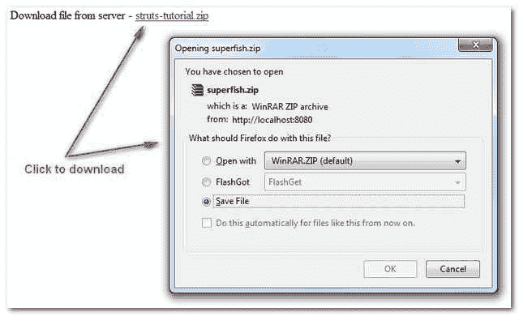

# struts–从网站下载文件示例

> 原文：<http://web.archive.org/web/20230101150211/http://www.mkyong.com/struts/struts-download-file-from-website-example/>

要让用户从您的 Struts web 项目下载文件，您必须通知" **HttpServletResponse** "返回一个应用程序文件，而不是普通的 HTML 页面。

```java
 response.setContentType("application/octet-stream");
response.setHeader("Content-Disposition",
"attachment;filename=downloadfilename.csv"); 
```

在服务器端，你可以从三种不同的方式获得下载文件

##### 1.文件系统

从文件系统获取

```java
 FileInputStream in = 
  new FileInputStream(new File("C:\\filename.zip")); 
```

##### 2.项目 web 路径

假设您的文件位于“**http://yourname.com/StrutsExample/upload/filename.zip**”，并且“**支撑示例**是您的项目名称(serlvet 上下文)。

```java
 //jndi:/yourname.com/StrutsExample/upload/filename.zip
URL url = getServlet().getServletContext().getResource("upload/filename.zip");
InputStream in = url.openStream(); 
```

##### 3.字节数组

如果您从数据库中检索文件或 blob 数据，它通常以字节数组的形式返回。

```java
 byte[] bytes = new byte[4096];
InputStream in = new ByteArrayInputStream(bytes); 
```

Download this Struts download file example – [Struts-Download-File-Example.zip](http://web.archive.org/web/20190214232809/http://www.mkyong.com/wp-content/uploads/2010/04/Struts-Download-File-Example.zip)

## 1.动作类

一个 action 类，返回一个应用程序文件而不是普通的 HTML 页面，并获得“superfish.zip”文件供用户下载。

```java
 package com.mkyong.common.action;

import java.io.ByteArrayInputStream;
import java.io.File;
import java.io.FileInputStream;
import java.io.InputStream;
import java.net.URL;

import javax.servlet.ServletContext;
import javax.servlet.ServletOutputStream;
import javax.servlet.http.HttpServletRequest;
import javax.servlet.http.HttpServletResponse;

import org.apache.struts.action.Action;
import org.apache.struts.action.ActionForm;
import org.apache.struts.action.ActionForward;
import org.apache.struts.action.ActionMapping;

public class DownloadFileAction extends Action{

   @Override
   public ActionForward execute(ActionMapping mapping, ActionForm form,
     HttpServletRequest request, HttpServletResponse response)
     throws Exception {

     //return an application file instead of html page
     response.setContentType("application/octet-stream");
     response.setHeader("Content-Disposition","attachment;filename=superfish.zip");

     try 
     {
       	//Get it from file system
       	FileInputStream in = 
      		new FileInputStream(new File("C:\\superfish.zip"));

        //Get it from web path
        //jndi:/localhost/StrutsExample/upload/superfish.zip
        //URL url = getServlet().getServletContext()
        //               .getResource("upload/superfish.zip");
        //InputStream in = url.openStream();

        //Get it from bytes array
        //byte[] bytes = new byte[4096];
        //InputStream in = new ByteArrayInputStream(bytes);

        ServletOutputStream out = response.getOutputStream();

        byte[] outputByte = new byte[4096];
        //copy binary content to output stream
        while(in.read(outputByte, 0, 4096) != -1){
        	out.write(outputByte, 0, 4096);
        }
        in.close();
        out.flush();
        out.close();

     }catch(Exception e){
    	e.printStackTrace();
   }

   return null;
  }
} 
```

 ## 2.JSP 页面

```java
<%@taglib uri="http://struts.apache.org/tags-html" prefix="html"%>

Download file from server - 
struts-tutorial.zip 

```

 ## 3.struts-config.xml

Struts 配置文件。

```java
 <?xml version="1.0" encoding="UTF-8"?>
<!DOCTYPE struts-config PUBLIC 
"-//Apache Software Foundation//DTD Struts Configuration 1.3//EN" 
"http://jakarta.apache.org/struts/dtds/struts-config_1_3.dtd">

<struts-config>

	<action-mappings>

		<action
			path="/DownloadPage"
			type="org.apache.struts.actions.ForwardAction"
			parameter="/pages/display.jsp"/>

		<action
			path="/DownloadIt"
			type="com.mkyong.common.action.DownloadFileAction"
			>
		</action>

	</action-mappings>

</struts-config> 
```

## 4.测试一下

**http://localhost:8080/struts example/download page . do**

[download file](http://web.archive.org/web/20190214232809/http://www.mkyong.com/tag/download-file/) [struts](http://web.archive.org/web/20190214232809/http://www.mkyong.com/tag/struts/)


