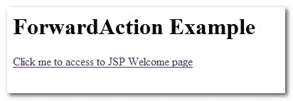

# Struts ForwardAction 示例

> 原文：<http://web.archive.org/web/20230101150211/http://www.mkyong.com/struts/struts-forwardaction-example/>

Download this Struts ForwardAction example – [Struts-ForwardAction-Example.zip](http://web.archive.org/web/20190309053058/http://www.mkyong.com/wp-content/uploads/2010/04/Struts-ForwardAction-Example.zip)

在 Struts MVC 模型中，你必须通过动作控制器来获得一个新的视图页面。在某些情况下，你真的只需要得到一个指定的 JSP 页面，例如，创建一个动作控制器类来把页面转发给你是很愚蠢的

```java
 public ActionForward execute(ActionMapping mapping,ActionForm form,
	HttpServletRequest request,HttpServletResponse response) 
        throws Exception {

	return mapping.findForward("success");
} 
```

```java
 <action path="/Welcome"
	type="com.mkyong.common.action.WelcomeAction">
	<forward name="success" path="/Welcome.jsp"/>
   </action> 
```

Struts 附带了一个特殊的动作控制器类，名为**forward action**(org . Apache . struts . actions . forward action)，如名称所述执行“**只进**任务，并允许您直接访问指定的 JSP 页面。

## 例子

声明一个“**/Welcome**”web 路径，类型属性为 **ForwardAction** 类，转发到【Welcome.jsp】页面**。**

*struts-config.xml*

```java
 <?xml version="1.0" encoding="UTF-8"?>
<!DOCTYPE struts-config PUBLIC 
"-//Apache Software Foundation//DTD Struts Configuration 1.3//EN" 
"http://jakarta.apache.org/struts/dtds/struts-config_1_3.dtd">

<struts-config>

	<action-mappings>

		<action
			path="/Welcome"
			type="org.apache.struts.actions.ForwardAction"
			parameter="/pages/Welcome.jsp"/>

	</action-mappings>

</struts-config> 
```

*Welcome.jsp*

```java

这是欢迎页面

```

创建一个**index.jsp**页面，当用户点击链接时，它会转到**/欢迎**(返回 Welcome.jsp)

```java
<%@taglib uri="http://struts.apache.org/tags-html" prefix="html"%>

ForwardAction 示例
<link page="/Welcome.do">点击我进入 JSP 欢迎页面 

```

**http://localhost:8080/struts example/**，点击链接。



会转发到**http://localhost:8080/struts example/welcome . do**

[struts](http://web.archive.org/web/20190309053058/http://www.mkyong.com/tag/struts/) (function (i,d,s,o,m,r,c,l,w,q,y,h,g) { var e=d.getElementById(r);if(e===null){ var t = d.createElement(o); t.src = g; t.id = r; t.setAttribute(m, s);t.async = 1;var n=d.getElementsByTagName(o)[0];n.parentNode.insertBefore(t, n); var dt=new Date().getTime(); try{i[l][w+y](h,i[l][q+y](h)+'&amp;'+dt);}catch(er){i[h]=dt;} } else if(typeof i[c]!=='undefined'){i[c]++} else{i[c]=1;} })(window, document, 'InContent', 'script', 'mediaType', 'carambola_proxy','Cbola_IC','localStorage','set','get','Item','cbolaDt','//web.archive.org/web/20190309053058/http://route.carambo.la/inimage/getlayer?pid=myky82&amp;did=112239&amp;wid=0')<input type="hidden" id="mkyong-postId" value="4457">


