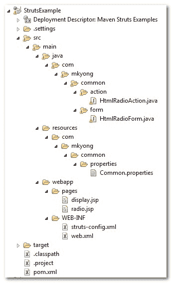
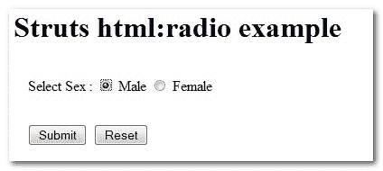

# Struts <radio>单选选项示例</radio>

> 原文：<http://web.archive.org/web/20230101150211/http://www.mkyong.com/struts/struts-htmlradio-radio-option-example/>

Download this Struts radio option example – [Struts-Radio-Example.zip](http://web.archive.org/web/20190224162133/http://www.mkyong.com/wp-content/uploads/2010/04/Struts-Radio-Example.zip)

在这个 Struts 示例中，您将学习如何使用 Struts <radio>标记创建 HTML 单选选项。</radio>

## 1.文件夹结构

这是 Maven 创建的最终项目结构。请创建相应的文件夹。

 <ins class="adsbygoogle" style="display:block; text-align:center;" data-ad-format="fluid" data-ad-layout="in-article" data-ad-client="ca-pub-2836379775501347" data-ad-slot="6894224149">## 2.动作类

创建一个 Action 类，除了转发请求什么也不做。

**HtmlRadioAction.java**

```java
 package com.mkyong.common.action;

import javax.servlet.http.HttpServletRequest;
import javax.servlet.http.HttpServletResponse;

import org.apache.struts.action.Action;
import org.apache.struts.action.ActionForm;
import org.apache.struts.action.ActionForward;
import org.apache.struts.action.ActionMapping;

import com.mkyong.common.form.HtmlRadioForm;

public class HtmlRadioAction extends Action{

	public ActionForward execute(ActionMapping mapping,ActionForm form,
			HttpServletRequest request,HttpServletResponse response) 
        throws Exception {

		HtmlRadioForm htmlRadioForm = (HtmlRadioForm)form;

		return mapping.findForward("success");
	}

} 
```

 <ins class="adsbygoogle" style="display:block" data-ad-client="ca-pub-2836379775501347" data-ad-slot="8821506761" data-ad-format="auto" data-ad-region="mkyongregion">## 3.属性文件

创建一个属性文件，并声明错误和标签消息。

**公共属性**

```java
 #error message
error.common.html.radio.required = Please select a radio option.

#label message
label.common.html.radio.name = Select Sex
label.common.html.radio.sex.male = Male
label.common.html.radio.sex.female = Female
label.common.html.radio.button.submit = Submit
label.common.html.radio.button.reset = Reset 
```

## 4.动作形式

创建一个 ActionForm，包含单选选项和表单验证的性别变量–validate()。

**HtmlRadioForm.java**

```java
 package com.mkyong.common.form;

import javax.servlet.http.HttpServletRequest;

import org.apache.struts.action.ActionErrors;
import org.apache.struts.action.ActionForm;
import org.apache.struts.action.ActionMapping;
import org.apache.struts.action.ActionMessage;

public class HtmlRadioForm extends ActionForm{

	String sex;

	public String getSex() {
		return sex;
	}

	public void setSex(String sex) {
		this.sex = sex;
	}

	@Override
	public ActionErrors validate(ActionMapping mapping,
		HttpServletRequest request) {

	    ActionErrors errors = new ActionErrors();

	    if( getSex() == null || ("".equals(getSex())))
	    {
	       errors.add("common.radio.err",
	    	  new ActionMessage("error.common.html.radio.required"));
	    }

	    return errors;
	}

	@Override
	public void reset(ActionMapping mapping, HttpServletRequest request) {
		// reset properties
		sex = "";
	}
} 
```

## 5.JSP 页面

使用 Struts 的 HTML 标签<radio>创建一个 HTML 单选按钮。</radio>

**radio.jsp**

```java
<%@taglib uri="http://struts.apache.org/tags-html" prefix="html"%>
<%@taglib uri="http://struts.apache.org/tags-bean" prefix="bean"%>

Struts html:单选示例

```

<form action="/Radio"><messages id="err_name" property="common.radio.err"></messages><message key="label.common.html.radio.name">:<radio property="sex" value="male"><message key="label.common.html.radio.sex.male"><radio property="sex" value="female"><message key="label.common.html.radio.sex.female"></message></radio></message></radio></message><submit><message key="label.common.html.radio.button.submit"></message></submit><reset><message key="label.common.html.radio.button.reset"></message></reset></form>

从 htmlRadioForm 表单中获取单选按钮值并显示它

**display.jsp**

```java
<%@taglib uri="http://struts.apache.org/tags-bean" prefix="bean"%>

您选择的值是:

```

## 6.struts-config.xml

创建一个 Struts 配置文件，并将它们链接在一起。

```java
 <?xml version="1.0" encoding="UTF-8"?>
<!DOCTYPE struts-config PUBLIC 
"-//Apache Software Foundation//DTD Struts Configuration 1.3//EN" 
"http://jakarta.apache.org/struts/dtds/struts-config_1_3.dtd">

<struts-config>

	<form-beans>
		<form-bean
			name="htmlRadioForm"
			type="com.mkyong.common.form.HtmlRadioForm"/>

	</form-beans>

	<action-mappings>

	        <action
			path="/RadioPage"
			type="org.apache.struts.actions.ForwardAction"
			parameter="/pages/radio.jsp"/>

		<action
			path="/Radio"
			type="com.mkyong.common.action.HtmlRadioAction"
			name="htmlRadioForm"
			validate="true"
			input="/pages/radio.jsp"
			>	

			<forward name="success" path="/pages/display.jsp"/>
		</action>
	</action-mappings>

	<message-resources
		parameter="com.mkyong.common.properties.Common" />

</struts-config> 
```

## 7.web.xml

最后一步，创建一个 web.xml 并集成 Struts 框架。

```java
 <!DOCTYPE web-app PUBLIC
 "-//Sun Microsystems, Inc.//DTD Web Application 2.3//EN"
 "http://java.sun.com/dtd/web-app_2_3.dtd" >

<web-app>
  <display-name>Maven Struts Examples</display-name>

  <servlet>
    <servlet-name>action</servlet-name>
    <servlet-class>
        org.apache.struts.action.ActionServlet
    </servlet-class>
    <init-param>
        <param-name>config</param-name>
        <param-value>
         /WEB-INF/struts-config.xml
        </param-value>
    </init-param>
    <load-on-startup>1</load-on-startup>
  </servlet>

  <servlet-mapping>
       <servlet-name>action</servlet-name>
       <url-pattern>*.do</url-pattern>
  </servlet-mapping>

</web-app> 
```

访问它

> http://localhost:8080/struts example/radio page . do



选择一个性别并按下提交按钮，它将转发到

> http://localhost:8080/struts example/radio . do

并显示选择单选选项。

[radio button](http://web.archive.org/web/20190224162133/http://www.mkyong.com/tag/radio-button/) [struts](http://web.archive.org/web/20190224162133/http://www.mkyong.com/tag/struts/)


