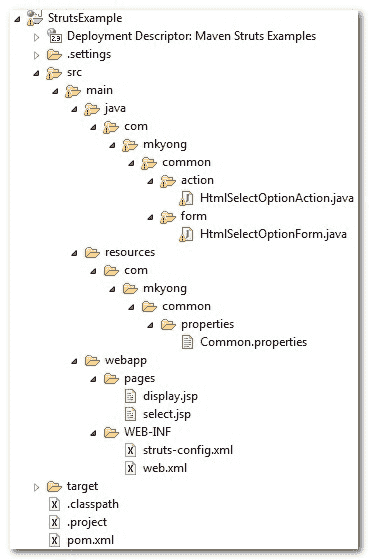
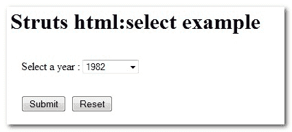

# Struts <select>下拉框示例</select>

> 原文：<http://web.archive.org/web/20230101150211/http://www.mkyong.com/struts/struts-htmlselect-drop-down-box-example/>

Download this Struts select option (drop down box) example – [Struts-Select-Option-Example.zip](http://web.archive.org/web/20190224154622/http://www.mkyong.com/wp-content/uploads/2010/04/Struts-Select-Option-Example.zip)

在这个 Struts 示例中，您将学习如何用 Struts `<select>`和`<option>`标签创建一个 HTML 选择选项(下拉框)。`<select>`标签用于创建一个选择列表(下拉列表)；而 select 元素中的`<option>`标签定义了列表中的可用选项。

## 1.文件夹结构

这是 Maven 创建的最终项目结构。请创建相应的文件夹。

 ## 2.动作类

创建一个 Action 类，除了转发请求什么也不做。

**html 选择选项 Action.java**

```java
 package com.mkyong.common.action;

import javax.servlet.http.HttpServletRequest;
import javax.servlet.http.HttpServletResponse;

import org.apache.struts.action.Action;
import org.apache.struts.action.ActionForm;
import org.apache.struts.action.ActionForward;
import org.apache.struts.action.ActionMapping;

import com.mkyong.common.form.HtmlSelectOptionForm;

public class HtmlSelectOptionAction extends Action{

	public ActionForward execute(ActionMapping mapping,ActionForm form,
			HttpServletRequest request,HttpServletResponse response) 
        throws Exception {

	  HtmlSelectOptionForm htmlSelectOptionForm = (HtmlSelectOptionForm)form;

	  return mapping.findForward("success");
	}

} 
```

 ## 3.属性文件

创建一个属性文件，并声明错误和标签消息。

**公共属性**

```java
 #error message
error.common.html.select.required = Please select a year.

#label message
label.common.html.select.name = Select a year 
label.common.html.select.button.submit = Submit
label.common.html.select.button.reset = Reset 
```

## 4.动作形式

创建一个 ActionForm，包含一个 year 变量来保存选择选项值。

**HtmlSelectOptionForm.java**

```java
 package com.mkyong.common.form;

import javax.servlet.http.HttpServletRequest;

import org.apache.struts.action.ActionErrors;
import org.apache.struts.action.ActionForm;
import org.apache.struts.action.ActionMapping;
import org.apache.struts.action.ActionMessage;

public class HtmlSelectOptionForm extends ActionForm{

	String year;

	public String getYear() {
		return year;
	}

	public void setYear(String year) {
		this.year = year;
	}

	@Override
	public ActionErrors validate(ActionMapping mapping,
	  HttpServletRequest request) {

	    ActionErrors errors = new ActionErrors();

	    if( getYear() == null || ("".equals(getYear())))
	    {
	       errors.add("common.select.err",
	    	 new ActionMessage("error.common.html.select.required"));
	    }

	    return errors;
	}

	@Override
	public void reset(ActionMapping mapping, HttpServletRequest request) {
		// reset properties
		year = "";
	}

} 
```

## 5.JSP 页面

使用 Struts 的 HTML 标签<select>和<option>创建一个 HTML 下拉列表。</option></select>

**select.jsp**

```java
<%@taglib uri="http://struts.apache.org/tags-html" prefix="html"%>
<%@taglib uri="http://struts.apache.org/tags-bean" prefix="bean"%>

Struts html:选择示例

```

<form action="/Select"><messages id="err_name" property="common.select.err"></messages><message key="label.common.html.select.name">: <select property="year"><option value="">-- None --</option> <option value="1980">1980</option> <option value="1981">1981</option> <option value="1982">1982</option> <option value="1983">1983</option> <option value="1984">1984</option> <option value="1985">1985</option></select></message><submit><message key="label.common.html.select.button.submit"></message></submit><reset><message key="label.common.html.select.button.reset"></message></reset></form>

从 htmlSelectOptionForm 表单中获取选定的下拉框值并显示它

**display.jsp**

```java
<%@taglib uri="http://struts.apache.org/tags-bean" prefix="bean"%>

您选择的年份是:

```

## 6.struts-config.xml

创建一个 Struts 配置文件，并将它们链接在一起。

```java
 <?xml version="1.0" encoding="UTF-8"?>
<!DOCTYPE struts-config PUBLIC 
"-//Apache Software Foundation//DTD Struts Configuration 1.3//EN" 
"http://jakarta.apache.org/struts/dtds/struts-config_1_3.dtd">

<struts-config>

	<form-beans>
		<form-bean
			name="htmlSelectOptionForm"
			type="com.mkyong.common.form.HtmlSelectOptionForm"/>

	</form-beans>

	<action-mappings>

	        <action
			path="/SelectPage"
			type="org.apache.struts.actions.ForwardAction"
			parameter="/pages/select.jsp"/>

		<action
			path="/Select"
			type="com.mkyong.common.action.HtmlSelectOptionAction"
			name="htmlSelectOptionForm"
			validate="true"
			input="/pages/select.jsp"
			>	

			<forward name="success" path="/pages/display.jsp"/>
		</action>
	</action-mappings>

	<message-resources
		parameter="com.mkyong.common.properties.Common" />

</struts-config> 
```

## 7.web.xml

最后一步，创建一个 web.xml 并集成 Struts 框架。

```java
 <!DOCTYPE web-app PUBLIC
 "-//Sun Microsystems, Inc.//DTD Web Application 2.3//EN"
 "http://java.sun.com/dtd/web-app_2_3.dtd" >

<web-app>
  <display-name>Maven Struts Examples</display-name>

  <servlet>
    <servlet-name>action</servlet-name>
    <servlet-class>
        org.apache.struts.action.ActionServlet
    </servlet-class>
    <init-param>
        <param-name>config</param-name>
        <param-value>
         /WEB-INF/struts-config.xml
        </param-value>
    </init-param>
    <load-on-startup>1</load-on-startup>
  </servlet>

  <servlet-mapping>
       <servlet-name>action</servlet-name>
       <url-pattern>*.do</url-pattern>
  </servlet-mapping>

</web-app> 
```

访问它

> http://localhost:8080/struts example/select page . do



选择一年并按下提交按钮，它将转发到

> http://localhost:8080/struts example/select . do

并显示选定的下拉框值。

[dropdown](http://web.archive.org/web/20190224154622/http://www.mkyong.com/tag/dropdown/) [struts](http://web.archive.org/web/20190224154622/http://www.mkyong.com/tag/struts/)


