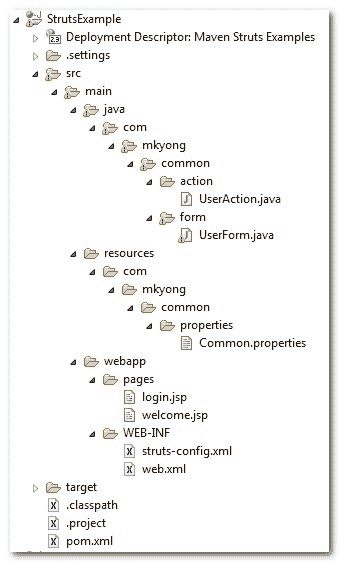
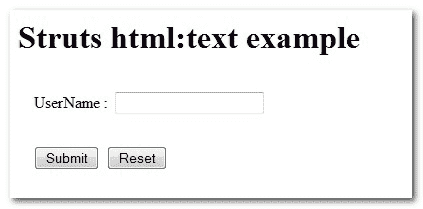
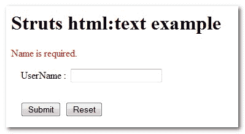
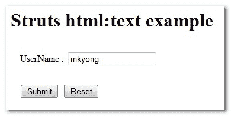

# Struts <text>文本框示例</text>

> 原文：<http://web.archive.org/web/20230101150211/http://www.mkyong.com/struts/struts-htmltext-textbox-example/>

Download this Struts text box example – [Struts-TextBox-Example.zip](http://web.archive.org/web/20190224160217/http://www.mkyong.com/wp-content/uploads/2010/04/Struts-TextBox-Example.zip)

在这个 Struts 示例中，您将学习如何使用 Struts **< html:text >** 标签创建 HTML 文本框输入字段，使用 **ActionForm** 验证文本框，使用 **ActionErrors** 显示错误消息，以及 JSP 页面中的消息资源。

## 1.文件夹结构

这是 Maven 创建的最终项目结构。请创建相应的文件夹。

 ## 2.动作类

创建一个 Action 类，除了转发请求什么也不做。

user action . Java

```java
 package com.mkyong.common.action;

import javax.servlet.http.HttpServletRequest;
import javax.servlet.http.HttpServletResponse;

import org.apache.struts.action.Action;
import org.apache.struts.action.ActionForm;
import org.apache.struts.action.ActionForward;
import org.apache.struts.action.ActionMapping;

public class UserAction extends Action{

	public ActionForward execute(ActionMapping mapping,ActionForm form,
		HttpServletRequest request,HttpServletResponse response) 
        throws Exception {

		return mapping.findForward("success");
	}

} 
```

 ## 3.属性文件

创建一个属性文件，并声明错误和标签消息。

**公共属性**

```java
 #common module error message
error.common.name.required = Name is required.

#common module label message
label.common.name = UserName
label.common.button.submit = Submit
label.common.button.reset = Reset 
```

## 4.动作形式

创建一个 ActionForm，接受一个用户名并在 validate()方法中验证它。如果用户名为空，从上面的属性文件中获取一条错误消息，并将其作为关键字“ **common.name.err** 添加到 ActionErrors 中，稍后将使用这个名称“ **common.name.err** 在 JSP 中显示错误消息。

**UserForm.java**

```java
 package com.mkyong.common.form;

import javax.servlet.http.HttpServletRequest;

import org.apache.struts.action.ActionErrors;
import org.apache.struts.action.ActionForm;
import org.apache.struts.action.ActionMapping;
import org.apache.struts.action.ActionMessage;

public class UserForm extends ActionForm{

	String username;

	public String getUsername() {
		return username;
	}

	public void setUsername(String username) {
		this.username = username;
	}

	@Override
	public ActionErrors validate(ActionMapping mapping,
	HttpServletRequest request) {

	   ActionErrors errors = new ActionErrors();

	    if( getUsername() == null || ("".equals(getUsername()))) {
	       errors.add("common.name.err",
                         new ActionMessage("error.common.name.required"));
	    }

	    return errors;
	}

	@Override
	public void reset(ActionMapping mapping, HttpServletRequest request) {
		// reset properties
		username = "";
	}

} 
```

## 5.JSP 页面

使用 Struts 的 html 标签 **< html:text >** 创建一个 HTML 文本框输入字段。标签消息在上述属性文件中声明，您可以直接通过**<bean:message key = " label _ name "/>**获取。

错误信息可以以两种方式显示:

1.  显示所有错误信息
2.  通过指定在 ActionErrors 中声明的错误消息键来显示指定的错误消息。

**login.jsp**

```java
<%@taglib uri="http://struts.apache.org/tags-html" prefix="html"%>
<%@taglib uri="http://struts.apache.org/tags-bean" prefix="bean"%>

Struts html:文本示例

```

<form action="/Login"><messages id="err_name" property="common.name.err"></messages><message key="label.common.name">:</message><submit><message key="label.common.button.submit"></message></submit><reset><message key="label.common.button.reset"></message></reset></form>

显示文本框输入。
**welcome.jsp**

```java
<%@taglib uri="http://struts.apache.org/tags-bean" prefix="bean"%>

欢迎光临

```

## 6.struts-config.xml

创建一个 Struts 配置文件，并将它们链接在一起。

在动作标签属性中:

*   path =您访问的 web 路径
*   type =您的操作类
*   name =您的行动表
*   validate = true 将导致 ActionForm 使用 validate()方法进行表单验证
*   input =如果验证为假，将转发到哪里？

您必须在 **struts-config.xml** 文件中包含您的属性文件，以使 struts 知道您的定制资源消息。

```java
 <message-resources
	parameter="com.mkyong.common.properties.Common" /> 
```

```java
 <?xml version="1.0" encoding="UTF-8"?>
<!DOCTYPE struts-config PUBLIC 
"-//Apache Software Foundation//DTD Struts Configuration 1.3//EN" 
"http://jakarta.apache.org/struts/dtds/struts-config_1_3.dtd">

<struts-config>

	<form-beans>
		<form-bean
			name="userForm"
			type="com.mkyong.common.form.UserForm"/>

	</form-beans>

	<action-mappings>

	    <action
			path="/LoginPage"
			type="org.apache.struts.actions.ForwardAction"
			parameter="/pages/login.jsp"/>

		<action
			path="/Login"
			type="com.mkyong.common.action.UserAction"
			name="userForm"
			validate="true"
			input="/pages/login.jsp"
			>	

			<forward name="success" path="/pages/welcome.jsp"/>
		</action>
	</action-mappings>

	<message-resources
		parameter="com.mkyong.common.properties.Common" />

</struts-config> 
```

## 7.web.xml

最后一步，为 Strut 框架集成创建一个 web.xml。

```java
 <!DOCTYPE web-app PUBLIC
 "-//Sun Microsystems, Inc.//DTD Web Application 2.3//EN"
 "http://java.sun.com/dtd/web-app_2_3.dtd" >

<web-app>
  <display-name>Maven Struts Examples</display-name>

  <servlet>
    <servlet-name>action</servlet-name>
    <servlet-class>
        org.apache.struts.action.ActionServlet
    </servlet-class>
    <init-param>
        <param-name>config</param-name>
        <param-value>
         /WEB-INF/struts-config.xml
        </param-value>
    </init-param>
    <load-on-startup>1</load-on-startup>
  </servlet>

  <servlet-mapping>
       <servlet-name>action</servlet-name>
       <url-pattern>*.do</url-pattern>
  </servlet-mapping>

</web-app> 
```

访问它

> http://localhost:8080/struts example/log in page . do



如果用户没有填写文本框并按下提交按钮，它将显示一条错误消息。



如果用户填写文本框并按提交按钮。



它会将文本框输入值传递给欢迎页面并显示出来。

[struts](http://web.archive.org/web/20190224160217/http://www.mkyong.com/tag/struts/) [textbox](http://web.archive.org/web/20190224160217/http://www.mkyong.com/tag/textbox/)


