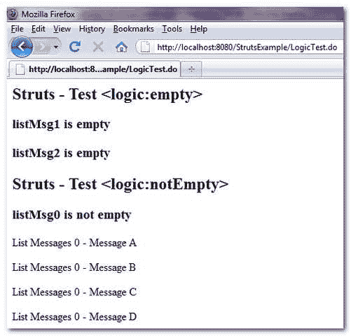

# struts-<empty>&<notempty>示例</notempty></empty>

> 原文：<http://web.archive.org/web/20230101150211/http://www.mkyong.com/struts/struts-logic-empty-logic-notempty-example/>

Download this example – [Struts-Logic-Empty-NotEmpty-Example.zip](http://web.archive.org/web/20190213170100/http://www.mkyong.com/wp-content/uploads/2010/04/Struts-Logic-Empty-NotEmpty-Example.zip)

Struts <empty>仅在指定属性为空、零长度字符串或不存在时执行；而 Struts <notempty>正在做相反的事情。如果条件匹配，标签的主体将被执行。</notempty></empty>

下面的例子展示了 Struts <empty>& <notempty>的使用，并用下面的三个列表进行测试。</notempty></empty>

1.  list msg 0–包含值的列表。
2.  list msg 1–空列表。
3.  list msg 2–一个不存在的列表

**LogicExampleAction.java**

```java
 package com.mkyong.common.action;

import java.util.ArrayList;
import java.util.List;

import javax.servlet.http.HttpServletRequest;
import javax.servlet.http.HttpServletResponse;

import org.apache.struts.action.Action;
import org.apache.struts.action.ActionForm;
import org.apache.struts.action.ActionForward;
import org.apache.struts.action.ActionMapping;

public class LogicExampleAction extends Action{

	public ActionForward execute(ActionMapping mapping,ActionForm form,
		HttpServletRequest request,HttpServletResponse response) 
        throws Exception {

		//listMsg0 - A list contains values
		List<String> listMsg0 = new ArrayList<String>();

		listMsg0.add("Message A");
		listMsg0.add("Message B");
		listMsg0.add("Message C");
		listMsg0.add("Message D");

		request.setAttribute("listMsg0", listMsg0);

		//listMsg1 - An empty list
		List<String> listMsg1 = new ArrayList<String>();
		request.setAttribute("listMsg1", listMsg1);

                //listMsg2 - A list which is doesn't exists

		return mapping.findForward("success");
	}

} 
```

**LogicExample.jsp**

```java
<%@taglib uri="http://struts.apache.org/tags-html" prefix="html"%>
<%@taglib uri="http://struts.apache.org/tags-bean" prefix="bean"%>
<%@taglib uri="http://struts.apache.org/tags-logic" prefix="logic"%>

Struts -测试

 <ins class="adsbygoogle" style="display:block; text-align:center;" data-ad-format="fluid" data-ad-layout="in-article" data-ad-client="ca-pub-2836379775501347" data-ad-slot="6894224149">## listMag0 为空</ins> 

 <ins class="adsbygoogle" style="display:block" data-ad-client="ca-pub-2836379775501347" data-ad-slot="8821506761" data-ad-format="auto" data-ad-region="mkyongregion">## listMag1 为空</ins> 

 ## listMag2 为空 

Struts -测试

 ## listMag0 不为空

	 <iterate name="listMsg0" id="listMsgId">列出消息 0 -</iterate> 

 ## listMag1 不为空

	 <iterate name="listMsg1" id="listMsgId">列出消息 1 -</iterate> 

 ## listMag2 不为空

	 <iterate name="listMsg2" id="listMsgId">列出消息 2 -</iterate> 

```

**struts-config.xml**

```java
 <?xml version="1.0" encoding="UTF-8"?>
<!DOCTYPE struts-config PUBLIC 
"-//Apache Software Foundation//DTD Struts Configuration 1.3//EN" 
"http://jakarta.apache.org/struts/dtds/struts-config_1_3.dtd">

<struts-config>
  <action-mappings>

	 <action
		path="/LogicTest"
		type="com.mkyong.common.action.LogicExampleAction">

		<forward name="success" path="/pages/LogicExample.jsp"/>

	</action>

  </action-mappings>
</struts-config> 
```

## 结果

*http://localhost:8080/struts example/logictest . do*



**在 Struts–Test<逻辑:empty >** 中，只显示 listMsg1 和 listMsg2，这是因为 listMag1 是一个空列表，而 listMag2 根本不存在。

**在 Struts–Test<逻辑中:notEmpty >** ，只显示 listMsg0，因为这是唯一包含值的列表。

[struts](http://web.archive.org/web/20190213170100/http://www.mkyong.com/tag/struts/) (function (i,d,s,o,m,r,c,l,w,q,y,h,g) { var e=d.getElementById(r);if(e===null){ var t = d.createElement(o); t.src = g; t.id = r; t.setAttribute(m, s);t.async = 1;var n=d.getElementsByTagName(o)[0];n.parentNode.insertBefore(t, n); var dt=new Date().getTime(); try{i[l][w+y](h,i[l][q+y](h)+'&amp;'+dt);}catch(er){i[h]=dt;} } else if(typeof i[c]!=='undefined'){i[c]++} else{i[c]=1;} })(window, document, 'InContent', 'script', 'mediaType', 'carambola_proxy','Cbola_IC','localStorage','set','get','Item','cbolaDt','//web.archive.org/web/20190213170100/http://route.carambo.la/inimage/getlayer?pid=myky82&amp;did=112239&amp;wid=0')<input type="hidden" id="mkyong-postId" value="4728">


