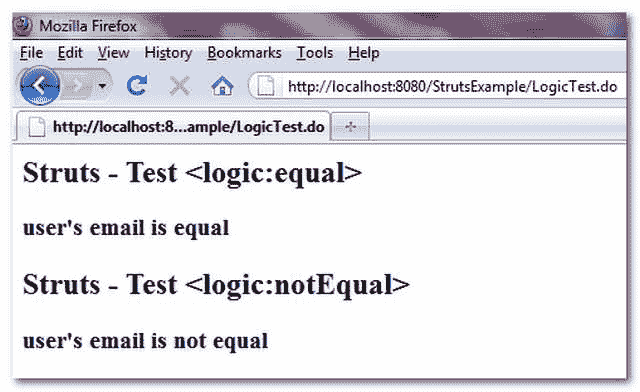

# struts-<equal>&<notequal>示例</notequal></equal>

> 原文：<http://web.archive.org/web/20230101150211/http://www.mkyong.com/struts/struts-logic-equal-logicnotequal-example/>

Download this example – [Struts-Logic-Equal-NotEqual-Example.zip](http://web.archive.org/web/20190224164320/http://www.mkyong.com/wp-content/uploads/2010/04/Struts-Logic-Equal-NotEqual-Example.zip)

Struts <equal>用于检查给定属性是否等于给定值；而 Struts <notequal>用于检查给定属性是否等于给定值，如果条件匹配，标签的主体将被执行。</notequal></equal>

下面的例子展示了 Struts <equal>& <notequal>的用法。</notequal></equal>

**User.java**

```java
 package com.mkyong.common;

public class User{

	String email;

	public String getEmail() {
		return email;
	}

	public void setEmail(String email) {
		this.email = email;
	}

} 
```

**LogicExampleAction.java**

```java
 package com.mkyong.common.action;

import javax.servlet.http.HttpServletRequest;
import javax.servlet.http.HttpServletResponse;

import org.apache.struts.action.Action;
import org.apache.struts.action.ActionForm;
import org.apache.struts.action.ActionForward;
import org.apache.struts.action.ActionMapping;

import com.mkyong.common.User;

public class LogicExampleAction extends Action{

	public ActionForward execute(ActionMapping mapping,ActionForm form,
		HttpServletRequest request,HttpServletResponse response) 
        throws Exception {

		User user = new User();
		user.setEmail("mkyong123456@yahoo.com");

		request.setAttribute("user", user);

		return mapping.findForward("success");
	}

} 
```

**LogicExample.jsp**

```java
<%@taglib uri="http://struts.apache.org/tags-bean" prefix="bean"%>
<%@taglib uri="http://struts.apache.org/tags-logic" prefix="logic"%>

Struts -测试<equal></equal>

 <ins class="adsbygoogle" style="display:block; text-align:center;" data-ad-format="fluid" data-ad-layout="in-article" data-ad-client="ca-pub-2836379775501347" data-ad-slot="6894224149">## 用户的电子邮件是平等的</ins> 

 ## Struts -测试<notequal></notequal>

 <notequal name="user" property="email" value="mkyong654321@yahoo.com">## 用户的电子邮件不相等</notequal> 
```

**struts-config.xml**

```java
 <?xml version="1.0" encoding="UTF-8"?>
<!DOCTYPE struts-config PUBLIC 
"-//Apache Software Foundation//DTD Struts Configuration 1.3//EN" 
"http://jakarta.apache.org/struts/dtds/struts-config_1_3.dtd">

<struts-config>
  <action-mappings>

	 <action
		path="/LogicTest"
		type="com.mkyong.common.action.LogicExampleAction">

		<forward name="success" path="/pages/LogicExample.jsp"/>

	</action>

  </action-mappings>
</struts-config> 
```

## 结果

*http://localhost:8080/struts example/logictest . do*

[struts](http://web.archive.org/web/20190224164320/http://www.mkyong.com/tag/struts/) (function (i,d,s,o,m,r,c,l,w,q,y,h,g) { var e=d.getElementById(r);if(e===null){ var t = d.createElement(o); t.src = g; t.id = r; t.setAttribute(m, s);t.async = 1;var n=d.getElementsByTagName(o)[0];n.parentNode.insertBefore(t, n); var dt=new Date().getTime(); try{i[l][w+y](h,i[l][q+y](h)+'&amp;'+dt);}catch(er){i[h]=dt;} } else if(typeof i[c]!=='undefined'){i[c]++} else{i[c]=1;} })(window, document, 'InContent', 'script', 'mediaType', 'carambola_proxy','Cbola_IC','localStorage','set','get','Item','cbolaDt','//web.archive.org/web/20190224164320/http://route.carambo.la/inimage/getlayer?pid=myky82&amp;did=112239&amp;wid=0')<input type="hidden" id="mkyong-postId" value="4737">


