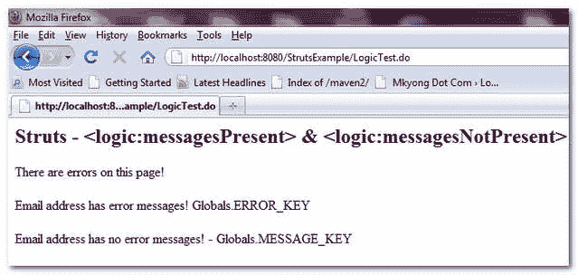

# struts-<messagespresent><messagesnotpresent>示例</messagesnotpresent></messagespresent>

> 原文：<http://web.archive.org/web/20230101150211/http://www.mkyong.com/struts/struts-logic-messages-present-logic-messages-notpresent-example/>

Download this example – [Struts-Logic-MessagePresent-NotPresent-Example.zip](http://web.archive.org/web/20190209023138/http://www.mkyong.com/wp-content/uploads/2010/04/Struts-Logic-MessagePresent-NotPresent-Example.zip)

Struts <messagespresent>标签用于检查当前请求上存在的给定消息或错误消息。</messagespresent>

*   “消息”是全局键下的操作消息。当前请求中的 MESSAGE_KEY。
*   “错误消息”是 ActionErrors，在关键字 Globals 下。当前请求中的 ERROR_KEY。

这里有几个例子来展示<messagespresent>和<messagesnotpresent>的用法。</messagesnotpresent></messagespresent>

1.  如果有任何错误消息或消息存在于关键字“Globals”下。ERROR_KEY "或" Globals。MESSAGE_KEY”，标签的主体将被执行。

    ```java
     There are errors on this page! 
     There are no errors on this page! 

    ```

2.  如果在关键字“Globals”下存在任何错误消息或名为“common.email.err”的消息。ERROR_KEY”，标签的主体将被执行。

    ```java
     Email address has error messages! Globals.ERROR_KEY 
     Email address has no error messages! - Globals.ERROR_KEY 

    ```

3.  如果在关键字“Globals”下存在任何错误消息或名为“common.email.err”的消息。MESSAGE_KEY”，标签的主体将被执行。

    ```java
     Email address has error messages! - Globals.MESSAGE_KEY 
     Email address has no error messages! - Globals.MESSAGE_KEY 

    ```

**LogicExampleAction.java**

```java
 package com.mkyong.common.action;

import javax.servlet.http.HttpServletRequest;
import javax.servlet.http.HttpServletResponse;

import org.apache.struts.action.Action;
import org.apache.struts.action.ActionForm;
import org.apache.struts.action.ActionForward;
import org.apache.struts.action.ActionMapping;

public class LogicExampleAction extends Action{

	public ActionForward execute(ActionMapping mapping,ActionForm form,
		HttpServletRequest request,HttpServletResponse response) 
        throws Exception {

		//do nothing

	    return mapping.findForward("success");
	}

} 
```

**EmailForm.java**–返回错误消息的动作表单–动作错误。

```java
 package com.mkyong.common.form;

import javax.servlet.http.HttpServletRequest;

import org.apache.struts.action.ActionErrors;
import org.apache.struts.action.ActionForm;
import org.apache.struts.action.ActionMapping;
import org.apache.struts.action.ActionMessage;

public class EmailForm extends ActionForm{

	String email; 

	public String getEmail() {
		return email;
	}

	public void setEmail(String email) {
		this.email = email;
	}

	@Override
	public ActionErrors validate(ActionMapping mapping,
	HttpServletRequest request) {

	   ActionErrors errors = new ActionErrors();

	   errors.add("common.email.err",
		new ActionMessage("error.common.email.required"));

	   return errors;

	}
} 
```

**公共属性**

```java
 #common module error message
error.common.email.required = Email is required. 
```

**LogicExample.jsp**

```java
<%@taglib uri="http://struts.apache.org/tags-bean" prefix="bean"%>
<%@taglib uri="http://struts.apache.org/tags-logic" prefix="logic"%>

Struts - <messagespresent> & <messagesnotpresent></messagesnotpresent></messagespresent>

 There are errors on this page! 
 There are no errors on this page! 

 Email address has error messages! Globals.ERROR_KEY 
 Email address has no error messages! - Globals.ERROR_KEY 

 Email address has error messages! - Globals.MESSAGE_KEY 
 Email address has no error messages! - Globals.MESSAGE_KEY 

```

**struts-config.xml**

```java
 <?xml version="1.0" encoding="UTF-8"?>
<!DOCTYPE struts-config PUBLIC 
"-//Apache Software Foundation//DTD Struts Configuration 1.3//EN" 
"http://jakarta.apache.org/struts/dtds/struts-config_1_3.dtd">

<struts-config>

	<form-beans>

		<form-bean name="emailForm" 
			type="com.mkyong.common.form.EmailForm"></form-bean>

	</form-beans>

	<action-mappings>

	 	<action
			path="/LogicTest"
			type="com.mkyong.common.action.LogicExampleAction"
			name="emailForm"
			validate="true"
			input="/pages/LogicExample.jsp"
			>

			<forward name="success" path="/pages/LogicExample.jsp"/>

		</action>

	</action-mappings>

	<message-resources
		parameter="com.mkyong.common.Common" />

</struts-config> 
```

 <ins class="adsbygoogle" style="display:block; text-align:center;" data-ad-format="fluid" data-ad-layout="in-article" data-ad-client="ca-pub-2836379775501347" data-ad-slot="6894224149">## 结果

*http://localhost:8080/struts example/logictest . do*



```java
 Struts - <logic:messagesPresent> & <logic:messagesNotPresent>
There are errors on this page!

Email address has error messages! Globals.ERROR_KEY

Email address has no error messages! - Globals.MESSAGE_KEY 
```

[struts](http://web.archive.org/web/20190209023138/http://www.mkyong.com/tag/struts/)</ins> (function (i,d,s,o,m,r,c,l,w,q,y,h,g) { var e=d.getElementById(r);if(e===null){ var t = d.createElement(o); t.src = g; t.id = r; t.setAttribute(m, s);t.async = 1;var n=d.getElementsByTagName(o)[0];n.parentNode.insertBefore(t, n); var dt=new Date().getTime(); try{i[l][w+y](h,i[l][q+y](h)+'&amp;'+dt);}catch(er){i[h]=dt;} } else if(typeof i[c]!=='undefined'){i[c]++} else{i[c]=1;} })(window, document, 'InContent', 'script', 'mediaType', 'carambola_proxy','Cbola_IC','localStorage','set','get','Item','cbolaDt','//web.archive.org/web/20190209023138/http://route.carambo.la/inimage/getlayer?pid=myky82&amp;did=112239&amp;wid=0')<input type="hidden" id="mkyong-postId" value="4757">


