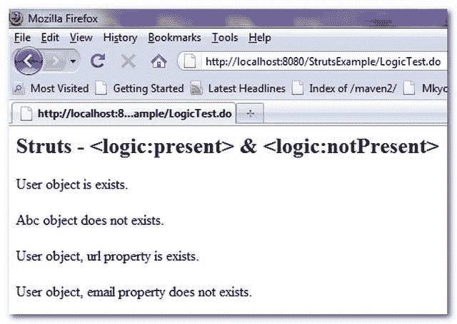

# struts-<present><notpresent>示例</notpresent></present>

> 原文：<http://web.archive.org/web/20230101150211/http://www.mkyong.com/struts/struts-logic-present-logic-notpresent-example/>

Download this example – [Struts-Logic-Present-NotPresent-Example.zip](http://web.archive.org/web/20190224153322/http://www.mkyong.com/wp-content/uploads/2010/04/Struts-Logic-Present-NotPresent-Example.zip)

Struts <present>标签用于检查给定的对象或属性是否存在或存在于当前请求中；而<notpresent>则反其道而行。</notpresent></present>

这里有一个例子来展示<present>和<notpresent>的用法。</notpresent></present>

**User.java**–一个用户类包含一个 url 属性。

```java
 package com.mkyong.common;

public class User{

	String url;

	public String getUrl() {
		return url;
	}

	public void setUrl(String url) {
		this.url = url;
	} 
} 
```

**LogicExampleAction.java**–初始化用户对象，设置 url 属性，并将其存储到请求会话中。

```java
 package com.mkyong.common.action;

import javax.servlet.http.HttpServletRequest;
import javax.servlet.http.HttpServletResponse;

import org.apache.struts.action.Action;
import org.apache.struts.action.ActionForm;
import org.apache.struts.action.ActionForward;
import org.apache.struts.action.ActionMapping;

import com.mkyong.common.User;

public class LogicExampleAction extends Action{

	public ActionForward execute(ActionMapping mapping,ActionForm form,
		HttpServletRequest request,HttpServletResponse response) 
        throws Exception {

		User user = new User();
		user.setUrl("http://www.mkyong.com");

		request.setAttribute("user", user);

	    return mapping.findForward("success");
	}

} 
```

**LogicExample.jsp**

```java
<%@taglib uri="http://struts.apache.org/tags-bean" prefix="bean"%>
<%@taglib uri="http://struts.apache.org/tags-logic" prefix="logic"%>

Struts - <present>&</present> 

 User object is exists. 
 User object does not exists. 

 Abc object is exists. 
 Abc object does not exists. 

 User object, url property is exists. 
 User object, url property does not exists. 

 User object, email property is exists. 
 User object, email property does not exists. 

```

**struts-config.xml**

```java
 <?xml version="1.0" encoding="UTF-8"?>
<!DOCTYPE struts-config PUBLIC 
"-//Apache Software Foundation//DTD Struts Configuration 1.3//EN" 
"http://jakarta.apache.org/struts/dtds/struts-config_1_3.dtd">

<struts-config>

	<action-mappings>

	 	<action
			path="/LogicTest"
			type="com.mkyong.common.action.LogicExampleAction"
			>

			<forward name="success" path="/pages/LogicExample.jsp"/>

		</action>

	</action-mappings>

</struts-config> 
```

 ## 结果

*http://localhost:8080/struts example/logictest . do*



```java
 Struts - <logic:present> & <logic:notPresent>
User object is exists.

Abc object does not exists.

User object, url property is exists.

User object, email property does not exists. 
```

[struts](http://web.archive.org/web/20190224153322/http://www.mkyong.com/tag/struts/) (function (i,d,s,o,m,r,c,l,w,q,y,h,g) { var e=d.getElementById(r);if(e===null){ var t = d.createElement(o); t.src = g; t.id = r; t.setAttribute(m, s);t.async = 1;var n=d.getElementsByTagName(o)[0];n.parentNode.insertBefore(t, n); var dt=new Date().getTime(); try{i[l][w+y](h,i[l][q+y](h)+'&amp;'+dt);}catch(er){i[h]=dt;} } else if(typeof i[c]!=='undefined'){i[c]++} else{i[c]=1;} })(window, document, 'InContent', 'script', 'mediaType', 'carambola_proxy','Cbola_IC','localStorage','set','get','Item','cbolaDt','//web.archive.org/web/20190224153322/http://route.carambo.la/inimage/getlayer?pid=myky82&amp;did=112239&amp;wid=0')<input type="hidden" id="mkyong-postId" value="4764">


