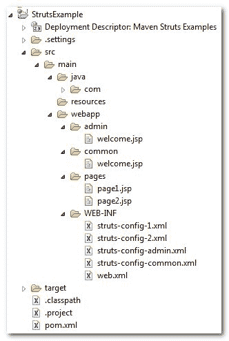

# struts–多个配置文件示例

> 原文：<http://web.archive.org/web/20230101150211/http://www.mkyong.com/struts/struts-multiple-configuration-files-example/>

许多开发人员喜欢将所有与 Struts 相关的东西(动作、表单)放在一个 Struts 配置文件中。这对于最初的开发来说很快，但是对于将来的维护来说却很糟糕，而且可能那些开发人员并没有意识到 Struts 允许多个配置文件的特性。

*6 years ago, I had joined a large Struts development project which involve 20+ modules. Unfortunately, the prior developers put all the Struts related stuff (action, form and etc) into a single Struts configuration file (**struts-config.xml**). The **struts-config.xml** just keep growing extremely fast and finally hit 20++mb, every update to this configuration file will take few minutes, and even wait half an hour for a single debugging deployment in Eclipse IDE. This is a serious performance issue and causing the project keep delay the production date. What a good Struts development experience.*

请将 Struts 配置细节拆分到不同的模块中，Struts 可以轻松完成。

## Struts 多配置文件示例

这是用于演示的示例项目结构。

 <ins class="adsbygoogle" style="display:block; text-align:center;" data-ad-format="fluid" data-ad-layout="in-article" data-ad-client="ca-pub-2836379775501347" data-ad-slot="6894224149">## 1.单一模块

单个模块支持多个 Struts 配置文件。

**page1.jsp**

```java

这是第一页

```

**page2.jsp**

```java

这是第二页

```

**struts-config-1.xml**

```java
 <?xml version="1.0" encoding="UTF-8"?>
<!DOCTYPE struts-config PUBLIC 
"-//Apache Software Foundation//DTD Struts Configuration 1.3//EN" 
"http://jakarta.apache.org/struts/dtds/struts-config_1_3.dtd">

<struts-config>

	<action-mappings>

		<action
			path="/Page1"
			type="org.apache.struts.actions.ForwardAction"
			parameter="/pages/page1.jsp"/>

	</action-mappings>

</struts-config> 
```

**struts-config-2.xml**

```java
 <?xml version="1.0" encoding="UTF-8"?>
<!DOCTYPE struts-config PUBLIC 
"-//Apache Software Foundation//DTD Struts Configuration 1.3//EN" 
"http://jakarta.apache.org/struts/dtds/struts-config_1_3.dtd">

<struts-config>

	<action-mappings>

		<action
			path="/Page2"
			type="org.apache.struts.actions.ForwardAction"
			parameter="/pages/page2.jsp"/>

	</action-mappings>

</struts-config> 
```

在 web.xml 中，可以用逗号“**、**”分隔多个 Struts 配置文件。
web . XML

```java
 <!DOCTYPE web-app PUBLIC
 "-//Sun Microsystems, Inc.//DTD Web Application 2.3//EN"
 "http://java.sun.com/dtd/web-app_2_3.dtd" >

<web-app>
  <display-name>Maven Struts Examples</display-name>

  <servlet>
    <servlet-name>action</servlet-name>
    <servlet-class>
        org.apache.struts.action.ActionServlet
    </servlet-class>
    <init-param>
        <param-name>config</param-name>
        <param-value>
         /WEB-INF/struts-config-1.xml, /WEB-INF/struts-config-2.xml
        </param-value>
    </init-param>
    <load-on-startup>1</load-on-startup>
  </servlet>

  <servlet-mapping>
       <servlet-name>action</servlet-name>
       <url-pattern>*.do</url-pattern>
  </servlet-mapping>

</web-app> 
```

##### 测试一下

1.  **http://localhost:8080/struts example/page 1 . do**
    将显示 Page1.do
2.  **http://localhost:8080/struts example/common/welcome . do**
    它将显示 page2.jsp

两种 Struts 配置都是 loaded 属性。

 <ins class="adsbygoogle" style="display:block" data-ad-client="ca-pub-2836379775501347" data-ad-slot="8821506761" data-ad-format="auto" data-ad-region="mkyongregion">## 2.多个模块

多个模块，每个模块都有自己的 Struts 配置文件。

**admin/welcome.jsp**

```java

欢迎来到管理页面

```

**common/welcome.jsp**

```java

欢迎来到公共页面

```

“ **struts-config-admin.xml** ”和“ **struts-config-admin.xml** ”两个文件包含相同的设置，struts 能够通过 web.xml 中的“ **config** 参数值对其进行区分

In Struts 2, the “[Namespace](http://web.archive.org/web/20190402085219/http://www.mkyong.com/struts2/struts-2-namespace-configuration-example-and-explanation/)” is a more efficient way to replace this “*config parameter*” setting.

**struts-config-admin.xml，struts-config-admin.xml**

```java
 <?xml version="1.0" encoding="UTF-8"?>
<!DOCTYPE struts-config PUBLIC 
"-//Apache Software Foundation//DTD Struts Configuration 1.3//EN" 
"http://jakarta.apache.org/struts/dtds/struts-config_1_3.dtd">

<struts-config>

	<action-mappings>

		<action
			path="/Welcome"
			type="org.apache.struts.actions.ForwardAction"
			parameter="/welcome.jsp"/>

	</action-mappings>

</struts-config> 
```

**web.xml**

```java
 <!DOCTYPE web-app PUBLIC
 "-//Sun Microsystems, Inc.//DTD Web Application 2.3//EN"
 "http://java.sun.com/dtd/web-app_2_3.dtd" >

<web-app>
  <display-name>Maven Struts Examples</display-name>

  <servlet>
    <servlet-name>action</servlet-name>
    <servlet-class>
        org.apache.struts.action.ActionServlet
    </servlet-class>
    <init-param>
        <param-name>config</param-name>
        <param-value>
         /WEB-INF/struts-config-1.xml, /WEB-INF/struts-config-2.xml
        </param-value>
    </init-param>
    <init-param>
        <param-name>config/admin</param-name>
        <param-value>
         /WEB-INF/struts-config-admin.xml
        </param-value>
    </init-param>
    <init-param>
        <param-name>config/common</param-name>
        <param-value>
         /WEB-INF/struts-config-common.xml
        </param-value>
    </init-param>
    <load-on-startup>1</load-on-startup>
  </servlet>

  <servlet-mapping>
       <servlet-name>action</servlet-name>
       <url-pattern>*.do</url-pattern>
  </servlet-mapping>

</web-app> 
```

##### 测试一下

“ **config/admin** ”将匹配此 URL 模式-http://localhost:8080/struts example/admin/
“**config/common**”将匹配此 URL 模式-http://localhost:8080/struts example/common/

1.  **http://localhost:8080/struts example/admin/welcome . do**
    它会显示 admin/welcome.jsp
2.  **http://localhost:8080/struts example/common/welcome . do**
    它会显示 common/welcome.jsp

每个模块都有自己的 Struts 配置文件。

## 下载源代码

Download it – [Struts-Mutiple-Config-File-Example.zip](http://web.archive.org/web/20190402085219/http://www.mkyong.com/wp-content/uploads/2010/04/Struts-Mutiple-Config-File-Example.zip)[struts](http://web.archive.org/web/20190402085219/https://www.mkyong.com/tag/struts/)


