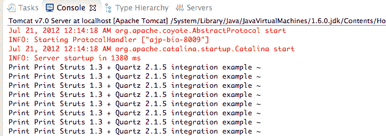

# Struts 1 + Quartz 2 调度器集成示例

> 原文：<http://web.archive.org/web/20230101150211/http://www.mkyong.com/struts/struts-quartz-scheduler-integration-example/>

在本教程中，我们将向您展示如何使用 Apache Struts 1.x 创建一个简单的 web 应用程序项目，并与 Quartz scheduler 框架集成。在项目启动期间，它将启动 Quartz 引擎并触发定义的调度程序任务。

总体思路非常简单，您只需要为集成工作创建一个 **Quartz Struts 插件**。

```java
 Struts <--> Quartz Struts Plug-in <--> Quartz 
```

使用的工具:

1.  Apache Struts 1.3.10
2.  石英 2.1.5
3.  Eclipse IDE
4.  专家

**Note**
Please visit this [Quartz 2 scheduler example](http://web.archive.org/web/20190214234307/http://www.mkyong.com/java/quartz-2-scheduler-tutorial/) to learn the basic usage of the Quartz framework.

## 1.属国

通过 Maven 获取 Struts 和 Quartz 依赖项。

*文件:pom.xml*

```java
 <dependency>
		<groupId>org.apache.tomcat</groupId>
		<artifactId>servlet-api</artifactId>
		<version>6.0.35</version>
	</dependency>

	<!-- Struts 1.3 framework -->
	<dependency>
		<groupId>org.apache.struts</groupId>
		<artifactId>struts-core</artifactId>
		<version>1.3.10</version>
	</dependency>

	<dependency>
		<groupId>org.apache.struts</groupId>
		<artifactId>struts-taglib</artifactId>
		<version>1.3.10</version>
	</dependency>

	<dependency>
		<groupId>org.apache.struts</groupId>
		<artifactId>struts-extras</artifactId>
		<version>1.3.10</version>
	</dependency>

	<!-- Quartz framework -->
	<dependency>
		<groupId>org.quartz-scheduler</groupId>
		<artifactId>quartz</artifactId>
		<version>2.1.5</version>
	</dependency> 
```

 <ins class="adsbygoogle" style="display:block; text-align:center;" data-ad-format="fluid" data-ad-layout="in-article" data-ad-client="ca-pub-2836379775501347" data-ad-slot="6894224149">## 2.Quartz 调度程序作业

创建一个 Quartz 作业来打印消息。

*文件:SchedulerJob.java*

```java
 package com.mkyong.common.quartz;

import org.quartz.Job;
import org.quartz.JobExecutionContext;
import org.quartz.JobExecutionException;

public class SchedulerJob implements Job
{
	public void execute(JobExecutionContext context)
	throws JobExecutionException {

	   System.out.println("Print Print Struts 1.3 + Quartz 2.1.5 integration example ~");

	}
} 
```

 <ins class="adsbygoogle" style="display:block" data-ad-client="ca-pub-2836379775501347" data-ad-slot="8821506761" data-ad-format="auto" data-ad-region="mkyongregion">## 3.Struts 插件

创建一个简单的 Struts 插件并集成 Quartz 框架。在这个插件中，在 Struts 初始化期间，`init()`方法将被调用，并每 5 秒启动一次 Quartz 调度程序作业。

*文件:QuartzPlugin.java*

```java
 package com.mkyong.common.plugin;

import javax.servlet.ServletException;

import org.apache.struts.action.ActionServlet;
import org.apache.struts.action.PlugIn;
import org.apache.struts.config.ModuleConfig;
import org.quartz.CronScheduleBuilder;
import org.quartz.JobBuilder;
import org.quartz.JobDetail;
import org.quartz.Scheduler;
import org.quartz.SchedulerException;
import org.quartz.Trigger;
import org.quartz.TriggerBuilder;
import org.quartz.impl.StdSchedulerFactory;

import com.mkyong.common.quartz.SchedulerJob;

public class QuartzPlugin implements PlugIn {

	@Override
	public void destroy() {
		// null
	}

	@Override
	public void init(ActionServlet servlet, ModuleConfig config)
			throws ServletException {

		JobDetail job = JobBuilder.newJob(SchedulerJob.class)
			.withIdentity("anyJobName", "group1").build();

		try {

			Trigger trigger = TriggerBuilder
				.newTrigger()
				.withIdentity("anyTriggerName", "group1")
				.withSchedule(
					CronScheduleBuilder.cronSchedule("0/5 * * * * ?"))
				.build();

			Scheduler scheduler = new StdSchedulerFactory().getScheduler();
			scheduler.start();
			scheduler.scheduleJob(job, trigger);

		} catch (SchedulerException e) {
			e.printStackTrace();
		}

	}

} 
```

## 4.声明插件

将上面的 **Struts 插件**包含到 Struts 配置文件(struts-config.xml)中。

*文件:struts-config.xml*

```java
 <?xml version="1.0" encoding="UTF-8"?>
<!DOCTYPE struts-config PUBLIC 
"-//Apache Software Foundation//DTD Struts Configuration 1.3//EN" 
"http://jakarta.apache.org/struts/dtds/struts-config_1_3.dtd">

<struts-config>

	<action-mappings>

	   <action path="/Welcome" type="org.apache.struts.actions.ForwardAction"
		parameter="/pages/quartz_started.jsp" />

	</action-mappings>

	<plug-in className="com.mkyong.common.plugin.QuartzPlugin" />

</struts-config> 
```

## 5.演示

在 Struts 启动期间，触发 Quartz 调度程序任务。



## 下载源代码

Download it – [Struts-Quartz-2-Example.zip](http://web.archive.org/web/20190214234307/http://www.mkyong.com/wp-content/uploads/2010/04/Struts-Quartz-2-Example.zip) (24 KB)

## 参考

1.  [石英官网](http://web.archive.org/web/20190214234307/http://www.quartz-scheduler.org/)
2.  [Quartz 2 调度器示例](http://web.archive.org/web/20190214234307/http://www.mkyong.com/java/quartz-2-scheduler-tutorial/)

[quartz](http://web.archive.org/web/20190214234307/http://www.mkyong.com/tag/quartz/) [scheduler](http://web.archive.org/web/20190214234307/http://www.mkyong.com/tag/scheduler/) [struts](http://web.archive.org/web/20190214234307/http://www.mkyong.com/tag/struts/)


