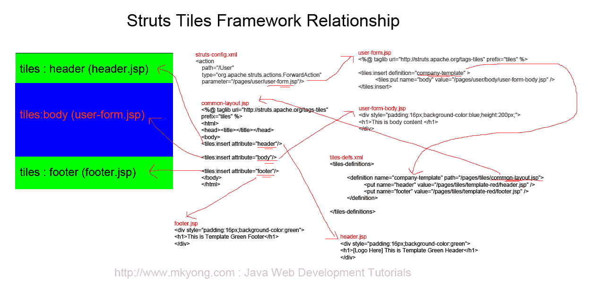
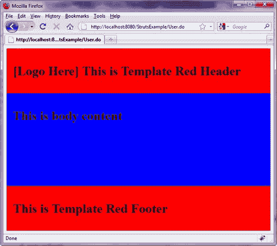
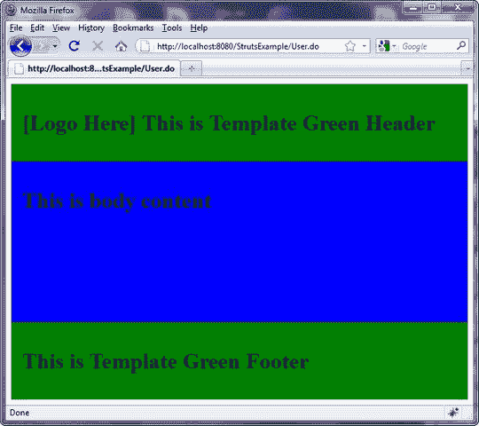

# Struts Tiles 框架示例

> 原文：<http://web.archive.org/web/20230101150211/http://www.mkyong.com/struts/struts-tiles-framework-example/>

Struts Tiles 框架是一个布局框架，它允许用户在所有网页上有效地维护页眉、页脚和菜单的标准外观。

Download this example – [Struts-Tile-Framework-Example.zip](http://web.archive.org/web/20210128124529/http://www.mkyong.com/wp-content/uploads/2010/05/Struts-Tile-Framework-Example.zip)

## 瓷砖模板示例

下面是一个创建 tiles 模板的示例，用于维护 Struts 中所有网页的页眉和页脚细节。

首先，看看这个 Struts tiles 框架关系。

 [

](http://web.archive.org/web/20210128124529/http://www.mkyong.com/wp-content/uploads/2010/05/struts-tiles.png)freestar.config.enabled_slots.push({ placementName: "mkyong_incontent_1", slotId: "mkyong_incontent_1" });

## 1.获取 Struts 图块库

从 struts 分发文件夹或通过 Maven central repository 获取 struts tiles 库

```java
 <dependency>
      <groupId>org.apache.struts</groupId>
	  <artifactId>struts-tiles</artifactId>
      <version>1.3.10</version>
    </dependency> 
```

并将其包含在项目依赖关系库中。

## 2.创建模板

为页眉和页脚详细信息创建红色模板和绿色模板。这两个模板只是背景颜色不同的纯 HTML 代码..

**Template-Red color**
*/Template-Red/header . JSP*

```java

# [此处为标志]这是红色标题模板

```

*/template-red/footer.jsp*

```java

# 这是红色页脚模板

```

**Template-Green color**
*/Template-Green/header . JSP*

```java

# [此处有标志]这是绿色标题模板

```

*/template-green/footer . JSP*

```java

# 这是绿色页脚模板

```

## 3.瓷砖布局

为所有网页创建标准网页布局。

**common-layout.jsp**

```java
<%@ taglib uri="http://struts.apache.org/tags-tiles" prefix="tiles" %>

```

## 4.主体模板

在 body 模板中，您应该始终为 body 细节创建两个页面“user-form.jsp 和 user-form-body.jsp ”,以打破与 tiles 框架的耦合。“user-form.jsp”用于获取 tiles 定义，并将真实的正文内容(user-form-body.jsp)作为正文模板。

**user-form.jsp**

```java
<%@ taglib uri="http://struts.apache.org/tags-tiles" prefix="tiles" %>

```

**user-form-body.jsp**

```java

# 这是正文内容

```

## 5.瓷砖定义

所有的模板都做好了，创建一个“tiles-defs.xml”文件并声明一个“company-template”定义为红色的模板。

**tiles-defs.xml**

```java
 <!DOCTYPE tiles-definitions PUBLIC
"-//Apache Software Foundation//DTD Tiles Configuration 1.3//EN"
"http://struts.apache.org/dtds/tiles-config_1_3.dtd">
<tiles-definitions>

   <definition name="company-template" path="/pages/tiles/common-layout.jsp">
	<put name="header" value="/pages/tiles/template-red/header.jsp" />
	<put name="footer" value="/pages/tiles/template-red/footer.jsp" />
   </definition>

</tiles-definitions> 
```

## 6.包括 TilesPlugin

要使用 Struts tiles 框架，您必须在 Struts 配置文件中声明" **TilesPlugin** "插件类。

**struts-config.xml**

```java
 <?xml version="1.0" encoding="UTF-8"?>
<!DOCTYPE struts-config PUBLIC 
"-//Apache Software Foundation//DTD Struts Configuration 1.3//EN" 
"http://jakarta.apache.org/struts/dtds/struts-config_1_3.dtd">

<struts-config>

	<action-mappings>

		<action
			path="/User"
			type="org.apache.struts.actions.ForwardAction"
			parameter="/pages/user/user-form.jsp"/>

	</action-mappings>

	<plug-in className="org.apache.struts.tiles.TilesPlugin" >
		<set-property property="definitions-config"
		value="/WEB-INF/tiles-defs.xml"/>
	</plug-in>

</struts-config> 
```

## 7.演示

在上述情况下，使用红色模板。

*http://localhost:8080/struts example/user . do*




要将其更改为 template green，只需更新“tiles-defs.xml”文件。

**tiles-defs.xml**

```java
 <!DOCTYPE tiles-definitions PUBLIC
"-//Apache Software Foundation//DTD Tiles Configuration 1.3//EN"
"http://struts.apache.org/dtds/tiles-config_1_3.dtd">
<tiles-definitions>

   <definition name="company-template" path="/pages/tiles/common-layout.jsp">
	<put name="header" value="/pages/tiles/template-green/header.jsp" />
	<put name="footer" value="/pages/tiles/template-green/footer.jsp" />
   </definition>

</tiles-definitions> 
```

再次访问它

*http://localhost:8080/struts example/user . do*




页眉和页脚的颜色发生了变化(模板为绿色)，在 tiles 配置文件中仅有微小的变化。

## 参考

Struts Tiles 文档—[http://struts.apache.org/1.x/struts-tiles/index.html](http://web.archive.org/web/20210128124529/https://struts.apache.org/1.x/struts-tiles/index.html)

Tags : [struts](http://web.archive.org/web/20210128124529/https://mkyong.com/tag/struts/) [template](http://web.archive.org/web/20210128124529/https://mkyong.com/tag/template/) [tiles](http://web.archive.org/web/20210128124529/https://mkyong.com/tag/tiles/)freestar.config.enabled_slots.push({ placementName: "mkyong_leaderboard_btf", slotId: "mkyong_leaderboard_btf" });<input type="hidden" id="mkyong-current-postId" value="4816">