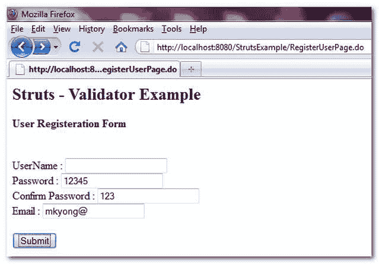
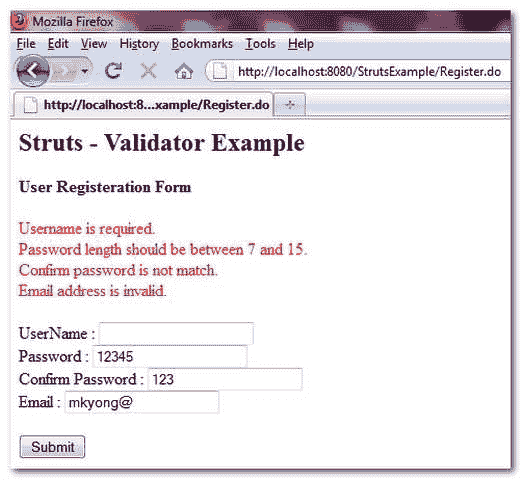

# Struts 验证器框架示例

> 原文：<http://web.archive.org/web/20230101150211/http://www.mkyong.com/struts/struts-validator-framework-example/>

Struts 验证器框架提供了许多通用的验证方法，使验证工作更加容易和可维护。使用 Struts validator，您需要将验证函数声明到一个 xml 文件中，而不是 ActionForm validate()方法，这可以使 Struts 验证更加标准化、可重用和减少重复代码。

Download this example – [Struts-Validator-Example.zip](http://web.archive.org/web/20190224155524/http://www.mkyong.com/wp-content/uploads/2010/04/Struts-Validator-Example.zip)

## 使用 Struts 验证器框架

下面是使用 Struts 验证器框架的快速指南。

 <ins class="adsbygoogle" style="display:block; text-align:center;" data-ad-format="fluid" data-ad-layout="in-article" data-ad-client="ca-pub-2836379775501347" data-ad-slot="6894224149">## 1.验证程序插件

要使用 Struts 验证器插件，您需要将" **ValidatorPlugIn** "类包含到 struts-config.xml 文件中。

```java
 ...
<plug-in className="org.apache.struts.validator.ValidatorPlugIn" >
	<set-property property="pathnames"
	value="/WEB-INF/validator-rules.xml, /WEB-INF/validator-user.xml"/>

</plug-in>
... 
```

" **validator-rules.xml** "文件包含了所有的通用验证器名称，你可以在 Struts 分发库中获得这个文件，(不要自己创建这个文件)。“validator-user.xml”包含所有表单域验证。

 <ins class="adsbygoogle" style="display:block" data-ad-client="ca-pub-2836379775501347" data-ad-slot="8821506761" data-ad-format="auto" data-ad-region="mkyongregion">## 2.验证器表单

对于需要使用验证器框架的表单 bean，它必须扩展**验证器表单**，而不是**动作表单**。

```java
 import org.apache.struts.validator.ValidatorForm;

public class UserForm extends ValidatorForm{
.. 
```

## 3.validator-user.xml

用户表单 bean、电子邮件属性，并将“必需”和“电子邮件”验证器附加到电子邮件属性。“必需”验证器将确保该字段不为空，而“电子邮件”验证器用于检查电子邮件格式是否正确。“必需”和“电子邮件”验证器都在“validator-rules.xml”文件中声明。

```java
 <form-validation>
   <formset>
      <form name="userForm">

		 <field property="email" depends="required,email">

		 	<msg name="required" key="err.user.email.required" />
		 	<msg name="email" key="err.user.email.invalid" />

		 </field>

     </form>
  </formset>
</form-validation> 
```

## Struts 验证器框架示例

理解 Struts validator 框架的最佳方式是创建一个简单的应用程序并完成验证工作。这里有一个简单的用户注册表单，使用 Struts validator 框架来检查用户名、密码和电子邮件。

## 1.行动

动作类，只是转发一个成功请求。

user action . Java

```java
 package com.mkyong.user.action;

import javax.servlet.http.HttpServletRequest;
import javax.servlet.http.HttpServletResponse;

import org.apache.struts.action.Action;
import org.apache.struts.action.ActionForm;
import org.apache.struts.action.ActionForward;
import org.apache.struts.action.ActionMapping;

public class UserAction extends Action{

	public ActionForward execute(ActionMapping mapping, ActionForm form,
		HttpServletRequest request, HttpServletResponse response)
	throws Exception {

		return mapping.findForward("success");
	}
} 
```

## 2.用户表单

UserForm 扩展了 ValidatorForm 类。

**UserForm.java**

```java
 package com.mkyong.user.form;

import org.apache.struts.validator.ValidatorForm;

public class UserForm extends ValidatorForm{

	String username;
	String pwd;
	String pwd2;
	String email;

	//getter and setter methods

} 
```

## 3.属性文件

属性文件包含所有标签和错误消息。

**用户属性**

```java
 #user module label message
label.user.name = Name
label.user.username = UserName
label.user.pwd = Password
label.user.pwd2 = Confirm Password
label.user.email = Email

label.user.button.submit = Submit

#Error message
err.user.username.required = Username is required.<br/>
err.user.username.length = Username length should be between {0} and {1}.<br/>
err.user.username.invalid = 
Username is invalid , it should be a-z, A-Z, 0-9, dash "-" or underscore "_".<br/>

err.user.pwd.required = Password is required.<br/>
err.user.pwd.length = Password length should be between {0} and {1}.<br/>
err.user.pwd.invalid = Password is invalid , it should be a-z, A-Z, 0-9.<br/>

err.user.pwd2.notmatch = Confirm password is not match.<br/>

err.user.email.required = Email is required.<br/>
err.user.email.invalid =  Email address is invalid.<br/> 
```

## 4.查看页面

一个简单的 jsp 页面创建所有需要的文本字段，和一个简单的感谢页面

**RegisterUser.jsp**

```java
<%@taglib uri="http://struts.apache.org/tags-bean" prefix="bean"%>
<%@taglib uri="http://struts.apache.org/tags-logic" prefix="logic"%>
<%@taglib uri="http://struts.apache.org/tags-html" prefix="html"%>

Struts -验证器示例

RegisterUser.jsp
User Registeration Form

```

<form action="/Register">
<message key="label.user.username">: <text property="username" size="20"><message key="label.user.pwd">: <text property="pwd" size="20"><message key="label.user.pwd2">: <text property="pwd2" size="20"><message key="label.user.email">: <text property="email" size="20"><submit><message key="label.user.button.submit"></message></submit>

**ThanksYou.jsp**

```java

Struts -验证器示例

Thanks you for the registration

```

## 5.Struts 配置

配置动作、表单映射并注册“ValidatorPlugIn”插件。

**struts-connfig.xml**

```java
 <?xml version="1.0" encoding="UTF-8"?>
<!DOCTYPE struts-config PUBLIC 
"-//Apache Software Foundation//DTD Struts Configuration 1.3//EN" 
"http://jakarta.apache.org/struts/dtds/struts-config_1_3.dtd">

<struts-config>

   <form-beans>
	<form-bean name="userForm" type="com.mkyong.user.form.UserForm" />	
   </form-beans>

   <action-mappings>

	 	<action
			path="/Register"
			type="com.mkyong.user.action.UserAction"
			name="userForm"
			input="/pages/RegisterUser.jsp"
			>

			<forward name="success" path="/pages/ThanksYou.jsp"/>

		</action>

		<action
			path="/RegisterUserPage"
			type="org.apache.struts.actions.ForwardAction"
			parameter="/pages/RegisterUser.jsp"/>

   </action-mappings>

   <message-resources
		parameter="com.mkyong.user.properties.user" />

   <plug-in className="org.apache.struts.validator.ValidatorPlugIn" >
	<set-property property="pathnames"
	value="/WEB-INF/validator-rules.xml, /WEB-INF/validator-user.xml"/>

   </plug-in>

</struts-config> 
```

## 6.validator-user.xml

为用户表单的用户名、密码和电子邮件属性定义验证器。

**validator-user.xml**

```java
 <!DOCTYPE form-validation PUBLIC
 "-//Apache Software Foundation
//DTD Commons Validator Rules Configuration 1.3.0//EN"
 "http://jakarta.apache.org/commons/dtds/validator_1_3_0.dtd">

<form-validation>
   <formset>
      <form name="userForm">
         <field property="username" depends="required,maxlength,minlength,mask">

         	<msg name="required" key="err.user.username.required" />
		<msg name="maxlength" key="err.user.username.length" />
		<msg name="minlength" key="err.user.username.length" />
		<msg name="mask" key="err.user.username.invalid" />

		<arg name="maxlength" key="${var:minlength}" position="0" resource="false"/>
                <arg name="maxlength" key="${var:maxlength}" position="1" resource="false"/>

	        <arg name="minlength" key="${var:minlength}" position="0" resource="false"/>
                <arg name="minlength" key="${var:maxlength}" position="1" resource="false"/>

                <var>
            	        <var-name>minlength</var-name>
		        <var-value>3</var-value>
		</var>		
		<var>
			<var-name>maxlength</var-name>
			<var-value>15</var-value>
		</var>
                <var>
			<var-name>mask</var-name>
			<var-value>^[a-zA-Z0-9-_]*$</var-value>
		</var>
         </field>

         <field property="pwd" depends="required,maxlength,minlength,mask">

         	<msg name="required" key="err.user.pwd.required" />
		<msg name="maxlength" key="err.user.pwd.length" />
		<msg name="minlength" key="err.user.pwd.length" />
		<msg name="mask" key="err.user.pwd.invalid" />

		<arg name="maxlength" key="${var:minlength}" position="0" resource="false"/>
                <arg name="maxlength" key="${var:maxlength}" position="1" resource="false"/>

		<arg name="minlength" key="${var:minlength}" position="0" resource="false"/>
                <arg name="minlength" key="${var:maxlength}" position="1" resource="false"/>

                <var>
            	        <var-name>minlength</var-name>
			<var-value>7</var-value>
		</var>		
		<var>
			<var-name>maxlength</var-name>
			<var-value>15</var-value>
		</var>
                <var>
			<var-name>mask</var-name>
			<var-value>^[a-zA-Z0-9]*$</var-value>
		</var>
         </field>

         <field property="pwd2" depends="validwhen">

         	<msg name="validwhen" key="err.user.pwd2.notmatch" />

		<var>
			<var-name>test</var-name>
			<var-value>
				(pwd == *this*)
			</var-value>
		</var>
	 </field>

	<field property="email" depends="required,email">	 
	 	<msg name="required" key="err.user.email.required" />
	 	<msg name="email" key="err.user.email.invalid" />
	 </field>

     </form>
  </formset>
</form-validation> 
```

## 7.演示

*http://localhost:8080/struts example/register user page . do*



*http://localhost:8080/struts example/register . do*



验证码是描述性的，足以知道它是如何工作的，如果你想知道细节，以及其他可用的验证器，请检查下面的参考网站。

## 参考

Struts 验证器文档—[http://struts.apache.org/1.2.4/userGuide/dev_validator.html](http://web.archive.org/web/20190224155524/http://struts.apache.org/1.2.4/userGuide/dev_validator.html)

[struts](http://web.archive.org/web/20190224155524/http://www.mkyong.com/tag/struts/) [validation](http://web.archive.org/web/20190224155524/http://www.mkyong.com/tag/validation/)</text></message></text></message></text></message></text></message></form>


