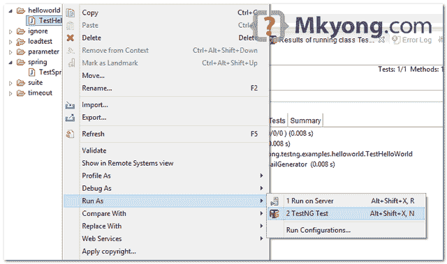
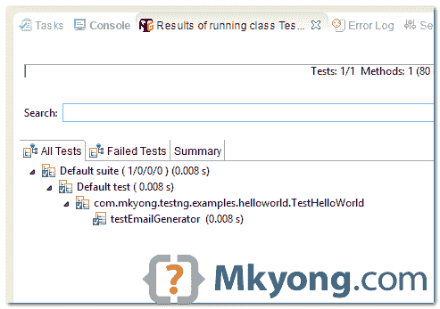

# TestNG Hello World 示例

> 原文：<http://web.archive.org/web/20230101150211/http://www.mkyong.com/unittest/testng-hello-world-example/>

一个经典的例子，向你展示如何开始使用 TestNG 单元测试框架。

使用的工具:

1.  测试 6.8.7
2.  maven3
3.  Eclipse IDE

## 1.测试依赖关系

在`pom.xml`中添加 TestNG 库。

pom.xml

```java
 <dependency>
		<groupId>org.testng</groupId>
		<artifactId>testng</artifactId>
		<version>6.8.7</version>
		<scope>test</scope>
	</dependency> 
```

 ## 2.测试示例

复习一个简单的类，有一个方法返回一个固定的邮箱“feedback@yoursite.com”。

RandomEmailGenerator.java

```java
 package com.mkyong.testng.project.service.email;

import org.springframework.stereotype.Service;

public class RandomEmailGenerator {

	public String generate() {
		return "feedback@yoursite.com";
	}

} 
```

创建一个这样的测试用例:

TestHelloWorld.java

```java
 package com.mkyong.testng.examples.helloworld;

import org.testng.Assert;
import org.testng.annotations.Test;
import com.mkyong.testng.project.service.email.RandomEmailGenerator;

public class TestHelloWorld {

	@Test()
	public void testEmailGenerator() {

		RandomEmailGenerator obj = new RandomEmailGenerator();
		String email = obj.generate();

		Assert.assertNotNull(email);
		Assert.assertEquals(email, "feedback@yoursite.com");

	}

} 
```

完成后，一个简单的 TestNG 测试用例就创建了，这个测试确保`RandomEmailGenerator.generate()`总是返回“feedback@yoursite.com”。

 ## 3.测试 Eclipse 插件

要在 Eclipse IDE 中运行上述测试，您需要安装 TestNG Eclipse 插件。按照这个[官方测试 Eclipse 插件指南](http://web.archive.org/web/20190303051040/http://testng.org/doc/eclipse.html)进行安装。

要运行 TestNG 测试，右键单击测试类并作为“TestNG test”运行。



结果



## 参考

1.  [TestNG 官方文档](http://web.archive.org/web/20190303051040/http://testng.org/doc/documentation-main.html)

[hello world](http://web.archive.org/web/20190303051040/http://www.mkyong.com/tag/hello-world/) [testng](http://web.archive.org/web/20190303051040/http://www.mkyong.com/tag/testng/)


