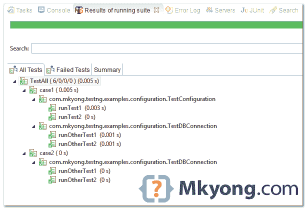

> 原文：<http://web.archive.org/web/20230101150211/http://www.mkyong.com/unittest/testng-tutorial-1-basic-usage/>

# TestNG–配置注释示例



在 TestNG 中，我们可以使用以下注释来为您的测试类进行配置，比如设置/清理数据库、准备虚拟数据、部署/关闭服务器等。

```java
 @BeforeSuite - For suite test, run before all tests in this suite have run. 
@AfterSuite -  For suite test, run after all tests in this suite have run.

@BeforeTest - For suite test, run before any test method belonging to the classes inside the <test> tag is run. 
@AfterTest - For suite test, run after all the test methods belonging to the classes inside the <test> tag have run. 

@BeforeGroups: Run before the first test method that belongs to the group is invoked. 
@AfterGroups: Run after the last test method that belongs to the groups is invoked. 

@BeforeClass - Run before the first test method in the current class is invoked. 
@AfterClass - Run after all the test methods in the current class have been run. 

@BeforeMethod - Run before each test method. 
@AfterMethod - Run after each test method. 
```

P.S Suite 测试–一起运行多个测试类。

回顾下面的例子，看看执行顺序——首先调用哪个方法，然后调用哪个方法。

## 1.单一测试类别

运行单个测试用例，展示之前/之后`group`、`class`和`method`的使用。

TestConfiguration.java

```java
 package com.mkyong.testng.examples.configuration;

import org.testng.annotations.AfterClass;
import org.testng.annotations.AfterGroups;
import org.testng.annotations.AfterMethod;
import org.testng.annotations.BeforeClass;
import org.testng.annotations.BeforeGroups;
import org.testng.annotations.BeforeMethod;
import org.testng.annotations.Test;

public class TestConfiguration {

	@BeforeGroups("shopping")
	public void beforeGroups() {
		System.out.println("@BeforeGroups");
	}

	@AfterGroups("shopping")
	public void afterGroups() {
		System.out.println("@AfterGroups");
	}

	@BeforeClass
	public void beforeClass() {
		System.out.println("@BeforeClass");
	}

	@AfterClass
	public void afterClass() {
		System.out.println("@AfterClass");
	}

	@BeforeMethod
	public void beforeMethod() {
		System.out.println("@BeforeMethod");
	}

	@AfterMethod
	public void afterMethod() {
		System.out.println("@AfterMethod");
	}

	@Test(groups = "shopping")
	public void runTest1() {
		System.out.println("@Test - runTest1");
	}

	@Test
	public void runTest2() {
		System.out.println("@Test - runTest2");
	}
} 
```

输出

```java
 @BeforeClass 

@BeforeGroups 
@BeforeMethod 
@Test - runTest1
@AfterMethod  
@AfterGroups  

@BeforeMethod
@Test - runTest2
@AfterMethod

@AfterClass

PASSED: runTest1
PASSED: runTest2

===============================================
    Default test
    Tests run: 2, Failures: 0, Skips: 0
=============================================== 
```

 <ins class="adsbygoogle" style="display:block; text-align:center;" data-ad-format="fluid" data-ad-layout="in-article" data-ad-client="ca-pub-2836379775501347" data-ad-slot="6894224149">## 2.套件测试类

再创建 2 个测试类来展示 before/after `suite`和`test`的用法。

DBConfig.java

```java
 package com.mkyong.testng.examples.configuration;

import org.testng.annotations.AfterSuite;
import org.testng.annotations.AfterTest;
import org.testng.annotations.BeforeSuite;
import org.testng.annotations.BeforeTest;

public class DBConfig {

	@BeforeSuite()
	public void beforeSuite() {
		System.out.println("@BeforeSuite");
	}

	@AfterSuite()
	public void afterSuite() {
		System.out.println("@AfterSuite");
	}

	@BeforeTest()
	public void beforeTest() {
		System.out.println("@BeforeTest");
	}

	@AfterTest()
	public void afterTest() {
		System.out.println("@AfterTest");
	}

} 
```

TestDBConnection.java

```java
 package com.mkyong.testng.examples.configuration;

import org.testng.annotations.Test;

public class TestDBConnection {

	@Test
	public void runOtherTest1() {
		System.out.println("@Test - runOtherTest1");
	}

	@Test
	public void runOtherTest2() {
		System.out.println("@Test - runOtherTest2");
	}

} 
```

创建一个 XML 文件来一起运行多个测试用例。阅读 XML 注释，这是不言自明的。

testng.xml

```java
 <!DOCTYPE suite SYSTEM "http://testng.org/testng-1.0.dtd" >

<!-- @BeforeSuite -->
<suite name="TestAll">

	<!-- @BeforeTest -->
	<test name="case1">
	  <classes>
		<class name="com.mkyong.testng.examples.configuration.TestConfiguration" />
		<class name="com.mkyong.testng.examples.configuration.TestDBConnection" />
		<class name="com.mkyong.testng.examples.configuration.DBConfig" />
	  </classes>
	</test>
	<!-- @AfterTest -->

	<!-- @BeforeTest -->
	<test name="case2">
	  <classes>
		<class name="com.mkyong.testng.examples.configuration.TestDBConnection" />
		<class name="com.mkyong.testng.examples.configuration.DBConfig" />
	  </classes>
	</test>
	<!-- @AfterTest -->

</suite>
<!-- @AfterSuite --> 
```

输出

```java
 @BeforeSuite

@BeforeTest		//Start {case1}
@BeforeClass
@BeforeGroups
@BeforeMethod
@Test - runTest1
@AfterMethod
@AfterGroups
@BeforeMethod
@Test - runTest2
@AfterMethod
@AfterClass
@Test - runOtherTest1
@Test - runOtherTest2
@AfterTest		//End {case1}

@BeforeTest		//Start {case2}
@Test - runOtherTest1
@Test - runOtherTest2
@AfterTest		//End {case2}

@AfterSuite

===============================================
TestAll
Total tests run: 6, Failures: 0, Skips: 0
=============================================== 
```

完成了。

 <ins class="adsbygoogle" style="display:block" data-ad-client="ca-pub-2836379775501347" data-ad-slot="8821506761" data-ad-format="auto" data-ad-region="mkyongregion">## 参考

1.  [测试文档](http://web.archive.org/web/20190228162811/http://testng.org/doc/documentation-main.html)
2.  [TestNG–运行多个测试类(套件测试)](http://web.archive.org/web/20190228162811/http://www.mkyong.com/unittest/testng-tutorial-5-suite-test/)

[suite test](http://web.archive.org/web/20190228162811/http://www.mkyong.com/tag/suite-test/) [testng](http://web.archive.org/web/20190228162811/http://www.mkyong.com/tag/testng/) [testng config](http://web.archive.org/web/20190228162811/http://www.mkyong.com/tag/testng-config/)


