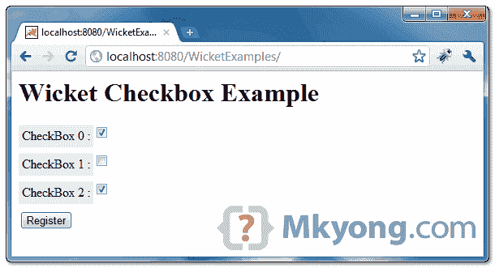
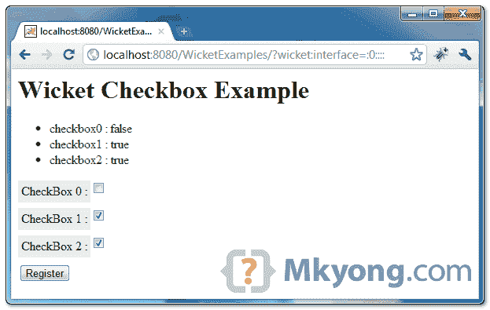

# Wicket 复选框示例

> 原文：<http://web.archive.org/web/20230101150211/http://www.mkyong.com/wicket/wicket-checkbox-example/>

Wicket 示例创建一个复选框，并自动选中该复选框。

```java
 //Java 
import org.apache.wicket.markup.html.form.CheckBox;
...
final CheckBox chk0 = new CheckBox("checkbox0", Model.of(Boolean.TRUE));	
final CheckBox chk1 = new CheckBox("checkbox1", new PropertyModel<Boolean>(this, "checkbox1"));
form.add(address);

//HTML
<input type="checkbox" wicket:id="checkbox0" />
<input type="checkbox" wicket:id="checkbox1" /> 
```

## 1.Wicket 复选框示例

呈现复选框的不同方式，默认勾选了“chk0”和“chk2”。

**Checked by default ?**
To checked a checkbox, you just need to assign a “true” to the component. This concept applied to other web application frameworks as well.

*文件:CheckBoxPage.java*

```java
 package com.mkyong.user;

import org.apache.wicket.PageParameters;
import org.apache.wicket.markup.html.form.CheckBox;
import org.apache.wicket.markup.html.form.Form;
import org.apache.wicket.markup.html.panel.FeedbackPanel;
import org.apache.wicket.markup.html.WebPage;
import org.apache.wicket.model.Model;
import org.apache.wicket.model.PropertyModel;

public class CheckBoxPage extends WebPage {

	private boolean checkbox1 = false; // uncheck
	private boolean checkbox2 = true; // checked by default

	public CheckBoxPage(final PageParameters parameters) {

		add(new FeedbackPanel("feedback"));

		final CheckBox chk0 = new CheckBox("checkbox0", Model.of(Boolean.TRUE));

		final CheckBox chk1 = new CheckBox("checkbox1",
				new PropertyModel<Boolean>(this, "checkbox1"));

		final CheckBox chk2 = new CheckBox("checkbox2",
				new PropertyModel<Boolean>(this, "checkbox2"));

		Form<?> form = new Form<Void>("userForm") {
			@Override
			protected void onSubmit() {

				info("checkbox0 : " + chk0.getModelObject().toString());
				info("checkbox1 : " + Boolean.toString(checkbox1));
				info("checkbox2 : " + Boolean.toString(checkbox2));

			}
		};

		add(form);
		form.add(chk0);
		form.add(chk1);
		form.add(chk2);
	}
} 
```

 <ins class="adsbygoogle" style="display:block; text-align:center;" data-ad-format="fluid" data-ad-layout="in-article" data-ad-client="ca-pub-2836379775501347" data-ad-slot="6894224149">## 2.Wicket HTML 页面

呈现 3 个复选框的页面。

*文件:CheckBoxPage.html*

```java
 <html>
<head>
<style>
label {
	background-color: #eee;
	padding: 4px;
	float:left;
}

.feedbackPanelINFO {
	color: green;
}
</style>
</head>
<body>
	<h1>Wicket Checkbox Example</h1>

	<div wicket:id="feedback"></div>
	<form wicket:id="userForm">
		<p>
			<label>CheckBox 0 :</label> 
			<input type="checkbox" wicket:id="checkbox0" />
		</p>
		<p>
			<label>CheckBox 1 :</label> 
			<input type="checkbox" wicket:id="checkbox1" />
		</p>
		<p>
			<label>CheckBox 2 :</label> 
			<input type="checkbox" wicket:id="checkbox2" />
		</p>
		<input type="submit" value="Register" />
	</form>

</body>
</html> 
```

 <ins class="adsbygoogle" style="display:block" data-ad-client="ca-pub-2836379775501347" data-ad-slot="8821506761" data-ad-format="auto" data-ad-region="mkyongregion">## 3.演示

开始并访问—*http://localhost:8080/wicket examples/*

默认情况下，“chk0”和“chk2”处于选中状态。

Download it – [Wicket-Checkbox-Example.zip](http://web.archive.org/web/20190306164345/http://www.mkyong.com/wp-content/uploads/2011/05/Wicket-Checkbox-Example.zip) (7KB)

## 参考

1.  [Wicket 复选框 Javadoc](http://web.archive.org/web/20190306164345/http://wicket.apache.org/apidocs/1.4/org/apache/wicket/markup/html/form/CheckBox.html)

[checkbox](http://web.archive.org/web/20190306164345/http://www.mkyong.com/tag/checkbox/) [wicket](http://web.archive.org/web/20190306164345/http://www.mkyong.com/tag/wicket/)


