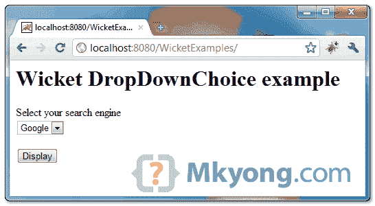
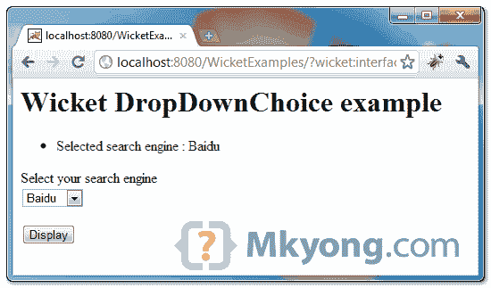

> 原文：<http://web.archive.org/web/20230101150211/http://www.mkyong.com/wicket/wicket-dropdown-box-example-dropdownchoice/>

# Wicket 下拉框示例–drop down choice

在 Wicket 中，可以使用“ **DropDownChoice** 来呈现一个下拉框组件。

```java
 //Java 
import org.apache.wicket.markup.html.form.DropDownChoice;
...
//choices in dropdown box
private static final List<String> SEARCH_ENGINES = Arrays.asList(new String[] {
		"Google", "Bing", "Baidu" });

//variable to hold the selected value from dropdown box,
//and also make "Google" is selected by default
private String selected = "Google";

DropDownChoice<String> listSites = new DropDownChoice<String>(
		"sites", new PropertyModel<String>(this, "selected"), SEARCH_ENGINES);

//HTML for dropdown box
<select wicket:id="sites"></select> 
```

## 1.Wicket DropDownChoice 示例

示例通过“`DropDownChoice`”显示下拉框，并默认一个选定值。

```java
 import java.util.Arrays;
import java.util.List;
import org.apache.wicket.PageParameters;
import org.apache.wicket.markup.html.form.DropDownChoice;
import org.apache.wicket.markup.html.form.Form;
import org.apache.wicket.markup.html.panel.FeedbackPanel;
import org.apache.wicket.markup.html.WebPage;
import org.apache.wicket.model.PropertyModel;

public class DropDownChoicePage extends WebPage {

	private static final List<String> SEARCH_ENGINES = Arrays.asList(new String[] {
			"Google", "Bing", "Baidu" });

	//make Google selected by default
	private String selected = "Google";

	public DropDownChoicePage(final PageParameters parameters) {

		add(new FeedbackPanel("feedback"));

		DropDownChoice<String> listSites = new DropDownChoice<String>(
			"sites", new PropertyModel<String>(this, "selected"), SEARCH_ENGINES);

		Form<?> form = new Form<Void>("form") {
			@Override
			protected void onSubmit() {

				info("Selected search engine : " + selected);

			}
		};

		add(form);
		form.add(listSites);

	}
} 
```

 <ins class="adsbygoogle" style="display:block; text-align:center;" data-ad-format="fluid" data-ad-layout="in-article" data-ad-client="ca-pub-2836379775501347" data-ad-slot="6894224149">## 2.Wicket HTML 页面

用于呈现下拉框的页面。

```java
 <html>
<head>
<style>
.feedbackPanelINFO {
	color: green;
}
</style>
</head>
<body>
	<h1>Wicket DropDownChoice example</h1>

	<div wicket:id="feedback"></div>
	<form wicket:id="form">
		<p>
			<label>Select your search engine </label> 
			<br /> 
			<select wicket:id="sites"></select>
		</p>
		<input type="submit" value="Display" />
	</form>

</body>
</html> 
```

 <ins class="adsbygoogle" style="display:block" data-ad-client="ca-pub-2836379775501347" data-ad-slot="8821506761" data-ad-format="auto" data-ad-region="mkyongregion">## 3.演示

开始并访问—*http://localhost:8080/wicket examples/*

默认选择“谷歌”。



选择“百度”并点击显示按钮。

Download it – [Wicket-DropDownChoice-Example.zip](http://web.archive.org/web/20190221190526/http://www.mkyong.com/wp-content/uploads/2011/05/Wicket-DropDownChoice-Examples.zip) (7KB)

## 参考

1.  [Wicket drop down choice Javadoc](http://web.archive.org/web/20190221190526/http://wicket.apache.org/apidocs/1.4/org/apache/wicket/markup/html/form/DropDownChoice.html)

[dropdown](http://web.archive.org/web/20190221190526/http://www.mkyong.com/tag/dropdown/) [wicket](http://web.archive.org/web/20190221190526/http://www.mkyong.com/tag/wicket/)


