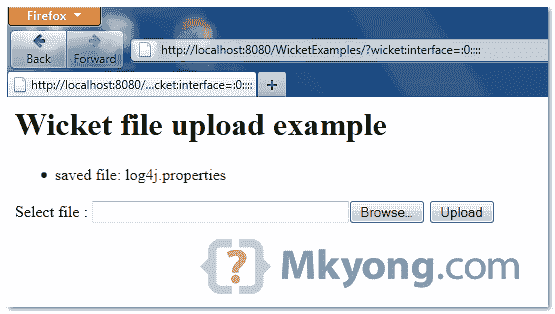

# Wicket 文件上传示例

> 原文：<http://web.archive.org/web/20230101150211/http://www.mkyong.com/wicket/wicket-file-upload-example/>

这个例子展示了如何创建一个 Wicket **FileUploadField** 组件，让用户从本地驱动器选择一个文件并上传到服务器。

```java
 //Java
import org.apache.wicket.markup.html.form.upload.FileUploadField;

	form.setMultiPart(true);
	form.add(fileUpload = new FileUploadField("fileUpload"));

//HTML
<input wicket:id="fileUpload" type="file"/> 
```

要上传文件，您必须在 Wicket 表单组件中启用“**多部分模式**”。

## 1.文件上传示例

示例呈现 fileupload 组件，并将**上传的文件大小限制为 10k** 。并且新上传的文件将被保存到预定义的位置。

```java
 package com.mkyong.user;

import java.io.File;
import org.apache.wicket.PageParameters;
import org.apache.wicket.markup.html.form.Form;
import org.apache.wicket.markup.html.form.upload.FileUpload;
import org.apache.wicket.markup.html.form.upload.FileUploadField;
import org.apache.wicket.markup.html.panel.FeedbackPanel;
import org.apache.wicket.markup.html.WebPage;
import org.apache.wicket.util.lang.Bytes;

public class FileUploadPage extends WebPage {

	private FileUploadField fileUpload;
	private String UPLOAD_FOLDER = "C:\\";

	public FileUploadPage(final PageParameters parameters) {

		add(new FeedbackPanel("feedback"));

		Form<?> form = new Form<Void>("form") {
		 @Override
		 protected void onSubmit() {

			final FileUpload uploadedFile = fileUpload.getFileUpload();
			if (uploadedFile != null) {

				// write to a new file
				File newFile = new File(UPLOAD_FOLDER
					+ uploadedFile.getClientFileName());

				if (newFile.exists()) {
					newFile.delete();
				}

				try {
					newFile.createNewFile();
					uploadedFile.writeTo(newFile);

					info("saved file: " + uploadedFile.getClientFileName());
				} catch (Exception e) {
					throw new IllegalStateException("Error");
				}
			 }

			}

		};

		// Enable multipart mode (need for uploads file)
		form.setMultiPart(true);

		// max upload size, 10k
		form.setMaxSize(Bytes.kilobytes(10));

		form.add(fileUpload = new FileUploadField("fileUpload"));

		add(form);

	}
} 
```

 <ins class="adsbygoogle" style="display:block; text-align:center;" data-ad-format="fluid" data-ad-layout="in-article" data-ad-client="ca-pub-2836379775501347" data-ad-slot="6894224149">## 2.HTML 页面

通过 HTML 输入标签呈现组件。

```java
 <html>
<head>
<style>
.feedbackPanelINFO {
	color: green;
}
.feedbackPanelERROR {
	color: red;
}
</style>
</head>
<body>
	<h1>Wicket file upload example</h1>

	<div wicket:id="feedback"></div>
	<form wicket:id="form">
		<p>
			<label>Select file :</label> 
			<input wicket:id="fileUpload" size="40" type="file"/>
			<input type="submit" value="Upload"/>
		</p>
	</form>

</body>
</html> 
```

 <ins class="adsbygoogle" style="display:block" data-ad-client="ca-pub-2836379775501347" data-ad-slot="8821506761" data-ad-format="auto" data-ad-region="mkyongregion">## 3.演示

开始并访问—*http://localhost:8080/wicket examples/*

如果文件大小超过 10k，显示错误


一切正常，显示保存的文件名。

Download it – [Wicket-FileUpload-Example.zip](http://web.archive.org/web/20190310100746/http://www.mkyong.com/wp-content/uploads/2011/05/Wicket-FileUpload-Example.zip) (7KB)

## 参考

1.  [Wicket 文件上传 Javadoc](http://web.archive.org/web/20190310100746/http://wicket.apache.org/apidocs/1.4/org/apache/wicket/markup/html/form/upload/FileUpload.html)
2.  [Wicket FileUploadField Javadoc](http://web.archive.org/web/20190310100746/http://wicket.apache.org/apidocs/1.4/org/apache/wicket/markup/html/form/upload/FileUploadField.html)

[file upload](http://web.archive.org/web/20190310100746/http://www.mkyong.com/tag/file-upload/) [wicket](http://web.archive.org/web/20190310100746/http://www.mkyong.com/tag/wicket/)


