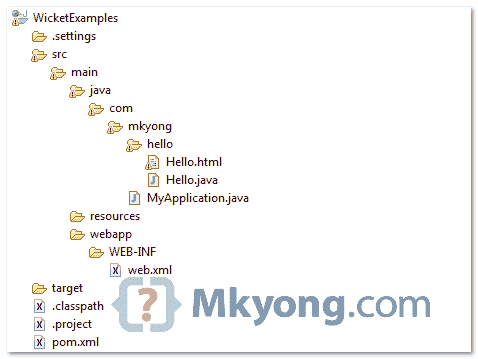
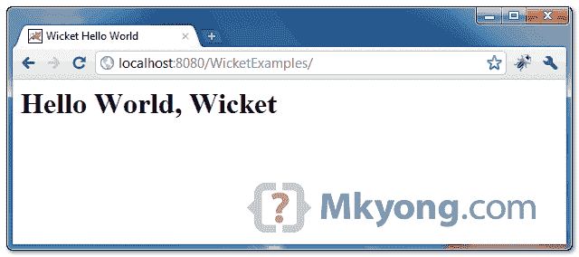

# Wicket Hello World 示例

> 原文：<http://web.archive.org/web/20230101150211/http://www.mkyong.com/wicket/wicket-hello-world-example-with-maven-tutorial/>

Wicket 中一个简单的 hello world 示例，展示了 Wicket web 应用程序的基本结构。

本文中使用的工具和技术

1.  Apache Wicket 1.4.17
2.  Eclipse 3.6
3.  Maven 3.0.3
4.  1.6.0.13 JDK

## 1.目录结构

查看这个 Wicket hello world web 应用程序的最终目录结构。在 Wicket 中，你需要把所有的文件”。html“和”。java”放在同一个包目录中。

**Note**
Read this [control where HTML is loaded in Wicket](http://web.archive.org/web/20221031160054/http://www.mkyong.com/wicket/how-do-change-the-html-file-location-wicket/) article to learn how to separate the “.html” and “.java” in different directory.

见下图:



按照以下步骤创建整个目录结构。

## 2.Maven 快速入门

通过 Maven 创建一个简单的 web 应用程序。

```java
 mvn archetype:generate -DgroupId=com.mkyong.core -DartifactId=WicketExamples 
 -DarchetypeArtifactId=maven-archetype-webapp -DinteractiveMode=false 
```

现在，它将创建所有标准的 web 文件夹结构。

## 3.Wicket 依赖性

在 Maven `pom.xml`文件中添加 Wicket 依赖项。

*文件:pom.xml*

```java
 <project  
    xmlns:xsi="http://www.w3.org/2001/XMLSchema-instance"
	xsi:schemaLocation="http://maven.apache.org/POM/4.0.0 
	http://maven.apache.org/maven-v4_0_0.xsd">
	<modelVersion>4.0.0</modelVersion>
	<groupId>com.mkyong.core</groupId>
	<artifactId>WicketExamples</artifactId>
	<packaging>war</packaging>
	<version>1.0-SNAPSHOT</version>
	<name>WicketExamples</name>
	<url>http://maven.apache.org</url>

	<dependencies>

		<dependency>
			<groupId>org.apache.wicket</groupId>
			<artifactId>wicket</artifactId>
			<version>1.4.17</version>
		</dependency>

		<!-- slf4j-log4j -->
		<dependency>
			<groupId>org.slf4j</groupId>
			<artifactId>slf4j-log4j12</artifactId>
			<version>1.5.6</version>
		</dependency>

	</dependencies>

	<build>
		<finalName>WicketExamples</finalName>

                <resources>
			<resource>
				<directory>src/main/resources</directory>
			</resource>
			<resource>
				<filtering>false</filtering>
				<directory>src/main/java</directory>
				<includes>
					<include>*</include>
				</includes>
				<excludes>
					<exclude>**/*.java</exclude>
				</excludes>
			</resource>
		</resources>

		<plugins>
			<plugin>
				<inherited>true</inherited>
				<groupId>org.apache.maven.plugins</groupId>
				<artifactId>maven-compiler-plugin</artifactId>
				<configuration>
					<source>1.6</source>
					<target>1.6</target>
					<optimise>true</optimise>
					<debug>true</debug>
				</configuration>
			</plugin>
		</plugins>
	</build>
</project> 
```

**Wicket need SLF4J !**
You have to include the slf4j logging implementation, otherwise Wicket will be failed to start.**Wicket need resource filter**
Remember to add the resource filter, Wicket puts all files in same package folder, if you didn’t define the resource filter to include everything “**<include>*</include>**” , “html”, “properties” or other resources files may failed to copy to the correct target folder.

## 4.Wicket 应用程序

在 Wicket 中，大多数东西都是**按照惯例**，你不需要配置它。在这种情况下，`WebApplication`返回一个" Hello.class "作为默认页面，当 Wicket 看到这个" **Hello.class** "时，它知道这个标注" html "的页面应该是"**【Hello.html】**"，而且它应该能在同一个包目录中找到。这就是为什么 Wicket 需要你把“html”和“java”类放在一起。

文件:MyApplication.java-主要应用入口。

```java
 package com.mkyong;

import org.apache.wicket.Page;
import org.apache.wicket.protocol.http.WebApplication;
import com.mkyong.hello.Hello;

public class MyApplication extends WebApplication {

	@Override
	public Class<? extends Page> getHomePage() {
		return Hello.class; //return default page
	}

} 
```

*文件:Hello.java*

```java
 package com.mkyong.hello;

import org.apache.wicket.PageParameters;
import org.apache.wicket.markup.html.basic.Label;
import org.apache.wicket.markup.html.WebPage;

public class Hello extends WebPage {

	private static final long serialVersionUID = 1L;

    public Hello(final PageParameters parameters) {

        add(new Label("message", "Hello World, Wicket"));

    }
} 
```

*文件:Hello.html*

```java
 <html>
    <head>
        <title>Wicket Hello World</title>
    </head>
    <body>
	  <h1>
        <span wicket:id="message">message will be replace later</span>
	  </h1>
    </body>
</html> 
```

## 5.Wicket 过滤器

为了让 Wicket 工作，您需要在您的`web.xml`文件中注册 Wicket 过滤器。

*文件:web.xml*

```java
 <?xml version="1.0" encoding="ISO-8859-1"?>
<web-app  
	xmlns:xsi="http://www.w3.org/2001/XMLSchema-instance"
	xsi:schemaLocation="http://java.sun.com/xml/ns/j2ee 
	http://java.sun.com/xml/ns/j2ee/web-app_2_4.xsd"
	version="2.4">
	<display-name>Wicket Web Application</display-name>

	<filter>
		<filter-name>wicket.wicketTest</filter-name>
		<filter-class>org.apache.wicket.protocol.http.WicketFilter</filter-class>
		<init-param>
			<param-name>applicationClassName</param-name>
			<param-value>com.mkyong.MyApplication</param-value>
		</init-param>
	</filter>

	<filter-mapping>
		<filter-name>wicket.wicketTest</filter-name>
		<url-pattern>/*</url-pattern>
	</filter-mapping>

</web-app> 
```

## 6.建造它

所有文件都准备好了，用 Maven 构建它。

```java
 mvn eclipse:eclipse -Dwtpversion=2.0 
```

将其导入 Eclipse 并启动项目。

## 7.测试一下

访问**http://localhost:8080/wicket examples/**，见图:



完成了。

Download it – [Wicket-HelloWorld-Examples.zip](http://web.archive.org/web/20221031160054/http://www.mkyong.com/wp-content/uploads/2009/02/Wicket-HelloWorld-Examples.zip) (6KB)**Wicket Examples**
You may interest to set up [wicket example in your local environment](http://web.archive.org/web/20221031160054/http://www.mkyong.com/wicket/how-do-setup-wicket-examples-in-eclipse/) to explore more about wicket components.

## 参考

1.  [Wicket 官方网站](http://web.archive.org/web/20221031160054/https://wicket.apache.org/)

<input type="hidden" id="mkyong-current-postId" value="990">