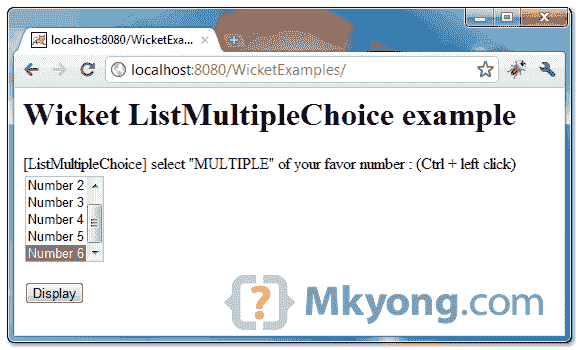
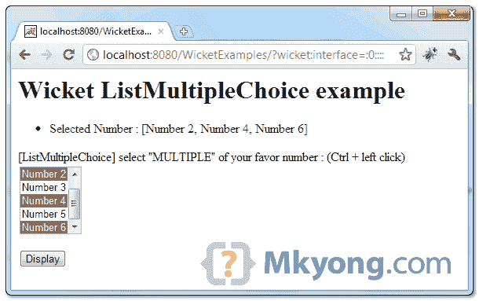

# Wicket ListMultipleChoice 示例

> 原文：<http://web.archive.org/web/20230101150211/http://www.mkyong.com/wicket/wicket-listmultiplechoice-example/>

在 Wicket 中，您可以使用`ListMultipleChoice`创建一个**多选滚动列表框**。

```java
 //Java 
import org.apache.wicket.markup.html.form.ListMultipleChoice;
...
//choices in list box
private static final List<String> NUMBERS = Arrays.asList(new String[] {
			"Number 1", "Number 2", "Number 3", "Number 4", "Number 5",
			"Number 6" });

//variable to hold the selected multiple values from listbox, 
//and make "Number 6" selected as default value
	private ArrayList<String> selectedNumber = new ArrayList<String>(
		Arrays.asList(new String[] { "Number 6" }));

ListMultipleChoice<String> listNumbers = new ListMultipleChoice<String>(
		"number", new Model(selectedNumber), NUMBERS);

//HTML for multiple select listbox
<select wicket:id="number"></select> 
```

## 1.Wicket 多重选择列表框示例

示例通过“`ListMultipleChoice`”显示一个多选可滚动列表框，并默认一个选定值。

```java
 package com.mkyong.user;

import java.util.ArrayList;
import java.util.Arrays;
import java.util.List;
import org.apache.wicket.PageParameters;
import org.apache.wicket.markup.html.form.Form;
import org.apache.wicket.markup.html.form.ListMultipleChoice;
import org.apache.wicket.markup.html.panel.FeedbackPanel;
import org.apache.wicket.markup.html.WebPage;
import org.apache.wicket.model.Model;

public class ListMultipleChoicePage extends WebPage {

	private static final List<String> NUMBERS = Arrays.asList(new String[] {
			"Number 1", "Number 2", "Number 3", "Number 4", "Number 5",
			"Number 6" });

	// Number 6 is selected by default
	private ArrayList<String> selectedNumber = new ArrayList<String>(
			Arrays.asList(new String[] { "Number 6" }));

	public ListMultipleChoicePage(final PageParameters parameters) {

		add(new FeedbackPanel("feedback"));

		ListMultipleChoice<String> listNumbers = new ListMultipleChoice<String>(
				"number", new Model(selectedNumber), NUMBERS);

		listNumbers.setMaxRows(5);

		Form<?> form = new Form<Void>("form") {
			@Override
			protected void onSubmit() {

				info("Selected Number : " + selectedNumber);

			}
		};

		add(form);
		form.add(listNumbers);

	}
} 
```

 ## 2.Wicket HTML 页面

页来呈现多选可滚动列表。

```java
 <html>
<head>
<style>
.feedbackPanelINFO {
	color: green;
}
</style>
</head>
<body>
	<h1>Wicket ListMultipleChoice example</h1>

	<div wicket:id="feedback"></div>
	<form wicket:id="form">
		<p>
			<label>[ListMultipleChoice] select "MULTIPLE" of your favor
				number : (Ctrl + left click)</label> 
			<br /> 
			<select wicket:id="number"></select>
		</p>
		<input type="submit" value="Display" />
	</form>

</body>
</html> 
```

 ## 3.演示

开始并访问—*http://localhost:8080/wicket examples/*

“数字 6”被自动选择。



选择“数字 2、4、6”并点击显示按钮。

Download it – [Wicket-ListMultipleChoice-Examples.zip](http://web.archive.org/web/20190214232815/http://www.mkyong.com/wp-content/uploads/2011/05/Wicket-ListMultipleChoice-Examples.zip) (7KB)

## 参考

1.  Wicket list multiple choice Javadoc

[listbox](http://web.archive.org/web/20190214232815/http://www.mkyong.com/tag/listbox/) [wicket](http://web.archive.org/web/20190214232815/http://www.mkyong.com/tag/wicket/)


