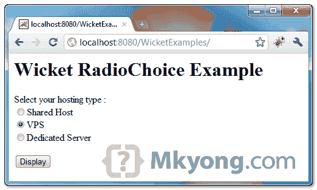

# Wicket 单选按钮示例–单选按钮

> 原文：<http://web.archive.org/web/20230101150211/http://www.mkyong.com/wicket/wicket-radio-buttons-example-radiochoice/>

Wicket 示例创建一组单选按钮，并默认选中单个单选按钮。

```java
 //Java 
import org.apache.wicket.markup.html.form.RadioChoice;
...
//choices in radio button
private static final List<String> TYPES = Arrays
	.asList(new String[] { "Shared Host", "VPS", "Dedicated Server" });

//variable to hold the selected radio button value, and default "VPS" is selected
private String selected = "VPS";

RadioChoice<String> hostingType = new RadioChoice<String>(
	"hosting", new PropertyModel<String>(this, "selected"), TYPES);

//HTML for radio button
<span wicket:id="hosting"></span> 
```

## 1.Wicket 单选按钮示例

示例通过“**单选按钮**显示一组单选按钮，默认选中单个单选按钮。

```java
 package com.mkyong.user;

import java.util.Arrays;
import java.util.List;
import org.apache.wicket.PageParameters;
import org.apache.wicket.markup.html.form.Form;
import org.apache.wicket.markup.html.form.RadioChoice;
import org.apache.wicket.markup.html.panel.FeedbackPanel;
import org.apache.wicket.markup.html.WebPage;
import org.apache.wicket.model.PropertyModel;

public class RadioChoicePage extends WebPage {

	//choices in radio button
	private static final List<String> TYPES = Arrays
			.asList(new String[] { "Shared Host", "VPS", "Dedicated Server" });

	//variable to hold radio button values
	private String selected = "VPS";

	public RadioChoicePage(final PageParameters parameters) {

		add(new FeedbackPanel("feedback"));

		RadioChoice<String> hostingType = new RadioChoice<String>(
				"hosting", new PropertyModel<String>(this, "selected"), TYPES);

		Form<?> form = new Form<Void>("form") {
			@Override
			protected void onSubmit() {

				info("Selected Type : " + selected);

			}
		};

		add(form);
		form.add(hostingType);

	}
} 
```

 ## 2.Wicket HTML 页面

页来呈现一组单选按钮。

```java
 <html>
<head>
<style>
.feedbackPanelINFO {
	color: green;
}
</style>
</head>
<body>
	<h1>Wicket RadioChoice Example</h1>

	<div wicket:id="feedback"></div>
	<form wicket:id="form">
		<p>
			<label>Select your hosting type :</label> 
			<br />
			<span wicket:id="hosting"></span>
		</p>
		<input type="submit" value="Display" />
	</form>

</body>
</html> 
```

 ## 3.演示

开始并访问—*http://localhost:8080/wicket examples/*

自动选择“VPS”。



现在，选择“专用服务器”选项并单击显示按钮。

Download it – [Wicket-RadioChoice-Examples.zip](http://web.archive.org/web/20190304031831/http://www.mkyong.com/wp-content/uploads/2011/05/Wicket-RadioChoice-Examples.zip) (7KB)

## 参考

1.  [Wicket RadioChoice Javadoc](http://web.archive.org/web/20190304031831/http://wicket.apache.org/apidocs/1.4/org/apache/wicket/markup/html/form/RadioChoice.html)

[radio button](http://web.archive.org/web/20190304031831/http://www.mkyong.com/tag/radio-button/) [wicket](http://web.archive.org/web/20190304031831/http://www.mkyong.com/tag/wicket/)


