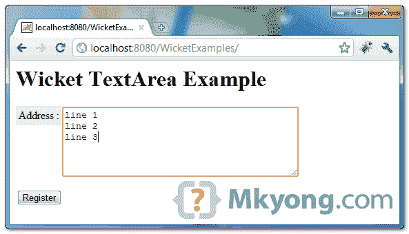

> 原文：<http://web.archive.org/web/20230101150211/http://www.mkyong.com/wicket/wicket-textarea-example/>

# Wicket textarea 示例

Wicket 教程向您展示了如何创建一个 textarea，多行文本编辑组件，通常用于地址字段。

```java
 //Java 
import org.apache.wicket.markup.html.form.TextArea;
...
final TextArea<String> address = new TextArea<String>("address",Model.of(""));		
form.add(address);

//HTML
<textarea wicket:id="address" rows="6" cols="40"></textarea> 
```

## 1.Wicket textarea 示例

为地址呈现文本区域字段的代码。

*文件:UserPage.java*

```java
 package com.mkyong.user;

import org.apache.wicket.PageParameters;
import org.apache.wicket.markup.html.form.Form;
import org.apache.wicket.markup.html.form.TextArea;
import org.apache.wicket.markup.html.panel.FeedbackPanel;
import org.apache.wicket.markup.html.WebPage;
import org.apache.wicket.model.Model;

public class UserPage extends WebPage {

	public UserPage(final PageParameters parameters) {

		add(new FeedbackPanel("feedback"));

		//create a textarea field for address
		final TextArea<String> address = new TextArea<String>("address",Model.of(""));
		address.setRequired(true);

		address.setLabel(Model.of("Address")); 

		Form<?> form = new Form<Void>("userForm") {
			@Override
			protected void onSubmit() {

				PageParameters pageParameters = new PageParameters();
				pageParameters.add("address", address.getModelObject());
				setResponsePage(SuccessPage.class, pageParameters);

			}
		};

		add(form);
		form.add(address);

	}
} 
```

 <ins class="adsbygoogle" style="display:block; text-align:center;" data-ad-format="fluid" data-ad-layout="in-article" data-ad-client="ca-pub-2836379775501347" data-ad-slot="6894224149">## 2.Wicket HTML 页面

呈现 textarea 字段的页面。

*File : UserPage.html*

```java
 <html>
<head>
<style>
label {
	background-color: #eee;
	padding: 4px;
	float:left;
}

.feedbackPanelERROR {
	color: red;
}
</style>
</head>
<body>
	<h1>Wicket TextArea Example</h1>

	<div wicket:id="feedback"></div>
	<form wicket:id="userForm">
		<p>
			<label>Address :</label> 

			<textarea wicket:id="address" rows="6" cols="40"></textarea>

		</p>
		<input type="submit" value="Register" />
	</form>

</body>
</html> 
```

 <ins class="adsbygoogle" style="display:block" data-ad-client="ca-pub-2836379775501347" data-ad-slot="8821506761" data-ad-format="auto" data-ad-region="mkyongregion">## 3.演示

开始并访问—*http://localhost:8080/wicket examples/*

Download it – [Wicket-textarea-example.zip](http://web.archive.org/web/20190301152104/http://www.mkyong.com/wp-content/uploads/2011/05/Wicket-textarea-example.zip) (8KB)

## 参考

1.  [Wicket TextArea Javadoc](http://web.archive.org/web/20190301152104/http://wicket.apache.org/apidocs/1.4/org/apache/wicket/markup/html/form/TextArea.html)

[textarea](http://web.archive.org/web/20190301152104/http://www.mkyong.com/tag/textarea/) [wicket](http://web.archive.org/web/20190301152104/http://www.mkyong.com/tag/wicket/)


