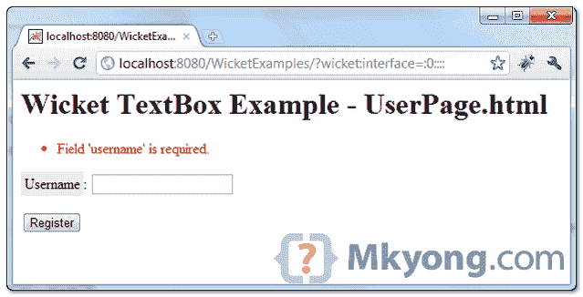
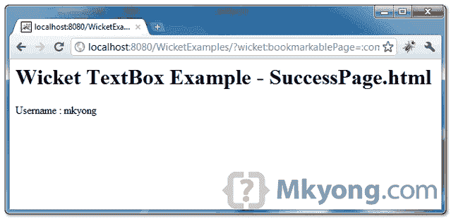

# Wicket 文本框示例

> 原文：<http://web.archive.org/web/20230101150211/http://www.mkyong.com/wicket/wicket-textbox-example/>

Wicket 教程向你展示了如何创建一个文本框，验证它，并将文本框的值传递到下一页。

```java
 //Java 
import org.apache.wicket.markup.html.form.TextField;
...
final TextField<String> username = new TextField<String>("username", Model.of(""));
form.add(username);

//HTML
<input wicket:id="username" type="text" size="20" /> 
```

## 1.Wicket 文本框示例

通过 Wicket 的`TextField`呈现文本框的用户页面。

*文件:UserPage.java*

```java
 package com.mkyong.user;

import org.apache.wicket.PageParameters;
import org.apache.wicket.markup.html.form.Form;
import org.apache.wicket.markup.html.form.TextField;
import org.apache.wicket.markup.html.panel.FeedbackPanel;
import org.apache.wicket.markup.html.WebPage;
import org.apache.wicket.model.Model;

public class UserPage extends WebPage {

	public UserPage(final PageParameters parameters) {

		add(new FeedbackPanel("feedback"));

		final TextField<String> username = new TextField<String>("username",
				Model.of(""));
		username.setRequired(true);
		username.add(new UsernameValidator());

		Form<?> form = new Form<Void>("userForm") {

			@Override
			protected void onSubmit() {

				final String usernameValue = username.getModelObject();

				PageParameters pageParameters = new PageParameters();
				pageParameters.add("username", usernameValue);
				setResponsePage(SuccessPage.class, pageParameters);

			}

		};

		add(form);
		form.add(username);

	}
} 
```

*File : UserPage.html*

```java
 <html>
<head>
<style>
label {
	background-color: #eee;
	padding: 4px;
}

.feedbackPanelERROR {
	color: red;
}
</style>
</head>
<body>
	<h1>Wicket TextBox Example - UserPage.html</h1>

	<div wicket:id="feedback"></div>
	<form wicket:id="userForm">
		<p>
			<label>Username</label>: 
			<input wicket:id="username" type="text" size="20" />
		</p>
		<input type="submit" value="Register" />
	</form>

</body>
</html> 
```

 ## 2.用户名验证器

一个用户名验证器，以确保用户名的长度在 5 到 15 之间，在字符或符号 a-z，0-9，下划线，连字符。

*文件:UsernameValidator.java*

```java
 package com.mkyong.user;

import org.apache.wicket.validation.CompoundValidator;
import org.apache.wicket.validation.validator.PatternValidator;
import org.apache.wicket.validation.validator.StringValidator;

public class UsernameValidator extends CompoundValidator<String> {

	private static final long serialVersionUID = 1L;

	public UsernameValidator() {

		add(StringValidator.lengthBetween(5, 15));
		add(new PatternValidator("[a-z0-9_-]+"));

	}
} 
```

 ## 3.显示文本框值

显示来自**UserPage.html**的文本框值的页面。

*文件:SuccessPage.java*

```java
 package com.mkyong.user;

import org.apache.wicket.PageParameters;
import org.apache.wicket.markup.html.basic.Label;
import org.apache.wicket.markup.html.WebPage;

public class SuccessPage extends WebPage {

	public SuccessPage(final PageParameters parameters) {

		String username = "";

		if(parameters.containsKey("username")){
			username = parameters.getString("username");
		}

		final Label result = new Label("result", "Username : " + username);
		add(result);

	}
} 
```

*文件:SuccessPage.html*

```java
 <html>
<body>
	<h1>Wicket TextBox Example - SuccessPage.html</h1>

	<label wicket:id="result"></label>

</body>
</html> 
```

## 4.演示

开始并访问—*http://localhost:8080/wicket examples/*

如果文本框有错误:



如果文本框没有错误，导航到下一页并显示文本框值。

Download it – [Wicket-textbox-examples.zip](http://web.archive.org/web/20190304030558/http://www.mkyong.com/wp-content/uploads/2011/05/Wicket-textbox-examples.zip) (8KB)

## 参考

1.  [用正则表达式验证用户名](http://web.archive.org/web/20190304030558/http://www.mkyong.com/regular-expressions/how-to-validate-username-with-regular-expression/)
2.  [Wicket TextField Javadoc](http://web.archive.org/web/20190304030558/http://wicket.apache.org/apidocs/1.4/org/apache/wicket/markup/html/form/TextField.html)

[textbox](http://web.archive.org/web/20190304030558/http://www.mkyong.com/tag/textbox/) [wicket](http://web.archive.org/web/20190304030558/http://www.mkyong.com/tag/wicket/)


