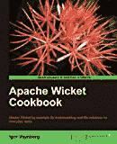

> 原文：<http://web.archive.org/web/20230101150211/https://mkyong.com/tutorials/wicket-tutorials/>

# Wicket 教程

Apache Wicket 是一个简单且功能丰富的基于组件的 web 框架，真正的可重用组件是这个框架的主要卖点。然而，由于基于组件和 MVC 架构之间的巨大差异，这使得 Wicket 很难学习，尤其是对于那些经典的 MVC 开发人员。

在本教程中，它提供了许多关于使用 Apache Wicket 1.4 的分步示例和解释。

## 基本和配置

Wicket hello world，基本的东西和 URL 配置。

*   [Wicket Hello World 示例](http://web.archive.org/web/20190213133126/http://www.mkyong.com/wicket/wicket-hello-world-example-with-maven-tutorial/)
    一个简单的 Hello World 探索 Wicket web 应用的基本结构。
*   [在本地环境中设置 Wicket 示例](http://web.archive.org/web/20190213133126/http://www.mkyong.com/wicket/how-do-setup-wicket-examples-in-eclipse/)
    在您的本地开发环境中设置一个克隆的 Wicket 示例站点以供快速参考。
*   [PageParameters 示例](http://web.archive.org/web/20190213133126/http://www.mkyong.com/wicket/wicket-pageparameters-example/)
    学习如何将参数传递给另一个页面。
*   [使 Wicket URL bookmarkablePage 结构友好](http://web.archive.org/web/20190213133126/http://www.mkyong.com/wicket/how-do-change-wicket-url-bookmarkablepage-structure-url-mounting/)
    默认情况下，Wicket 生成的 URL 很难看，这里有一种方法可以使 URL 更加整洁友好。
*   [在 Wicket 中加密 URL](http://web.archive.org/web/20190213133126/http://www.mkyong.com/wicket/how-do-encrypt-encode-url-in-wicket/)
    在 Wicket 中加密 URL 的简单方法。

 <ins class="adsbygoogle" style="display:block; text-align:center;" data-ad-format="fluid" data-ad-layout="in-article" data-ad-client="ca-pub-2836379775501347" data-ad-slot="6894224149">## 模型

Wicket 模型示例，从组件绑定到对象属性，反之亦然。

*   [PropertyModel 示例](http://web.archive.org/web/20190213133126/http://www.mkyong.com/wicket/wicket-propertymodel-example/)
    使用 PropertyModel 将表单组件绑定到对象属性。
*   [CompoundPropertyModel 示例](http://web.archive.org/web/20190213133126/http://www.mkyong.com/wicket/wicket-compoundpropertymodel-example/)
    使用 CompoundPropertyModel 将表单组件绑定到对象属性。

 <ins class="adsbygoogle" style="display:block" data-ad-client="ca-pub-2836379775501347" data-ad-slot="8821506761" data-ad-format="auto" data-ad-region="mkyongregion">## 表单组件

Wicket 表单组件示例。

*   [Textbox 示例](http://web.archive.org/web/20190213133126/http://www.mkyong.com/wicket/wicket-textbox-example/)
    使用 TextField 来呈现一个用户名文本框，并附加了一个简单的用户名验证器。
*   [密码字段示例](http://web.archive.org/web/20190213133126/http://www.mkyong.com/wicket/wicket-password-field-example/)
    使用 PasswordTextField 来呈现密码字段，并附加了一个强大的密码验证器。
*   [Textarea 示例](http://web.archive.org/web/20190213133126/http://www.mkyong.com/wicket/wicket-textarea-example/)
    使用 Textarea 呈现多行地址栏。
*   [复选框示例](http://web.archive.org/web/20190213133126/http://www.mkyong.com/wicket/wicket-checkbox-example/)
    使用 Checkbox 渲染复选框，默认选中。
*   [多个复选框示例](http://web.archive.org/web/20190213133126/http://www.mkyong.com/wicket/wicket-multiple-checkboxes-example-checkboxmultiplechoice/)
    使用 CheckBoxMultipleChoice 呈现多个复选框。
*   [单选按钮示例](http://web.archive.org/web/20190213133126/http://www.mkyong.com/wicket/wicket-radio-buttons-example-radiochoice/)
    使用 RadioChoice 呈现一组单选按钮。
*   [单选列表框示例](http://web.archive.org/web/20190213133126/http://www.mkyong.com/wicket/wicket-listchoice-example/)
    使用 ListChoice 呈现单选可滚动列表。
*   [多选列表框示例](http://web.archive.org/web/20190213133126/http://www.mkyong.com/wicket/wicket-listmultiplechoice-example/)
    使用 ListMultipleChoice 呈现多选可滚动列表。
*   [下拉框示例](http://web.archive.org/web/20190213133126/http://www.mkyong.com/wicket/wicket-dropdown-box-example-dropdownchoice/)
    使用 DropDownChoice 来呈现下拉框选项。
*   [文件上传示例](http://web.archive.org/web/20190213133126/http://www.mkyong.com/wicket/wicket-file-upload-example/)
    使用 FileUploadField 来呈现文件上传组件。
*   [Select 和 SelectOption 示例](http://web.archive.org/web/20190213133126/http://www.mkyong.com/wicket/wicket-select-example/)
    Wicket 扩展——使用“Select”和“SelectOption”呈现一个下拉框，该下拉框用< optgroup >标签将相关选项分组。
*   [调色板示例](http://web.archive.org/web/20190213133126/http://www.mkyong.com/wicket/wicket-palette-example/)
    Wicket 扩展——使用“调色板”来呈现两个选择框，并允许用户将项目从一个选择框移动到另一个选择框。

## 验证器

Wicket 中的自定义验证器。

*   [创建自定义验证器](http://web.archive.org/web/20190213133126/http://www.mkyong.com/wicket/create-custom-validator-in-wicket/)
    示例创建自定义验证器。
*   [自定义 notequilinputvalidator](http://web.archive.org/web/20190213133126/http://www.mkyong.com/wicket/notequalinputvalidator-in-wicket/)
    另一个自定义验证器来确保两个组件不相等。

## Wicket 集成

将 Wicket 与其他人集成。

*   [Wicket + Spring 集成示例](http://web.archive.org/web/20190213133126/http://www.mkyong.com/wicket/wicket-spring-integration-example/)
    将 Wicket 与 Spring 框架轻松集成的示例。
*   [Wicket + Kaptcha 集成示例](http://web.archive.org/web/20190213133126/http://www.mkyong.com/wicket/how-do-integrate-kaptcha-in-wicket-solution/)
    通过 Spring 将 Kaptcha 与 Wicket 框架集成的示例。
*   [Wicket + Log4j 集成实例](http://web.archive.org/web/20190213133126/http://www.mkyong.com/wicket/wicket-log4j-integration-example/)
    如何将 Log4j 与 Wicket 集成，通过 slf4j-log4j 桥绑定。

## 常见问题

Wicket 中的一些常见问题。

*   [改变 html 文件在 Wicket](http://web.archive.org/web/20190213133126/http://www.mkyong.com/wicket/how-do-change-the-html-file-location-wicket/)
    中的位置由于某些原因，你想把 java 和 html 文件分开放在不同的文件夹中，这里有几种方法可以做到。
*   [在 Wicket 中获取 servlet context](http://web.archive.org/web/20190213133126/http://www.mkyong.com/wicket/how-do-get-servletcontext-in-wicket/)
    servlet context 对于提供 web 信息很有用，向你展示如何在 Wicket 中获取它。
*   [将 Wicket 更改为部署模式](http://web.archive.org/web/20190213133126/http://www.mkyong.com/wicket/how-to-change-wicket-to-deployment-mode/)
    将 Wicket 从开发模式更改为部署模式的两种方法。
*   [AJAX 更新后调用 Javascript](http://web.archive.org/web/20190213133126/http://www.mkyong.com/wicket/how-to-call-javscript-after-ajax-update-wicket/)
    向你展示如何在 AJAX 更新后运行 Javascript 代码。
*   [文件上传验证器被忽略](http://web.archive.org/web/20190213133126/http://www.mkyong.com/wicket/wicket-fileupload-validator-is-not-execute/)
    如果没有选择文件，文件上传验证器将不执行！解决方案。
*   [在 Wicket](http://web.archive.org/web/20190213133126/http://www.mkyong.com/wicket/how-do-configure-404-error-page-in-wicket-solution/)
    中配置 404 错误页面如何为找不到的 url 配置 404 错误页面。
*   [获取 web 应用的根上下文](http://web.archive.org/web/20190213133126/http://www.mkyong.com/wicket/how-do-get-root-context-of-a-web-application-in-wicket/)
    获取 Wicket 项目根上下文的常用方法。
*   [检测浏览器是否支持 JavaScript 或 Ajax](http://web.archive.org/web/20190213133126/http://www.mkyong.com/wicket/how-do-detect-browser-javascript-or-ajax-disabled-in-wicket/)
    Wicket 方式检测浏览器是否支持 JavaScript 或 Ajax
*   [向 HTML 标签中动态添加属性](http://web.archive.org/web/20190213133126/http://www.mkyong.com/wicket/how-to-dynamic-add-attribute-to-a-html-tag-in-wicket/)
    示例动态操作 HTML 标签中的属性。
*   [Wicket](http://web.archive.org/web/20190213133126/http://www.mkyong.com/wicket/how-do-use-ajaxlazyloadpanel-in-wicket/)
    中的 AjaxLazyLoadPanel 示例使用 AjaxLazyLoadPanel 来启用惰性加载效果。

## 常见错误

Wicket 中的一些常见错误消息。

*   [Java . lang . classnotfoundexception:org . slf4j . impl . staticloggerbinder](http://web.archive.org/web/20190213133126/http://www.mkyong.com/wicket/java-lang-classnotfoundexception-org-slf4j-impl-staticloggerbinder/)
*   [启用 org . Apache . wicket . util . resource 的调试消息](http://web.archive.org/web/20190213133126/http://www.mkyong.com/wicket/enable-debug-messages-for-org-apache-wicket-util-resource/)

## Wicket 参考

*   [Apache Wicket 官网](http://web.archive.org/web/20190213133126/http://wicket.apache.org/ )
*   [Apache Wicket 示例](http://web.archive.org/web/20190213133126/http://wicketstuff.org/wicket14/)
*   [Apache Wicket Wiki 文档](http://web.archive.org/web/20190213133126/https://cwiki.apache.org/WICKET/framework-documentation.html )
*   [Apache Wicket API JavaDocs](http://web.archive.org/web/20190213133126/http://wicket.apache.org/apidocs/1.4/index.html?index-all.html)

## 下一步是什么？

为了研究更多关于 Wicket 框架的话题，我推荐下面两本很棒的 Wicket 书籍。

[tutorials](http://web.archive.org/web/20190213133126/http://www.mkyong.com/tag/tutorials/) [wicket](http://web.archive.org/web/20190213133126/http://www.mkyong.com/tag/wicket/) (function (i,d,s,o,m,r,c,l,w,q,y,h,g) { var e=d.getElementById(r);if(e===null){ var t = d.createElement(o); t.src = g; t.id = r; t.setAttribute(m, s);t.async = 1;var n=d.getElementsByTagName(o)[0];n.parentNode.insertBefore(t, n); var dt=new Date().getTime(); try{i[l][w+y](h,i[l][q+y](h)+'&amp;'+dt);}catch(er){i[h]=dt;} } else if(typeof i[c]!=='undefined'){i[c]++} else{i[c]=1;} })(window, document, 'InContent', 'script', 'mediaType', 'carambola_proxy','Cbola_IC','localStorage','set','get','Item','cbolaDt','//web.archive.org/web/20190213133126/http://route.carambo.la/inimage/getlayer?pid=myky82&amp;did=112239&amp;wid=0')<input type="hidden" id="mkyong-postId" value="9134">

