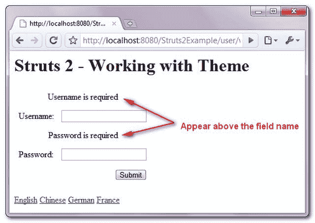
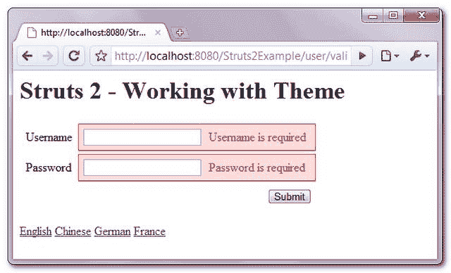
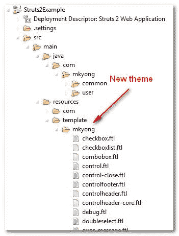

# 使用 Struts 2 主题和模板

> 原文：<http://web.archive.org/web/20230101150211/http://www.mkyong.com/struts2/working-with-struts-2-theme-template/>

Download It – [Struts2-Theme-Example.zip](http://web.archive.org/web/20190304032055/http://www.mkyong.com/wp-content/uploads/2010/06/Struts2-Theme-Example.zip)

在 Struts2 中，当您在 HTML 页面中放置一个“**s:textfield**”UI 标签时

```java
 <s:textfield key="global.username" name="username" /> 
```

以下 2 列 HTML 表格布局设计将自动生成

```java
 <tr>
<td class="tdLabel">
  <label for="validateUser_username" class="label">Username:</label>
</td>
<td>
  <input type="text" name="username" value="" id="validateUser_username"/>
</td>
</tr> 
```

Struts 2 使用“主题和模板”特性为您生成预先设计好的表格布局。

让我们看看序列:

1.  Struts 2 看到一个" **s:textfield** "标签。
2.  搜索声明的主题(如果没有声明主题，将选择默认的 xhtml 主题)。
3.  搜索对应主题的模板，如“ **s:textfield - > text.ftl** ”、“**s:password->password . ftl**”。所有预定义的 HTML 布局都在 ftl 文件中定义。
4.  将值绑定到模板文件中。
5.  显示最终的 HTML 标记。

Struts 2 tags + Theme’s template file (ftl) = Final HTML markup code.Struts 2 is using the freemaker framework as the default template engine, all ftl files are written in freemaker script. No worry, the freemarker syntax is almost in human explains words, it’s quite easy to learn.

## 使用 Struts 2 主题和模板

在本文中，您将创建一个新的主题来定制错误消息的位置。在默认的“xhtml”主题中，错误消息将出现在字段名称的上方。



在新主题中，错误信息将显示在输入字段旁边，并用红色突出显示。

 <ins class="adsbygoogle" style="display:block; text-align:center;" data-ad-format="fluid" data-ad-layout="in-article" data-ad-client="ca-pub-2836379775501347" data-ad-slot="6894224149">## 1.提取主题

所有的主题和模板文件都在模板文件夹 **struts2-core.jar** 中。将其解压缩到您的本地驱动器。

The ftl file is just a normal text file, you can open it with any prefer text editors. <ins class="adsbygoogle" style="display:block" data-ad-client="ca-pub-2836379775501347" data-ad-slot="8821506761" data-ad-format="auto" data-ad-region="mkyongregion">## 2.创建新主题

创建一个新文件夹，复制所有现有的 xhtml 模板文件(ftl)并将新文件夹放入项目资源文件夹。

To understand how Struts 2 find the theme template folder, read [Struts 2 template directory](http://web.archive.org/web/20190304032055/http://struts.apache.org/2.0.14/docs/selecting-template-directory.html) selection for more detail.Often times, you just need to copy and modify the existing “xhtml” theme, unless you have reason not to.

## 3.定义新主题

定义“ **struts.ui.theme** ”和“ **struts.ui.templateDir** ”来告诉 Struts 2 在哪里可以找到你的新主题和模板文件夹。

**struts.xml**

```java
 <struts>
    ...
 	<constant name="struts.ui.theme" value="mkyong" />
	<constant name="struts.ui.templateDir" value="template" />
	...
</struts> 
```

Now, when Struts 2 see a “**s:textfield**“, it will find the “mkyong” theme instead of the default “xhtml” theme. Read [Struts 2 select a theme](http://web.archive.org/web/20190304032055/http://struts.apache.org/2.0.14/docs/selecting-themes.html) for more detail.

## 4.修改主题

要修改现有的模板(ftl)文件，您可能需要了解一点 [freemarker 语法](http://web.archive.org/web/20190304032055/http://freemarker.sourceforge.net/)。

1.创建一个新的 **error-message.ftl** 文件来显示错误消息。

**错误消息. ftl**

```java
 <#--
	Only show message if errors are available.
	This will be done if ActionSupport is used.
-->
<#assign hasFieldErrors = parameters.name?? && fieldErrors?? && fieldErrors[parameters.name]??/>
<#if hasFieldErrors>
<#list fieldErrors[parameters.name] as error>
   <span class="errorMessage" errorFor="${parameters.id}">${error?html}</span><#t/>
</#list>
</#if> 
```

2.如果存在错误，通过向“td”标签添加一个新的“errorsBg”类来修改 **controlheader.ftl** 。

**controlheader.ftl**

```java
 <#include "/${parameters.templateDir}/mkyong/controlheader-core.ftl" />
    <td
<#if hasFieldErrors>
    class="errorsBg" <#t/>
</#if>
<#if parameters.align??>
    align="${parameters.align?html}"<#t/>
</#if>
><#t/> 
```

3.通过删除许多不必要的标签来修改 **controlheader-core.ftl** ，如果存在错误，则向“td”标签添加一个新的“errorsBg”类。

**controlheader-core.ftl**

```java
 <#--
	Only show message if errors are available.
	This will be done if ActionSupport is used.
-->
<#assign hasFieldErrors = parameters.name?? && fieldErrors?? && fieldErrors[parameters.name]??/>
<#--
	if the label position is top,
	then give the label its own row in the table
-->
<tr>

<td class="tdLabel <#t/>
<#--
<#if hasFieldErrors>
errorsBg"<#t/>
</#if>
-->
><#rt/>

<#if parameters.label??>
    <label <#t/>
<#if parameters.id??>
        for="${parameters.id?html}" <#t/>
</#if>
<#if hasFieldErrors>
        class="errorLabel"<#t/>
<#else>
        class="label"<#t/>
</#if>
 ><#t/>

<#if parameters.required?default(false) && parameters.requiredposition?default("right") != 'right'>
    <span class="required">*</span><#t/>
</#if>
${parameters.label?html}<#t/>
<#if parameters.required?default(false) && parameters.requiredposition?default("right") == 'right'>
 	<span class="required">*</span><#t/>
</#if>

</label><#t/>
</#if>

</td><#lt/> 
```

4.修改 **text.ftl** ，在“ **simple/text.ftl** ”之后添加一个新的模板文件“ **error-message.ftl** ”。

**text.ftl**

```java
 <#include "/${parameters.templateDir}/${parameters.theme}/controlheader.ftl" />
<#include "/${parameters.templateDir}/simple/text.ftl" />
<#include "/${parameters.templateDir}/mkyong/error-message.ftl" />
<#include "/${parameters.templateDir}/xhtml/controlfooter.ftl" /> 
```

5.将 CSS 放在视图页面中以格式化错误消息。

```java
 <style type="text/css">
.errorsBg{
	background-color:#fdd;
	color:red;	
	border: 1px solid;
}

.errorMessage{
	padding:0px 8px;
}

table{
	border-spacing: 4px;
}
td{
	padding:4px;
}
</style> 
```

5.完成，保存，现在错误信息将显示在输入字段旁边，并用红色突出显示。

Hope this article can give you a general concept about how to create or modify a theme in Struts2.

## 参考

1.  [http://freemarker.sourceforge.net/](http://web.archive.org/web/20190304032055/http://freemarker.sourceforge.net/)
2.  [http://www . vita rara . org/CMS/struts _ 2 _ cookbook/creating _ a _ theme](http://web.archive.org/web/20190304032055/http://www.vitarara.org/cms/struts_2_cookbook/creating_a_theme)
3.  [http://struts . Apache . org/2 . 0 . 14/docs/themes-and-templates . html](http://web.archive.org/web/20190304032055/http://struts.apache.org/2.0.14/docs/themes-and-templates.html)
4.  [http://www . packtpub . com/article/themes-and-templates-with-Apache-struts 2](http://web.archive.org/web/20190304032055/http://www.packtpub.com/article/themes-and-templates-with-apache-struts2)

[struts2](http://web.archive.org/web/20190304032055/http://www.mkyong.com/tag/struts2/) [template](http://web.archive.org/web/20190304032055/http://www.mkyong.com/tag/template/) [theme](http://web.archive.org/web/20190304032055/http://www.mkyong.com/tag/theme/)


