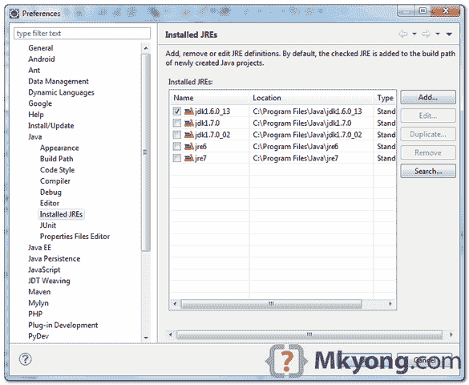

> 原文：<http://web.archive.org/web/20230101150211/http://www.mkyong.com/google-app-engine/your-project-must-be-configured-to-use-a-jdk-in-order-to-use-jsps/>

# 为了使用 JSP，您的项目必须配置为使用 JDK

## 问题

使用 Eclipse 3.7+Google Plugin for Eclipse 来开发 GAE 项目，当在“war”目录下创建一个. jsp 文件时，Eclipse 在 JSP 文件上方显示一个交叉错误图标。

在 Eclipse problem 视图中，它显示"**为了使用 JSP，您项目必须被配置为使用 JDK。**”。

 <ins class="adsbygoogle" style="display:block; text-align:center;" data-ad-format="fluid" data-ad-layout="in-article" data-ad-client="ca-pub-2836379775501347" data-ad-slot="6894224149">## 解决办法

要解决这个问题，改变你的 Eclipse 安装的 JRE，并把它指向你的 JDK 文件夹。在 Eclipse 菜单中，选择 **Windows** - > **首选项** - > **Java** - > **已安装 JREs** ，添加您的 JDK 文件夹并选中它。

P.S JSP 需要 JDK“javac”来编译，而 JRE 中并不存在。

 <ins class="adsbygoogle" style="display:block" data-ad-client="ca-pub-2836379775501347" data-ad-slot="8821506761" data-ad-format="auto" data-ad-region="mkyongregion">## 参考

1.  [使用 JDK 以便使用 JSP 解决谷歌应用引擎问题](http://web.archive.org/web/20190217080723/http://code.google.com/p/googleappengine/issues/detail?id=1211) 

[gae](http://web.archive.org/web/20190217080723/http://www.mkyong.com/tag/gae/) [jdk](http://web.archive.org/web/20190217080723/http://www.mkyong.com/tag/jdk/) [jsp](http://web.archive.org/web/20190217080723/http://www.mkyong.com/tag/jsp/)

